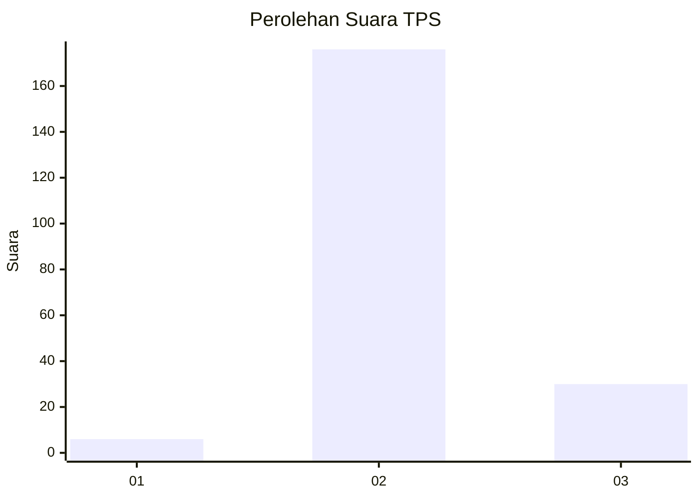
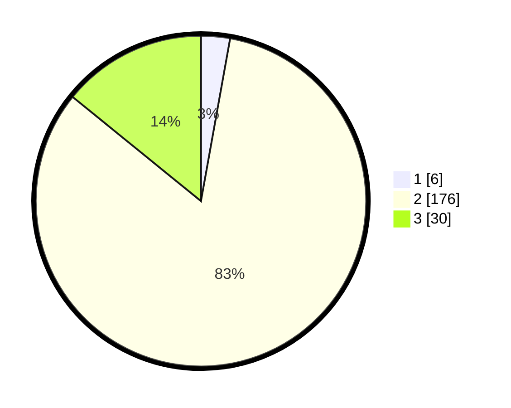

# Hasil

## Grafik

## Tabel

| No. | Nama Paslon    | Suara | Suara (raw) | Persentase |
|:--- |:-------------- | -----:| -----------:| ----------:|
| 1   | ANIES MUHAIMIN | 6     | [6][p-1]    | 2,83       |
| 2   | PRABOWO GIBRAN | 176   | [176][p-2]  | 83,02      |
| 3   | GANJAR MAHFUD  | 30    | [30][p-3]   | 14,15      |

[p-1]: https://github.com/gigit-pemilu/pemilu-2024-51-bali/blob/main/pilpres/hitung-suara/sub/51-bali/sub/07-karangasem/sub/08-kubu/sub/2007-tulamben/sub/003-tps/sub/paslon-1.txt
[p-2]: https://github.com/gigit-pemilu/pemilu-2024-51-bali/blob/main/pilpres/hitung-suara/sub/51-bali/sub/07-karangasem/sub/08-kubu/sub/2007-tulamben/sub/003-tps/sub/paslon-2.txt
[p-3]: https://github.com/gigit-pemilu/pemilu-2024-51-bali/blob/main/pilpres/hitung-suara/sub/51-bali/sub/07-karangasem/sub/08-kubu/sub/2007-tulamben/sub/003-tps/sub/paslon-3.txt

## Foto C Plano

https://sirekap-obj-formc.kpu.go.id/91b3/pemilu/ppwp/51/07/08/20/07/5107082007003-20240214-141911--7593f827-f05f-4ebe-8c20-2dcc75fb888d.jpg

https://sirekap-obj-formc.kpu.go.id/91b3/pemilu/ppwp/51/07/08/20/07/5107082007003-20240214-141941--9b19b761-90d0-4300-a5bd-e6f09169f7f5.jpg

https://sirekap-obj-formc.kpu.go.id/91b3/pemilu/ppwp/51/07/08/20/07/5107082007003-20240214-230312--394402b6-bd80-4309-9814-bc0433a7c4ce.jpg

## Metadata

| Key        | Value               |
| ---------- | ------------------- |
| Time Stamp | 2024-02-15 02:10:27 |

