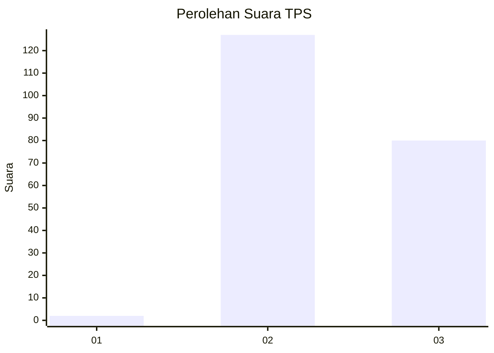
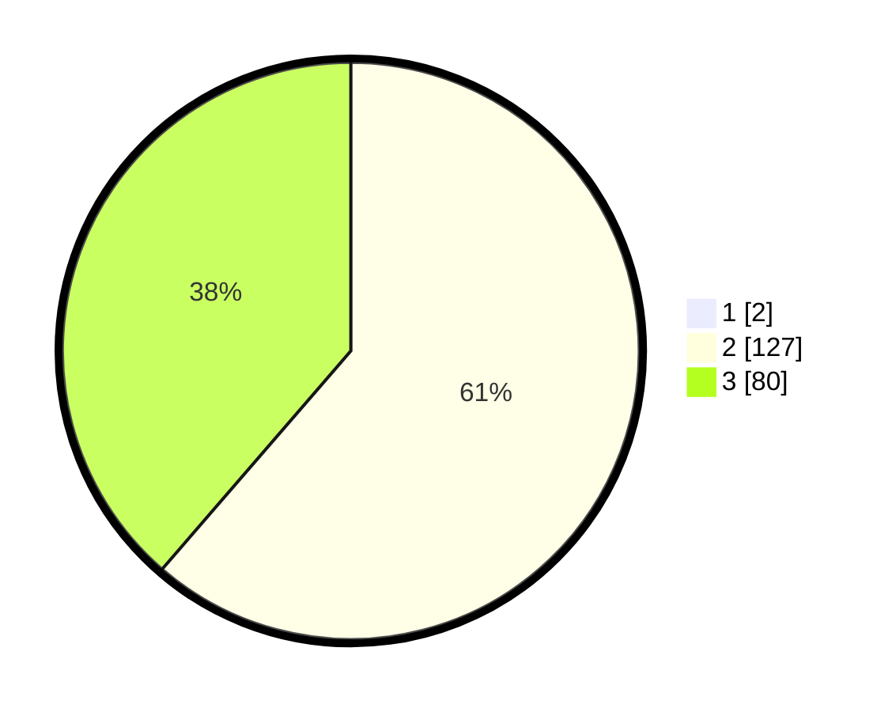

# Hasil

## Grafik

## Tabel

| No. | Nama Paslon    | Suara | Suara (raw) | Persentase |
|:--- |:-------------- | -----:| -----------:| ----------:|
| 1   | ANIES MUHAIMIN | 2     | [2][p-1]    | 0,96       |
| 2   | PRABOWO GIBRAN | 127   | [127][p-2]  | 60,77      |
| 3   | GANJAR MAHFUD  | 80    | [80][p-3]   | 38,28      |

[p-1]: https://github.com/gigit-pemilu/pemilu-2024-51-bali/blob/main/pilpres/hitung-suara/sub/51-bali/sub/07-karangasem/sub/08-kubu/sub/2007-tulamben/sub/006-tps/sub/paslon-1.txt
[p-2]: https://github.com/gigit-pemilu/pemilu-2024-51-bali/blob/main/pilpres/hitung-suara/sub/51-bali/sub/07-karangasem/sub/08-kubu/sub/2007-tulamben/sub/006-tps/sub/paslon-2.txt
[p-3]: https://github.com/gigit-pemilu/pemilu-2024-51-bali/blob/main/pilpres/hitung-suara/sub/51-bali/sub/07-karangasem/sub/08-kubu/sub/2007-tulamben/sub/006-tps/sub/paslon-3.txt

## Foto C Plano

https://sirekap-obj-formc.kpu.go.id/2f82/pemilu/ppwp/51/07/08/20/07/5107082007006-20240214-141908--bf14dc9f-d124-4871-9459-32e22833cf13.jpg

https://sirekap-obj-formc.kpu.go.id/2f82/pemilu/ppwp/51/07/08/20/07/5107082007006-20240214-141259--fda110fa-5a5b-4cee-ab71-b7519b2f0b5d.jpg

https://sirekap-obj-formc.kpu.go.id/2f82/pemilu/ppwp/51/07/08/20/07/5107082007006-20240214-141305--0176be80-f9d8-4688-be25-9dbc1eb6d7f9.jpg

## Metadata

| Key        | Value               |
| ---------- | ------------------- |
| Time Stamp | 2024-02-15 15:00:29 |

