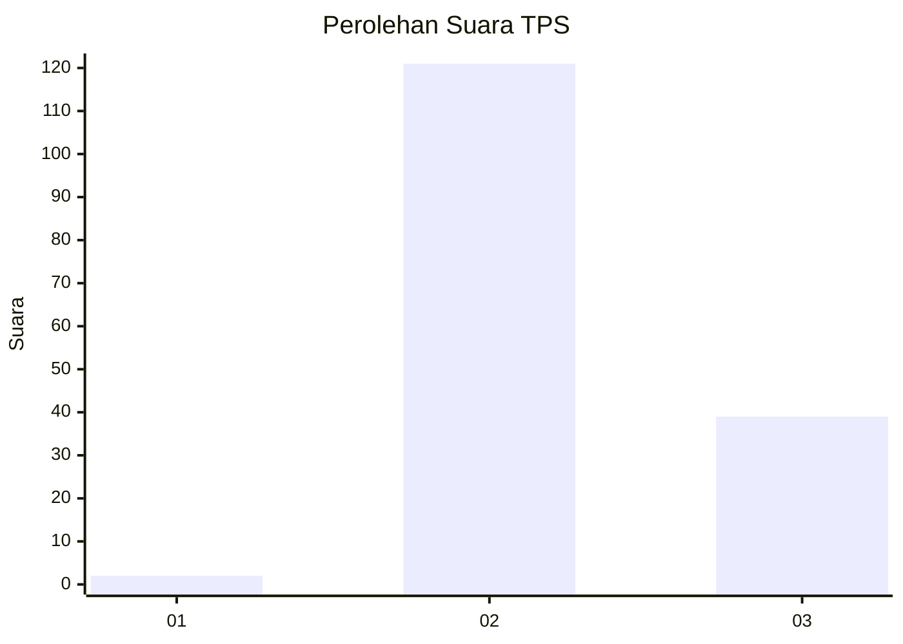
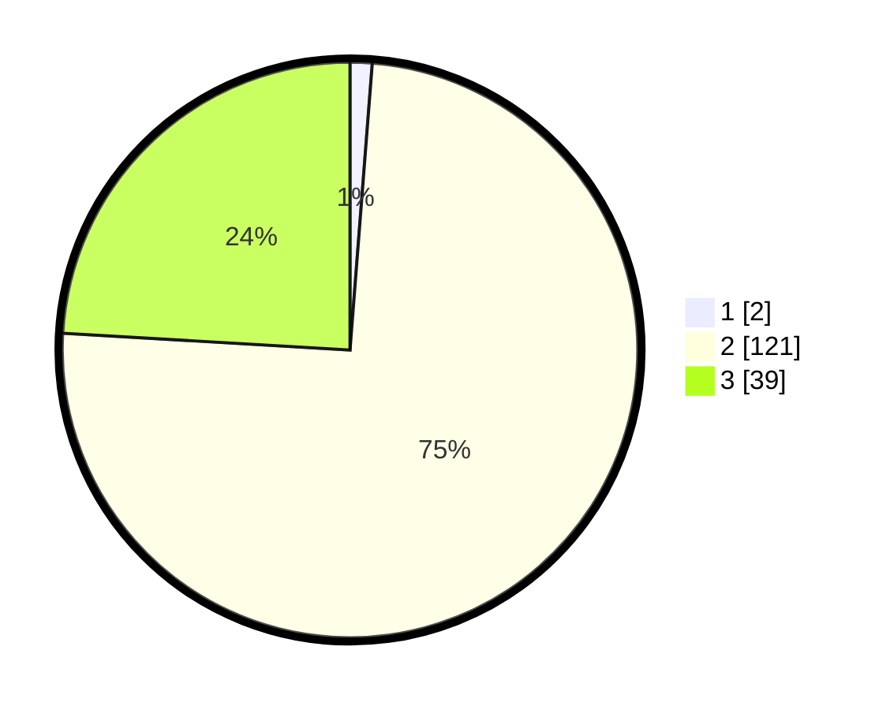

# Hasil

## Grafik

## Tabel

| No. | Nama Paslon    | Suara | Suara (raw) | Persentase |
|:--- |:-------------- | -----:| -----------:| ----------:|
| 1   | ANIES MUHAIMIN | 2     | [2][p-1]    | 1,23       |
| 2   | PRABOWO GIBRAN | 121   | [121][p-2]  | 74,69      |
| 3   | GANJAR MAHFUD  | 39    | [39][p-3]   | 24,07      |

[p-1]: https://github.com/gigit-pemilu/pemilu-2024-51-bali/blob/main/pilpres/hitung-suara/sub/51-bali/sub/07-karangasem/sub/08-kubu/sub/2007-tulamben/sub/027-tps/sub/paslon-1.txt
[p-2]: https://github.com/gigit-pemilu/pemilu-2024-51-bali/blob/main/pilpres/hitung-suara/sub/51-bali/sub/07-karangasem/sub/08-kubu/sub/2007-tulamben/sub/027-tps/sub/paslon-2.txt
[p-3]: https://github.com/gigit-pemilu/pemilu-2024-51-bali/blob/main/pilpres/hitung-suara/sub/51-bali/sub/07-karangasem/sub/08-kubu/sub/2007-tulamben/sub/027-tps/sub/paslon-3.txt

## Foto C Plano

https://sirekap-obj-formc.kpu.go.id/1f22/pemilu/ppwp/51/07/08/20/07/5107082007027-20240214-192717--6c531d08-adab-4fac-aa29-9aff68603e57.jpg

https://sirekap-obj-formc.kpu.go.id/1f22/pemilu/ppwp/51/07/08/20/07/5107082007027-20240214-192854--53f5cc9d-fd37-4c79-bcc7-aa3ac403eba8.jpg

https://sirekap-obj-formc.kpu.go.id/1f22/pemilu/ppwp/51/07/08/20/07/5107082007027-20240214-193019--de41a724-0452-47dc-90fa-6b8e544aed19.jpg

## Metadata

| Key        | Value               |
| ---------- | ------------------- |
| Time Stamp | 2024-02-15 15:00:29 |

