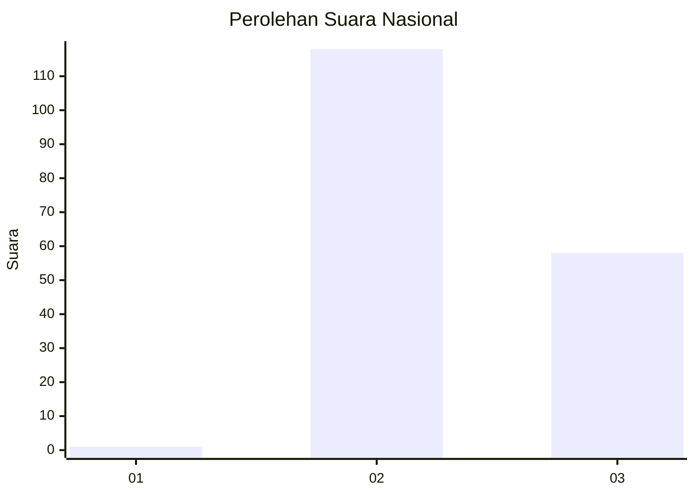
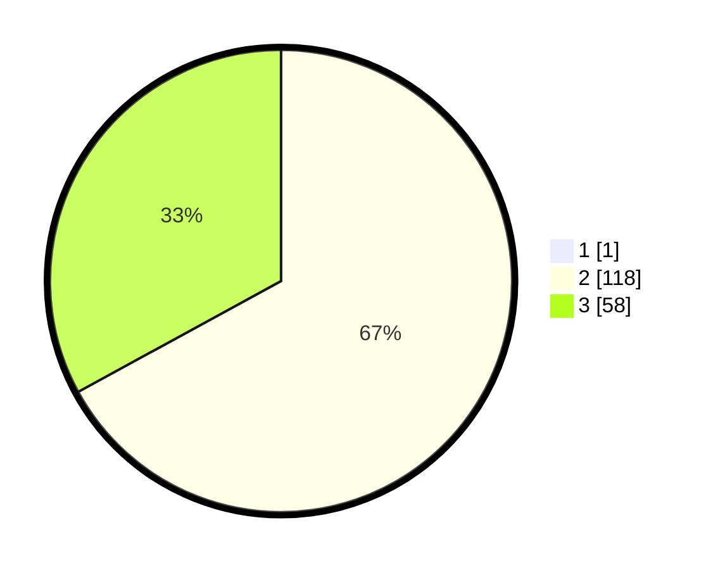

# Hasil

## Grafik

## Tabel

| No. | Nama Paslon    | Suara | Suara (raw) | Persentase |
|:--- |:-------------- | -----:| -----------:| ----------:|
| 1   | ANIES MUHAIMIN | 1     | [1][p-1]    | 0,56       |
| 2   | PRABOWO GIBRAN | 118   | [118][p-2]  | 66,67      |
| 3   | GANJAR MAHFUD  | 58    | [58][p-3]   | 32,77      |

[p-1]: https://github.com/gigit-pemilu/pemilu-2024/blob/main/pilpres/hitung-suara/sub/51-bali/sub/07-karangasem/sub/08-kubu/sub/2007-tulamben/sub/031-tps/sub/paslon-1.txt
[p-2]: https://github.com/gigit-pemilu/pemilu-2024/blob/main/pilpres/hitung-suara/sub/51-bali/sub/07-karangasem/sub/08-kubu/sub/2007-tulamben/sub/031-tps/sub/paslon-2.txt
[p-3]: https://github.com/gigit-pemilu/pemilu-2024/blob/main/pilpres/hitung-suara/sub/51-bali/sub/07-karangasem/sub/08-kubu/sub/2007-tulamben/sub/031-tps/sub/paslon-3.txt

## Foto C Plano

https://sirekap-obj-formc.kpu.go.id/5cb7/pemilu/ppwp/51/07/08/20/07/5107082007031-20240215-225521--e4b6d7b0-e9e2-4c4f-9dfe-25a639b0b087.jpg

https://sirekap-obj-formc.kpu.go.id/5cb7/pemilu/ppwp/51/07/08/20/07/5107082007031-20240215-225523--1320ecb5-19a6-4d64-b40e-5fb465b4076d.jpg

https://sirekap-obj-formc.kpu.go.id/5cb7/pemilu/ppwp/51/07/08/20/07/5107082007031-20240215-225522--21b9c31b-1b72-40ba-a724-b72db9e5c440.jpg

## Metadata

| Key        | Value               |
| ---------- | ------------------- |
| Time Stamp | 2024-02-16 08:00:28 |

## DATA PEMILIH TETAP

Jumlah pemilih dalam DPT: **230**.
 * L: **113**.
 * P: **117**.

## DATA PENGGUNA HAK PILIH

Jumlah pengguna hak pilih dalam DPT: **186**.
 * L: **93**.
 * P: **93**.

Jumlah pengguna hak pilih dalam DPTb: **3**.
 * L: **3**.
 * P: **0**.

Jumlah pengguna hak pilih dalam DPK: **9**.
 * L: **5**.
 * P: **4**.

Jumlah pengguna hak pilih: **198**.
 * L: **101**.
 * P: **97**.

## JUMLAH SUARA SAH DAN TIDAK SAH

JUMLAH SELURUH SUARA SAH: **177**.

JUMLAH SUARA TIDAK SAH: **21**.

JUMLAH SELURUH SUARA SAH DAN SUARA TIDAK SAH: **198**.

