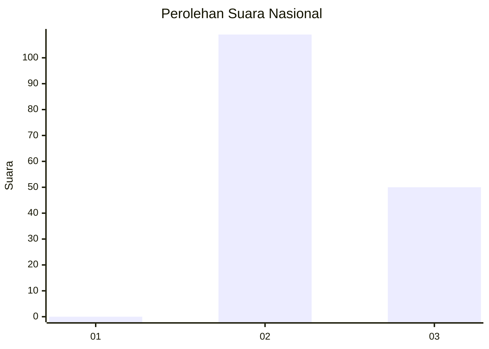
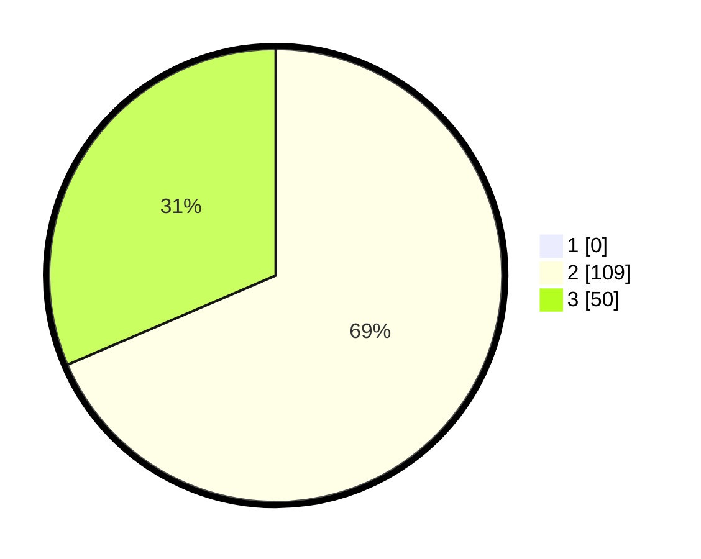

# Hasil

## Grafik

## Tabel

| No. | Nama Paslon    | Suara | Suara (raw) | Persentase |
|:--- |:-------------- | -----:| -----------:| ----------:|
| 1   | ANIES MUHAIMIN | 0     | [0][p-1]    | 0,00       |
| 2   | PRABOWO GIBRAN | 109   | [109][p-2]  | 68,55      |
| 3   | GANJAR MAHFUD  | 50    | [50][p-3]   | 31,45      |

[p-1]: https://github.com/gigit-pemilu/pemilu-2024/blob/main/pilpres/hitung-suara/sub/51-bali/sub/07-karangasem/sub/08-kubu/sub/2008-baturinggit/sub/001-tps/sub/paslon-1.txt
[p-2]: https://github.com/gigit-pemilu/pemilu-2024/blob/main/pilpres/hitung-suara/sub/51-bali/sub/07-karangasem/sub/08-kubu/sub/2008-baturinggit/sub/001-tps/sub/paslon-2.txt
[p-3]: https://github.com/gigit-pemilu/pemilu-2024/blob/main/pilpres/hitung-suara/sub/51-bali/sub/07-karangasem/sub/08-kubu/sub/2008-baturinggit/sub/001-tps/sub/paslon-3.txt

## Foto C Plano

https://sirekap-obj-formc.kpu.go.id/46fc/pemilu/ppwp/51/07/08/20/08/5107082008001-20240214-141718--02d0b450-dbe6-4773-967b-be62fc823068.jpg

https://sirekap-obj-formc.kpu.go.id/46fc/pemilu/ppwp/51/07/08/20/08/5107082008001-20240214-141850--17c8f426-e693-4f19-94ca-3101030d6c67.jpg

https://sirekap-obj-formc.kpu.go.id/46fc/pemilu/ppwp/51/07/08/20/08/5107082008001-20240214-155202--f28b2bc3-d911-4d97-8113-b682becd0579.jpg

## Metadata

| Key        | Value               |
| ---------- | ------------------- |
| Time Stamp | 2024-02-14 21:46:01 |

