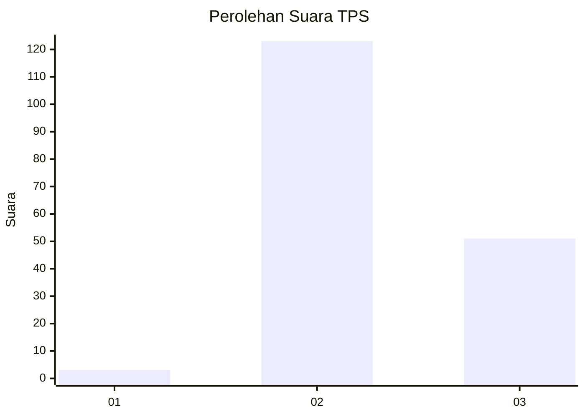

# Hasil

## Grafik

## Tabel

| No. | Nama Paslon    | Suara | Suara (raw) | Persentase |
|:--- |:-------------- | -----:| -----------:| ----------:|
| 1   | ANIES MUHAIMIN | 3     | [3][p-1]    | 1,69       |
| 2   | PRABOWO GIBRAN | 123   | [123][p-2]  | 69,49      |
| 3   | GANJAR MAHFUD  | 51    | [51][p-3]   | 28,81      |

[p-1]: https://github.com/gigit-pemilu/pemilu-2024-51-bali/blob/main/pilpres/hitung-suara/sub/51-bali/sub/07-karangasem/sub/08-kubu/sub/2008-baturinggit/sub/004-tps/sub/paslon-1.txt
[p-2]: https://github.com/gigit-pemilu/pemilu-2024-51-bali/blob/main/pilpres/hitung-suara/sub/51-bali/sub/07-karangasem/sub/08-kubu/sub/2008-baturinggit/sub/004-tps/sub/paslon-2.txt
[p-3]: https://github.com/gigit-pemilu/pemilu-2024-51-bali/blob/main/pilpres/hitung-suara/sub/51-bali/sub/07-karangasem/sub/08-kubu/sub/2008-baturinggit/sub/004-tps/sub/paslon-3.txt

## Foto C Plano

https://sirekap-obj-formc.kpu.go.id/2d4b/pemilu/ppwp/51/07/08/20/08/5107082008004-20240214-221154--711cd20a-0fef-4f17-9d40-95433b7d52dd.jpg

https://sirekap-obj-formc.kpu.go.id/2d4b/pemilu/ppwp/51/07/08/20/08/5107082008004-20240214-221314--64c870d9-986f-448e-bf4a-fd08897b6236.jpg

https://sirekap-obj-formc.kpu.go.id/2d4b/pemilu/ppwp/51/07/08/20/08/5107082008004-20240214-221523--eace16af-3c70-4d36-8244-c921b5bf80b4.jpg

## Metadata

| Key        | Value               |
| ---------- | ------------------- |
| Time Stamp | 2024-02-15 12:00:28 |

## DATA PEMILIH TETAP

Jumlah pemilih dalam DPT: **226**.
 * L: **104**.
 * P: **122**.

## DATA PENGGUNA HAK PILIH

Jumlah pengguna hak pilih dalam DPT: **171**.
 * L: **87**.
 * P: **84**.

Jumlah pengguna hak pilih dalam DPTb: **0**.
 * L: **0**.
 * P: **0**.

Jumlah pengguna hak pilih dalam DPK: **10**.
 * L: **4**.
 * P: **6**.

Jumlah pengguna hak pilih: **181**.
 * L: **91**.
 * P: **90**.

## JUMLAH SUARA SAH DAN TIDAK SAH

JUMLAH SELURUH SUARA SAH: **177**.

JUMLAH SUARA TIDAK SAH: **4**.

JUMLAH SELURUH SUARA SAH DAN SUARA TIDAK SAH: **181**.

