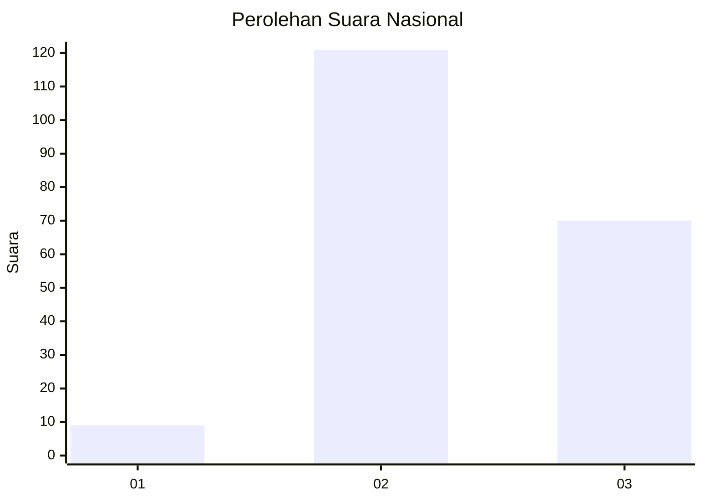
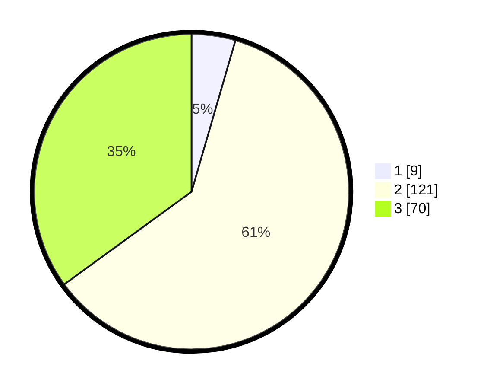

# Hasil

## Grafik

## Tabel

| No. | Nama Paslon    | Suara | Suara (raw) | Persentase |
|:--- |:-------------- | -----:| -----------:| ----------:|
| 1   | ANIES MUHAIMIN | 9     | [9][p-1]    | 4,50       |
| 2   | PRABOWO GIBRAN | 121   | [121][p-2]  | 60,50      |
| 3   | GANJAR MAHFUD  | 70    | [70][p-3]   | 35,00      |

[p-1]: https://github.com/gigit-pemilu/pemilu-2024/blob/main/pilpres/hitung-suara/sub/51-bali/sub/07-karangasem/sub/08-kubu/sub/2008-baturinggit/sub/007-tps/sub/paslon-1.txt
[p-2]: https://github.com/gigit-pemilu/pemilu-2024/blob/main/pilpres/hitung-suara/sub/51-bali/sub/07-karangasem/sub/08-kubu/sub/2008-baturinggit/sub/007-tps/sub/paslon-2.txt
[p-3]: https://github.com/gigit-pemilu/pemilu-2024/blob/main/pilpres/hitung-suara/sub/51-bali/sub/07-karangasem/sub/08-kubu/sub/2008-baturinggit/sub/007-tps/sub/paslon-3.txt

## Foto C Plano

https://sirekap-obj-formc.kpu.go.id/ec9b/pemilu/ppwp/51/07/08/20/08/5107082008007-20240214-204848--ee7df591-9534-4da3-931c-581c71654dfd.jpg

https://sirekap-obj-formc.kpu.go.id/ec9b/pemilu/ppwp/51/07/08/20/08/5107082008007-20240214-204852--43e942fc-304a-4ffa-bd3a-08527d6804bb.jpg

https://sirekap-obj-formc.kpu.go.id/ec9b/pemilu/ppwp/51/07/08/20/08/5107082008007-20240214-204857--d4ce1974-54bd-48fb-87cf-64da7001779e.jpg

## Metadata

| Key        | Value               |
| ---------- | ------------------- |
| Time Stamp | 2024-02-15 15:00:29 |

