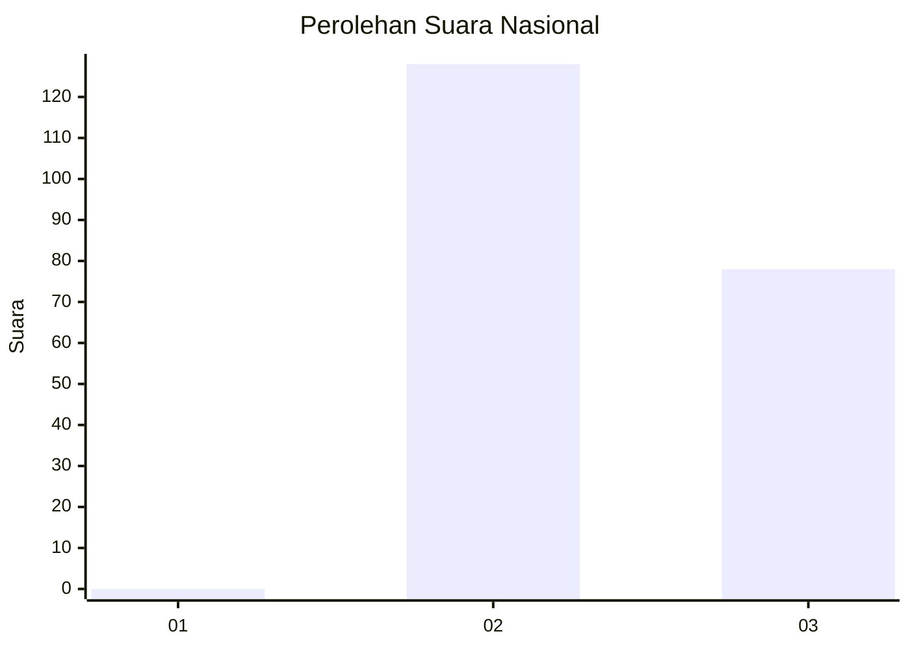
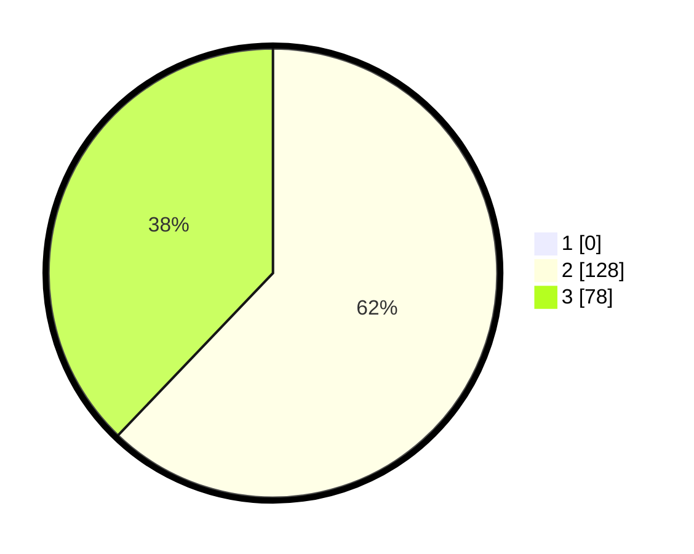

# Hasil

## Grafik

## Tabel

| No. | Nama Paslon    | Suara | Suara (raw) | Persentase |
|:--- |:-------------- | -----:| -----------:| ----------:|
| 1   | ANIES MUHAIMIN | 0     | [0][p-1]    | 0,00       |
| 2   | PRABOWO GIBRAN | 128   | [128][p-2]  | 62,14      |
| 3   | GANJAR MAHFUD  | 78    | [78][p-3]   | 37,86      |

[p-1]: https://github.com/gigit-pemilu/pemilu-2024/blob/main/pilpres/hitung-suara/sub/51-bali/sub/07-karangasem/sub/08-kubu/sub/2009-sukadana/sub/001-tps/sub/paslon-1.txt
[p-2]: https://github.com/gigit-pemilu/pemilu-2024/blob/main/pilpres/hitung-suara/sub/51-bali/sub/07-karangasem/sub/08-kubu/sub/2009-sukadana/sub/001-tps/sub/paslon-2.txt
[p-3]: https://github.com/gigit-pemilu/pemilu-2024/blob/main/pilpres/hitung-suara/sub/51-bali/sub/07-karangasem/sub/08-kubu/sub/2009-sukadana/sub/001-tps/sub/paslon-3.txt

## Foto C Plano

https://sirekap-obj-formc.kpu.go.id/ea4d/pemilu/ppwp/51/07/08/20/09/5107082009001-20240214-211401--3d0733b4-a2d7-4b90-8c88-7a7e5e36ca4d.jpg

https://sirekap-obj-formc.kpu.go.id/ea4d/pemilu/ppwp/51/07/08/20/09/5107082009001-20240214-212327--6d1a25fd-e7cb-4e86-86f5-34b2e4712dd5.jpg

https://sirekap-obj-formc.kpu.go.id/ea4d/pemilu/ppwp/51/07/08/20/09/5107082009001-20240214-212447--53abaab4-3d2c-4c96-963b-5f8125bd2392.jpg

## Metadata

| Key        | Value               |
| ---------- | ------------------- |
| Time Stamp | 2024-02-15 15:00:29 |

