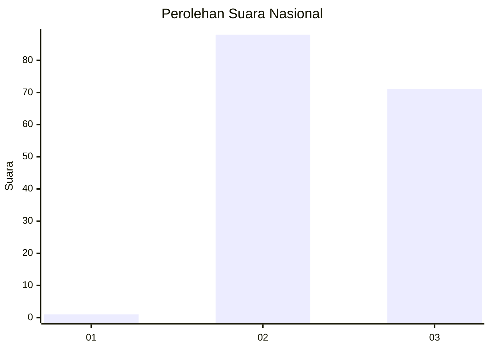
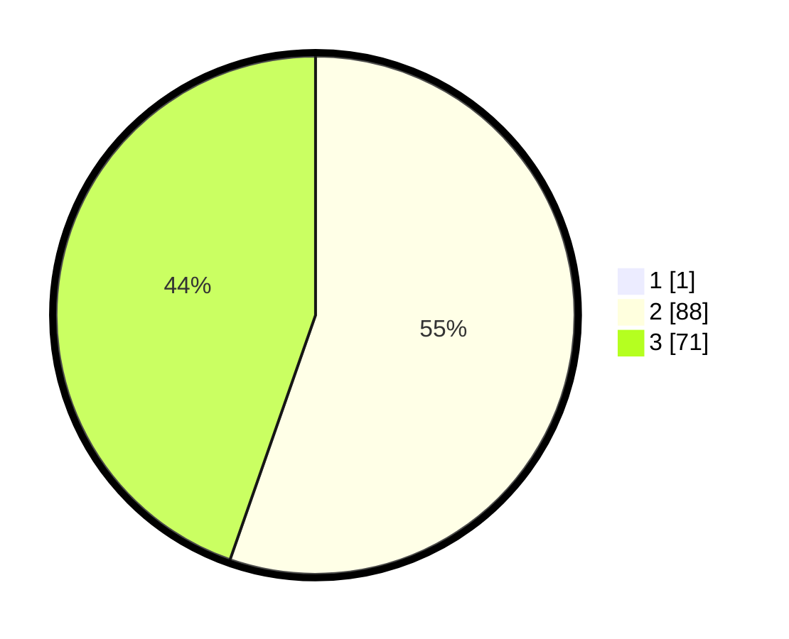

# Hasil

## Grafik

## Tabel

| No. | Nama Paslon    | Suara | Suara (raw) | Persentase |
|:--- |:-------------- | -----:| -----------:| ----------:|
| 1   | ANIES MUHAIMIN | 1     | [1][p-1]    | 0,63       |
| 2   | PRABOWO GIBRAN | 88    | [88][p-2]   | 55,00      |
| 3   | GANJAR MAHFUD  | 71    | [71][p-3]   | 44,38      |

[p-1]: https://github.com/gigit-pemilu/pemilu-2024/blob/main/pilpres/hitung-suara/sub/51-bali/sub/07-karangasem/sub/08-kubu/sub/2009-sukadana/sub/015-tps/sub/paslon-1.txt
[p-2]: https://github.com/gigit-pemilu/pemilu-2024/blob/main/pilpres/hitung-suara/sub/51-bali/sub/07-karangasem/sub/08-kubu/sub/2009-sukadana/sub/015-tps/sub/paslon-2.txt
[p-3]: https://github.com/gigit-pemilu/pemilu-2024/blob/main/pilpres/hitung-suara/sub/51-bali/sub/07-karangasem/sub/08-kubu/sub/2009-sukadana/sub/015-tps/sub/paslon-3.txt

## Foto C Plano

https://sirekap-obj-formc.kpu.go.id/7890/pemilu/ppwp/51/07/08/20/09/5107082009015-20240214-155815--46ac4e0d-5eca-42c3-91b4-2633487648e1.jpg

https://sirekap-obj-formc.kpu.go.id/7890/pemilu/ppwp/51/07/08/20/09/5107082009015-20240214-123951--17e2d89b-a5a7-4584-ba93-bfb2d4fa29a8.jpg

https://sirekap-obj-formc.kpu.go.id/7890/pemilu/ppwp/51/07/08/20/09/5107082009015-20240214-125114--f22032b5-dc5a-4132-afe7-b4a7160ff3a2.jpg

## Metadata

| Key        | Value               |
| ---------- | ------------------- |
| Time Stamp | 2024-02-14 21:46:01 |

