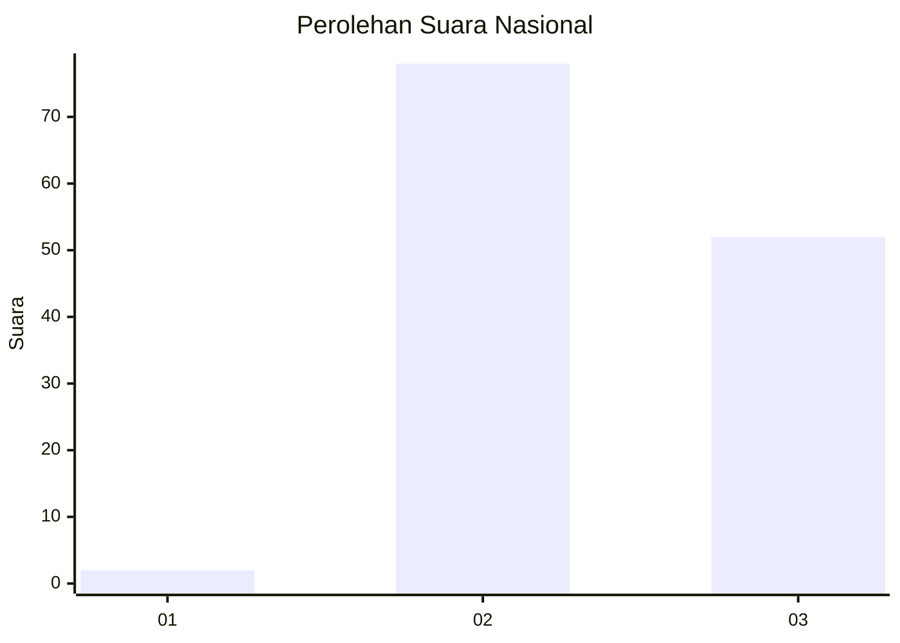
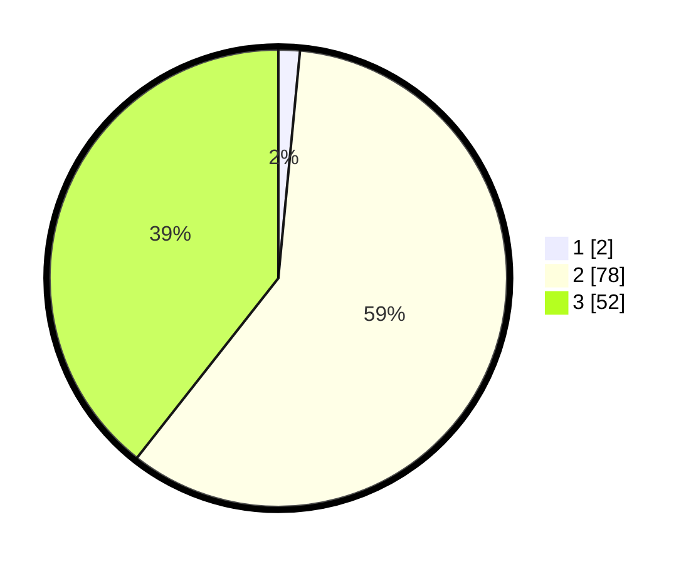

# Hasil

## Grafik

## Tabel

| No. | Nama Paslon    | Suara | Suara (raw) | Persentase |
|:--- |:-------------- | -----:| -----------:| ----------:|
| 1   | ANIES MUHAIMIN | 2     | [2][p-1]    | 1,52       |
| 2   | PRABOWO GIBRAN | 78    | [78][p-2]   | 59,09      |
| 3   | GANJAR MAHFUD  | 52    | [52][p-3]   | 39,39      |

[p-1]: https://github.com/gigit-pemilu/pemilu-2024/blob/main/pilpres/hitung-suara/sub/51-bali/sub/07-karangasem/sub/08-kubu/sub/2009-sukadana/sub/020-tps/sub/paslon-1.txt
[p-2]: https://github.com/gigit-pemilu/pemilu-2024/blob/main/pilpres/hitung-suara/sub/51-bali/sub/07-karangasem/sub/08-kubu/sub/2009-sukadana/sub/020-tps/sub/paslon-2.txt
[p-3]: https://github.com/gigit-pemilu/pemilu-2024/blob/main/pilpres/hitung-suara/sub/51-bali/sub/07-karangasem/sub/08-kubu/sub/2009-sukadana/sub/020-tps/sub/paslon-3.txt

## Foto C Plano

https://sirekap-obj-formc.kpu.go.id/8c33/pemilu/ppwp/51/07/08/20/09/5107082009020-20240214-231001--df361e72-7cea-4561-938f-7cdc6e965a91.jpg

https://sirekap-obj-formc.kpu.go.id/8c33/pemilu/ppwp/51/07/08/20/09/5107082009020-20240214-231151--e24fd154-6018-40ec-977d-ebf30d84d969.jpg

https://sirekap-obj-formc.kpu.go.id/8c33/pemilu/ppwp/51/07/08/20/09/5107082009020-20240214-231158--aed429fd-8724-430c-8320-43c7cb41e459.jpg

## Metadata

| Key        | Value               |
| ---------- | ------------------- |
| Time Stamp | 2024-02-16 09:30:28 |

