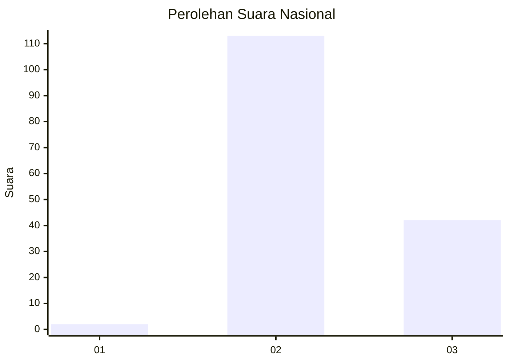
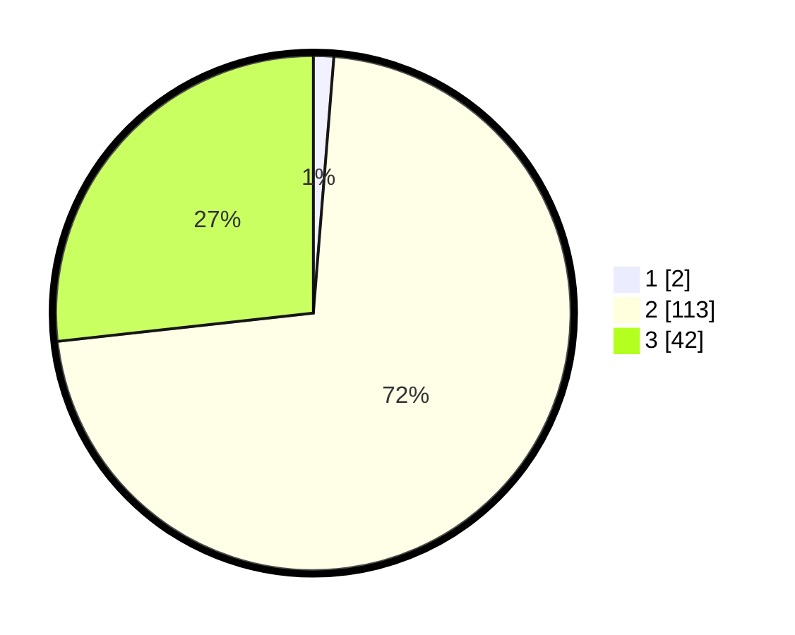

# Hasil

## Grafik

## Tabel

| No. | Nama Paslon    | Suara | Suara (raw) | Persentase |
|:--- |:-------------- | -----:| -----------:| ----------:|
| 1   | ANIES MUHAIMIN | 2     | [2][p-1]    | 1,27       |
| 2   | PRABOWO GIBRAN | 113   | [113][p-2]  | 71,97      |
| 3   | GANJAR MAHFUD  | 42    | [42][p-3]   | 26,75      |

[p-1]: https://github.com/gigit-pemilu/pemilu-2024/blob/main/pilpres/hitung-suara/sub/51-bali/sub/07-karangasem/sub/08-kubu/sub/2009-sukadana/sub/021-tps/sub/paslon-1.txt
[p-2]: https://github.com/gigit-pemilu/pemilu-2024/blob/main/pilpres/hitung-suara/sub/51-bali/sub/07-karangasem/sub/08-kubu/sub/2009-sukadana/sub/021-tps/sub/paslon-2.txt
[p-3]: https://github.com/gigit-pemilu/pemilu-2024/blob/main/pilpres/hitung-suara/sub/51-bali/sub/07-karangasem/sub/08-kubu/sub/2009-sukadana/sub/021-tps/sub/paslon-3.txt

## Foto C Plano

https://sirekap-obj-formc.kpu.go.id/1d1a/pemilu/ppwp/51/07/08/20/09/5107082009021-20240214-131951--4d8fff00-d8ab-4782-9e09-788fb80b1149.jpg

https://sirekap-obj-formc.kpu.go.id/1d1a/pemilu/ppwp/51/07/08/20/09/5107082009021-20240214-133046--c0bf48d2-8f53-4482-8e12-5cf98700ce4e.jpg

https://sirekap-obj-formc.kpu.go.id/1d1a/pemilu/ppwp/51/07/08/20/09/5107082009021-20240214-131356--21009803-7f0a-4fac-8721-337b1653d529.jpg

## Metadata

| Key        | Value               |
| ---------- | ------------------- |
| Time Stamp | 2024-02-26 17:00:04 |

