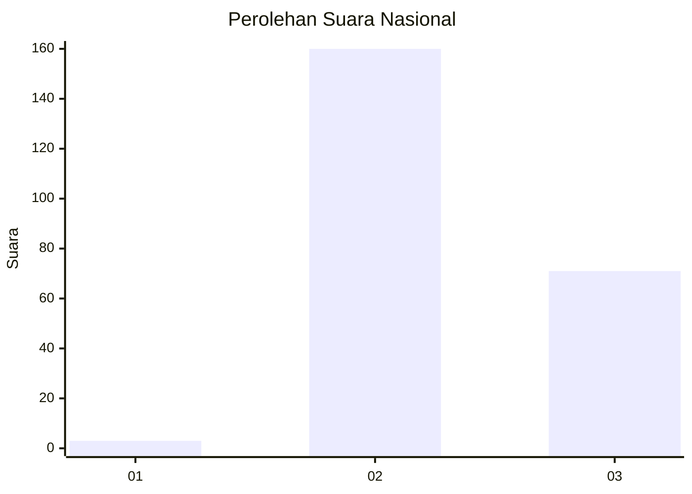

# Hasil

## Grafik

## Tabel

| No. | Nama Paslon    | Suara | Suara (raw) | Persentase |
|:--- |:-------------- | -----:| -----------:| ----------:|
| 1   | ANIES MUHAIMIN | 3     | [3][p-1]    | 1,28       |
| 2   | PRABOWO GIBRAN | 160   | [160][p-2]  | 68,38      |
| 3   | GANJAR MAHFUD  | 71    | [71][p-3]   | 30,34      |

[p-1]: https://github.com/gigit-pemilu/pemilu-2024/blob/main/pilpres/hitung-suara/sub/51-bali/sub/08-buleleng/sub/01-gerokgak/sub/2001-sumberklampok/sub/002-tps/sub/paslon-1.txt
[p-2]: https://github.com/gigit-pemilu/pemilu-2024/blob/main/pilpres/hitung-suara/sub/51-bali/sub/08-buleleng/sub/01-gerokgak/sub/2001-sumberklampok/sub/002-tps/sub/paslon-2.txt
[p-3]: https://github.com/gigit-pemilu/pemilu-2024/blob/main/pilpres/hitung-suara/sub/51-bali/sub/08-buleleng/sub/01-gerokgak/sub/2001-sumberklampok/sub/002-tps/sub/paslon-3.txt

## Foto C Plano

https://sirekap-obj-formc.kpu.go.id/2476/pemilu/ppwp/51/08/01/20/01/5108012001002-20240215-024826--74c1717d-c794-45b4-8ec6-bfb5e7bc25af.jpg

https://sirekap-obj-formc.kpu.go.id/2476/pemilu/ppwp/51/08/01/20/01/5108012001002-20240215-025007--0baaaf80-23c8-4df6-bac6-c235e72041a5.jpg

## Metadata

| Key        | Value               |
| ---------- | ------------------- |
| Time Stamp | 2024-02-24 22:31:28 |

