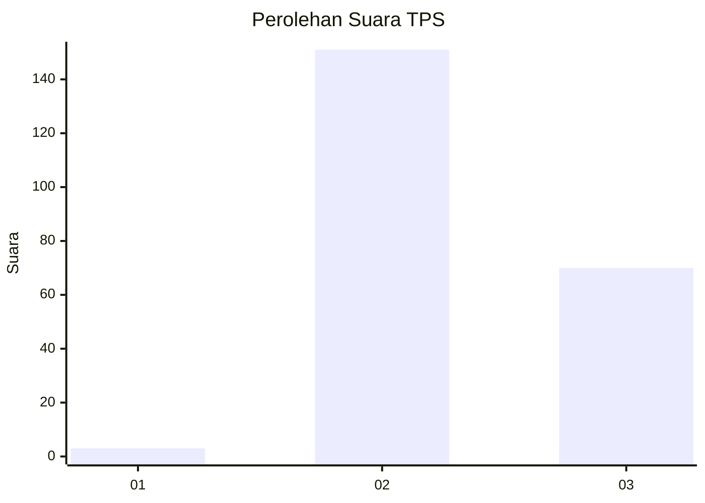
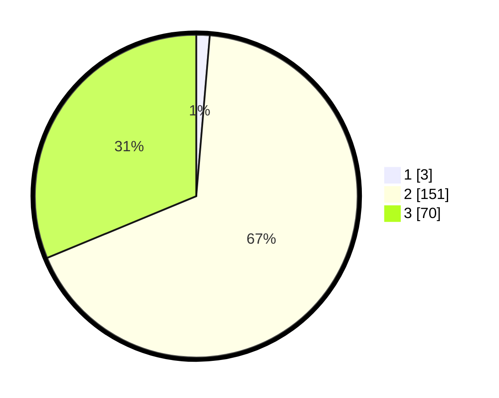

# Hasil

## Grafik

## Tabel

| No. | Nama Paslon    | Suara | Suara (raw) | Persentase |
|:--- |:-------------- | -----:| -----------:| ----------:|
| 1   | ANIES MUHAIMIN | 3     | [3][p-1]    | 1,34       |
| 2   | PRABOWO GIBRAN | 151   | [151][p-2]  | 67,41      |
| 3   | GANJAR MAHFUD  | 70    | [70][p-3]   | 31,25      |

[p-1]: https://github.com/gigit-pemilu/pemilu-2024-51-bali/blob/main/pilpres/hitung-suara/sub/51-bali/sub/08-buleleng/sub/01-gerokgak/sub/2001-sumberklampok/sub/003-tps/sub/paslon-1.txt
[p-2]: https://github.com/gigit-pemilu/pemilu-2024-51-bali/blob/main/pilpres/hitung-suara/sub/51-bali/sub/08-buleleng/sub/01-gerokgak/sub/2001-sumberklampok/sub/003-tps/sub/paslon-2.txt
[p-3]: https://github.com/gigit-pemilu/pemilu-2024-51-bali/blob/main/pilpres/hitung-suara/sub/51-bali/sub/08-buleleng/sub/01-gerokgak/sub/2001-sumberklampok/sub/003-tps/sub/paslon-3.txt

## Foto C Plano

https://sirekap-obj-formc.kpu.go.id/a2fb/pemilu/ppwp/51/08/01/20/01/5108012001003-20240215-205618--1c7075a3-7b0a-4c7c-aa3f-f02d88f3eff6.jpg

https://sirekap-obj-formc.kpu.go.id/a2fb/pemilu/ppwp/51/08/01/20/01/5108012001003-20240215-205620--d62c4ab0-6b19-4192-a790-7e2951cbdb18.jpg

https://sirekap-obj-formc.kpu.go.id/a2fb/pemilu/ppwp/51/08/01/20/01/5108012001003-20240215-205619--46162631-fdaf-4a75-aae9-584c70a40028.jpg

## Metadata

| Key        | Value               |
| ---------- | ------------------- |
| Time Stamp | 2024-02-16 16:25:10 |

## DATA PEMILIH TETAP

Jumlah pemilih dalam DPT: **286**.
 * L: **135**.
 * P: **151**.

## DATA PENGGUNA HAK PILIH

Jumlah pengguna hak pilih dalam DPT: **230**.
 * L: **111**.
 * P: **119**.

Jumlah pengguna hak pilih dalam DPTb: **0**.
 * L: **0**.
 * P: **0**.

Jumlah pengguna hak pilih dalam DPK: **5**.
 * L: **1**.
 * P: **4**.

Jumlah pengguna hak pilih: **235**.
 * L: **112**.
 * P: **123**.

## JUMLAH SUARA SAH DAN TIDAK SAH

JUMLAH SELURUH SUARA SAH: **224**.

JUMLAH SUARA TIDAK SAH: **11**.

JUMLAH SELURUH SUARA SAH DAN SUARA TIDAK SAH: **235**.

