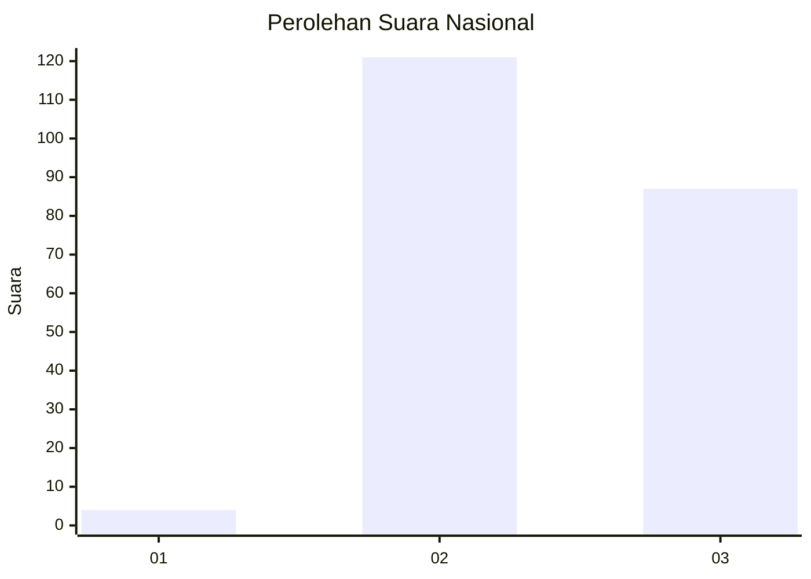
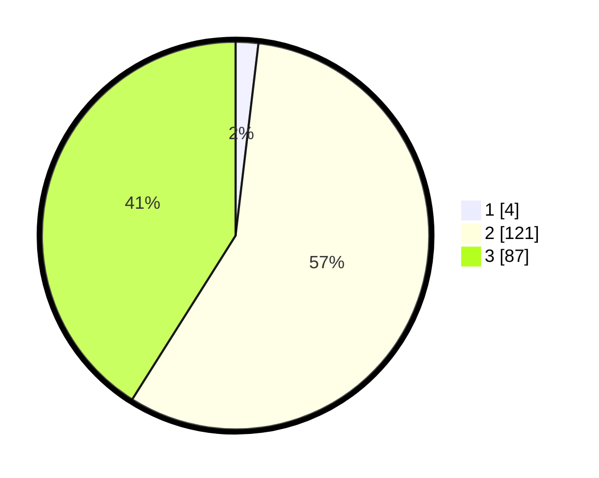

# Hasil

## Grafik

## Tabel

| No. | Nama Paslon    | Suara | Suara (raw) | Persentase |
|:--- |:-------------- | -----:| -----------:| ----------:|
| 1   | ANIES MUHAIMIN | 4     | [4][p-1]    | 1,89       |
| 2   | PRABOWO GIBRAN | 121   | [121][p-2]  | 57,08      |
| 3   | GANJAR MAHFUD  | 87    | [87][p-3]   | 41,04      |

[p-1]: https://github.com/gigit-pemilu/pemilu-2024/blob/main/pilpres/hitung-suara/sub/51-bali/sub/08-buleleng/sub/01-gerokgak/sub/2001-sumberklampok/sub/004-tps/sub/paslon-1.txt
[p-2]: https://github.com/gigit-pemilu/pemilu-2024/blob/main/pilpres/hitung-suara/sub/51-bali/sub/08-buleleng/sub/01-gerokgak/sub/2001-sumberklampok/sub/004-tps/sub/paslon-2.txt
[p-3]: https://github.com/gigit-pemilu/pemilu-2024/blob/main/pilpres/hitung-suara/sub/51-bali/sub/08-buleleng/sub/01-gerokgak/sub/2001-sumberklampok/sub/004-tps/sub/paslon-3.txt

## Foto C Plano

https://sirekap-obj-formc.kpu.go.id/7c78/pemilu/ppwp/51/08/01/20/01/5108012001004-20240215-105856--54773cd5-b10a-486c-8df2-15da74103fae.jpg

https://sirekap-obj-formc.kpu.go.id/7c78/pemilu/ppwp/51/08/01/20/01/5108012001004-20240215-105925--c2528bd0-edce-45d9-83db-26934d283c2b.jpg

https://sirekap-obj-formc.kpu.go.id/7c78/pemilu/ppwp/51/08/01/20/01/5108012001004-20240215-105907--38aefd5d-9454-4ae8-9468-b1ca611e62d0.jpg

## Metadata

| Key        | Value               |
| ---------- | ------------------- |
| Time Stamp | 2024-02-15 19:00:26 |

## DATA PEMILIH TETAP

Jumlah pemilih dalam DPT: **286**.
 * L: **145**.
 * P: **141**.

## DATA PENGGUNA HAK PILIH

Jumlah pengguna hak pilih dalam DPT: **213**.
 * L: **113**.
 * P: **100**.

Jumlah pengguna hak pilih dalam DPTb: **0**.
 * L: **0**.
 * P: **0**.

Jumlah pengguna hak pilih dalam DPK: **1**.
 * L: **1**.
 * P: **0**.

Jumlah pengguna hak pilih: **214**.
 * L: **114**.
 * P: **100**.

## JUMLAH SUARA SAH DAN TIDAK SAH

JUMLAH SELURUH SUARA SAH: **212**.

JUMLAH SUARA TIDAK SAH: **2**.

JUMLAH SELURUH SUARA SAH DAN SUARA TIDAK SAH: **214**.

