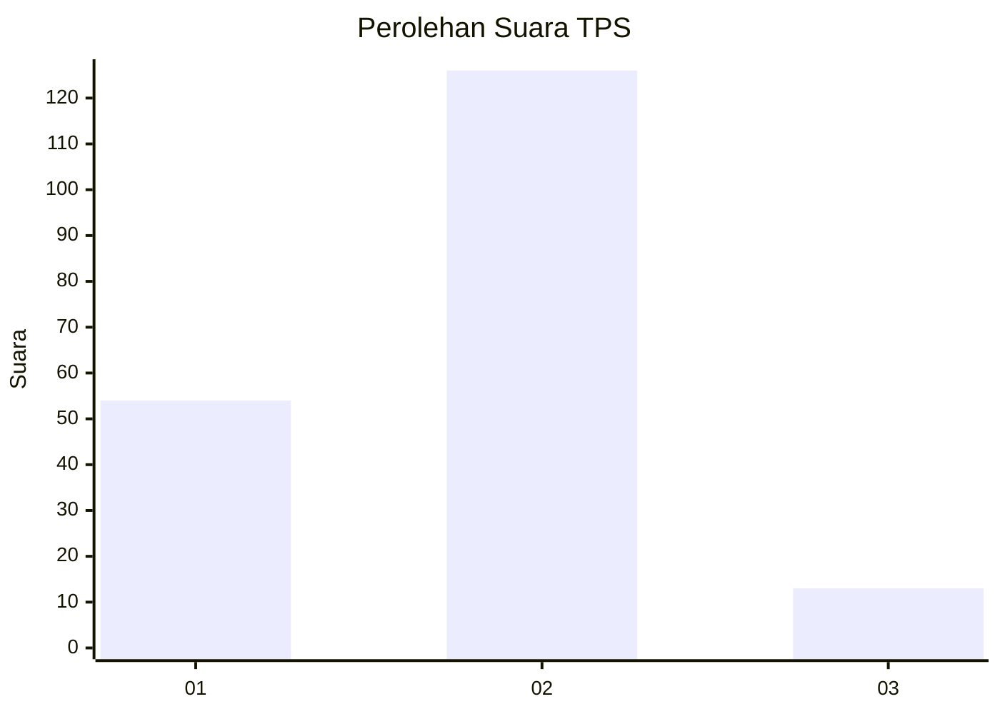
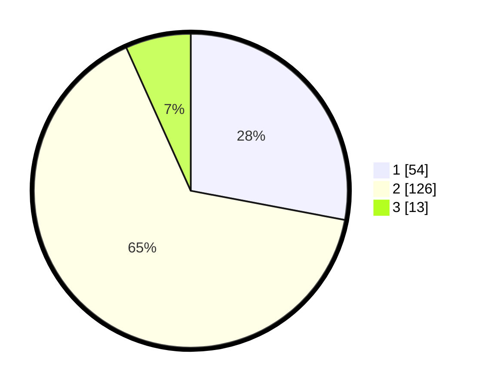

# Hasil

## Grafik

## Tabel

| No. | Nama Paslon    | Suara | Suara (raw) | Persentase |
|:--- |:-------------- | -----:| -----------:| ----------:|
| 1   | ANIES MUHAIMIN | 54    | [54][p-1]   | 27,98      |
| 2   | PRABOWO GIBRAN | 126   | [126][p-2]  | 65,28      |
| 3   | GANJAR MAHFUD  | 13    | [13][p-3]   | 6,74       |

[p-1]: https://github.com/gigit-pemilu/pemilu-2024-51-bali/blob/main/pilpres/hitung-suara/sub/51-bali/sub/08-buleleng/sub/01-gerokgak/sub/2001-sumberklampok/sub/010-tps/sub/paslon-1.txt
[p-2]: https://github.com/gigit-pemilu/pemilu-2024-51-bali/blob/main/pilpres/hitung-suara/sub/51-bali/sub/08-buleleng/sub/01-gerokgak/sub/2001-sumberklampok/sub/010-tps/sub/paslon-2.txt
[p-3]: https://github.com/gigit-pemilu/pemilu-2024-51-bali/blob/main/pilpres/hitung-suara/sub/51-bali/sub/08-buleleng/sub/01-gerokgak/sub/2001-sumberklampok/sub/010-tps/sub/paslon-3.txt

## Foto C Plano

https://sirekap-obj-formc.kpu.go.id/cd3c/pemilu/ppwp/51/08/01/20/01/5108012001010-20240214-131809--3e1f6586-805c-4efe-8654-83fb581b2505.jpg

https://sirekap-obj-formc.kpu.go.id/cd3c/pemilu/ppwp/51/08/01/20/01/5108012001010-20240214-132111--242207be-adbb-453c-8e3a-7ee71869a421.jpg

https://sirekap-obj-formc.kpu.go.id/cd3c/pemilu/ppwp/51/08/01/20/01/5108012001010-20240214-132230--d764e38c-6ba4-45b4-a789-c3177cb41b27.jpg

## Metadata

| Key        | Value               |
| ---------- | ------------------- |
| Time Stamp | 2024-02-14 21:46:01 |

## DATA PEMILIH TETAP

Jumlah pemilih dalam DPT: **238**.
 * L: **117**.
 * P: **121**.

## DATA PENGGUNA HAK PILIH

Jumlah pengguna hak pilih dalam DPT: **192**.
 * L: **93**.
 * P: **99**.

Jumlah pengguna hak pilih dalam DPTb: **0**.
 * L: **0**.
 * P: **0**.

Jumlah pengguna hak pilih dalam DPK: **2**.
 * L: **1**.
 * P: **1**.

Jumlah pengguna hak pilih: **194**.
 * L: **94**.
 * P: **100**.

## JUMLAH SUARA SAH DAN TIDAK SAH

JUMLAH SELURUH SUARA SAH: **193**.

JUMLAH SUARA TIDAK SAH: **1**.

JUMLAH SELURUH SUARA SAH DAN SUARA TIDAK SAH: **194**.

