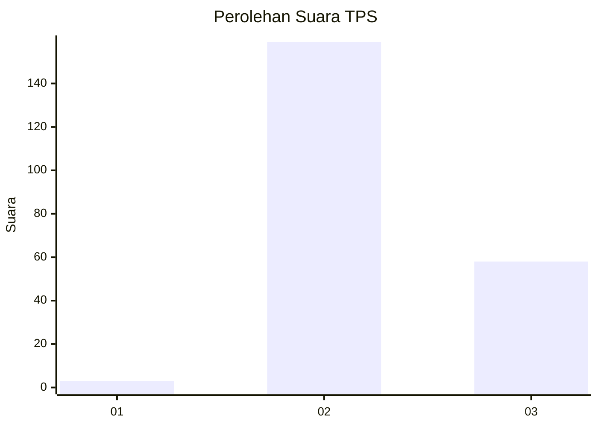
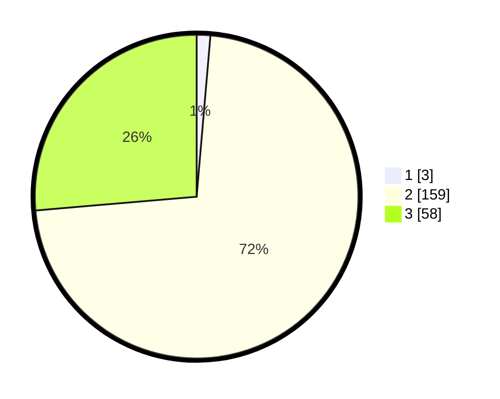

# Hasil

## Grafik

## Tabel

| No. | Nama Paslon    | Suara | Suara (raw) | Persentase |
|:--- |:-------------- | -----:| -----------:| ----------:|
| 1   | ANIES MUHAIMIN | 3     | [3][p-1]    | 1,36       |
| 2   | PRABOWO GIBRAN | 159   | [159][p-2]  | 72,27      |
| 3   | GANJAR MAHFUD  | 58    | [58][p-3]   | 26,36      |

[p-1]: https://github.com/gigit-pemilu/pemilu-2024-51-bali/blob/main/pilpres/hitung-suara/sub/51-bali/sub/08-buleleng/sub/01-gerokgak/sub/2002-pejarakan/sub/001-tps/sub/paslon-1.txt
[p-2]: https://github.com/gigit-pemilu/pemilu-2024-51-bali/blob/main/pilpres/hitung-suara/sub/51-bali/sub/08-buleleng/sub/01-gerokgak/sub/2002-pejarakan/sub/001-tps/sub/paslon-2.txt
[p-3]: https://github.com/gigit-pemilu/pemilu-2024-51-bali/blob/main/pilpres/hitung-suara/sub/51-bali/sub/08-buleleng/sub/01-gerokgak/sub/2002-pejarakan/sub/001-tps/sub/paslon-3.txt

## Foto C Plano

https://sirekap-obj-formc.kpu.go.id/6f95/pemilu/ppwp/51/08/01/20/02/5108012002001-20240214-131252--e1c6392d-98e6-4b4c-8f0d-ef039df3b3bc.jpg

https://sirekap-obj-formc.kpu.go.id/6f95/pemilu/ppwp/51/08/01/20/02/5108012002001-20240214-131418--46cc005f-ab55-4ecc-9ac1-16b1e66682a5.jpg

https://sirekap-obj-formc.kpu.go.id/6f95/pemilu/ppwp/51/08/01/20/02/5108012002001-20240214-131517--b3fe2c5c-0a11-478e-8e26-9cc035cdd099.jpg

## Metadata

| Key        | Value               |
| ---------- | ------------------- |
| Time Stamp | 2024-02-14 21:46:01 |

## DATA PEMILIH TETAP

Jumlah pemilih dalam DPT: **249**.
 * L: **125**.
 * P: **124**.

## DATA PENGGUNA HAK PILIH

Jumlah pengguna hak pilih dalam DPT: **225**.
 * L: **113**.
 * P: **112**.

Jumlah pengguna hak pilih dalam DPTb: **0**.
 * L: **0**.
 * P: **0**.

Jumlah pengguna hak pilih dalam DPK: **0**.
 * L: **0**.
 * P: **0**.

Jumlah pengguna hak pilih: **225**.
 * L: **113**.
 * P: **112**.

## JUMLAH SUARA SAH DAN TIDAK SAH

JUMLAH SELURUH SUARA SAH: **220**.

JUMLAH SUARA TIDAK SAH: **5**.

JUMLAH SELURUH SUARA SAH DAN SUARA TIDAK SAH: **225**.

