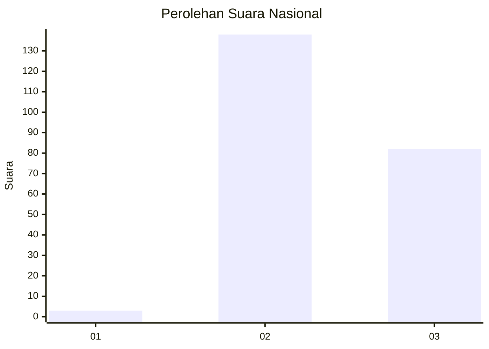
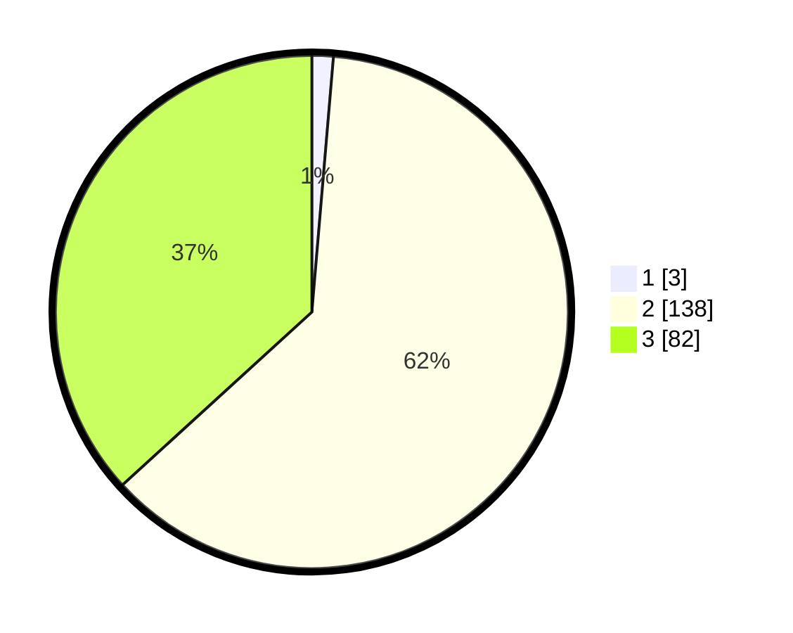

# Hasil

## Grafik

## Tabel

| No. | Nama Paslon    | Suara | Suara (raw) | Persentase |
|:--- |:-------------- | -----:| -----------:| ----------:|
| 1   | ANIES MUHAIMIN | 3     | [3][p-1]    | 1,35       |
| 2   | PRABOWO GIBRAN | 138   | [138][p-2]  | 61,88      |
| 3   | GANJAR MAHFUD  | 82    | [82][p-3]   | 36,77      |

[p-1]: https://github.com/gigit-pemilu/pemilu-2024/blob/main/pilpres/hitung-suara/sub/51-bali/sub/08-buleleng/sub/01-gerokgak/sub/2002-pejarakan/sub/005-tps/sub/paslon-1.txt
[p-2]: https://github.com/gigit-pemilu/pemilu-2024/blob/main/pilpres/hitung-suara/sub/51-bali/sub/08-buleleng/sub/01-gerokgak/sub/2002-pejarakan/sub/005-tps/sub/paslon-2.txt
[p-3]: https://github.com/gigit-pemilu/pemilu-2024/blob/main/pilpres/hitung-suara/sub/51-bali/sub/08-buleleng/sub/01-gerokgak/sub/2002-pejarakan/sub/005-tps/sub/paslon-3.txt

## Foto C Plano

https://sirekap-obj-formc.kpu.go.id/4f4f/pemilu/ppwp/51/08/01/20/02/5108012002005-20240214-132114--6d2f795c-85a0-4065-8345-2577cae3ed36.jpg

https://sirekap-obj-formc.kpu.go.id/4f4f/pemilu/ppwp/51/08/01/20/02/5108012002005-20240214-131915--dd437503-5d18-4e2e-849f-6e0ccaef0d38.jpg

https://sirekap-obj-formc.kpu.go.id/4f4f/pemilu/ppwp/51/08/01/20/02/5108012002005-20240214-132840--f7c4eb17-3655-4de4-9745-47e132b6c48b.jpg

## Metadata

| Key        | Value               |
| ---------- | ------------------- |
| Time Stamp | 2024-02-14 21:46:01 |

