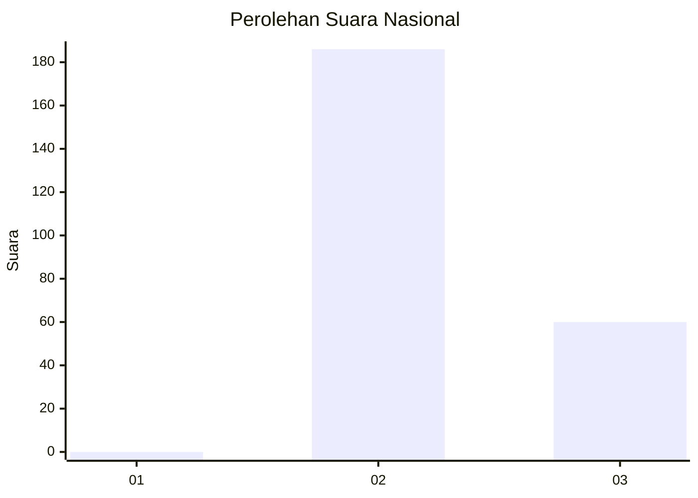
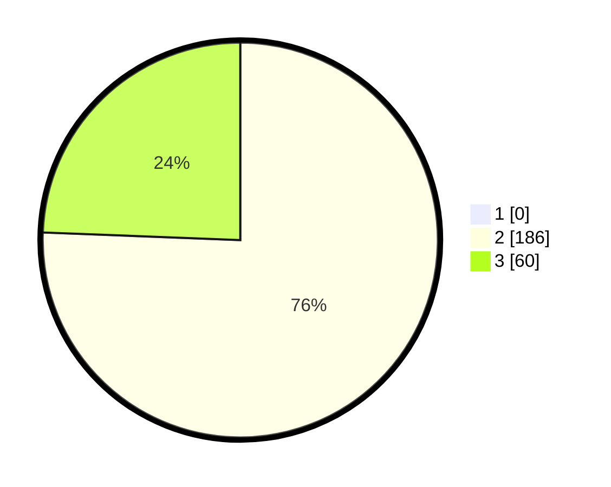

# Hasil

## Grafik

## Tabel

| No. | Nama Paslon    | Suara | Suara (raw) | Persentase |
|:--- |:-------------- | -----:| -----------:| ----------:|
| 1   | ANIES MUHAIMIN | 0     | [0][p-1]    | 0,00       |
| 2   | PRABOWO GIBRAN | 186   | [186][p-2]  | 75,61      |
| 3   | GANJAR MAHFUD  | 60    | [60][p-3]   | 24,39      |

[p-1]: https://github.com/gigit-pemilu/pemilu-2024/blob/main/pilpres/hitung-suara/sub/51-bali/sub/08-buleleng/sub/01-gerokgak/sub/2002-pejarakan/sub/013-tps/sub/paslon-1.txt
[p-2]: https://github.com/gigit-pemilu/pemilu-2024/blob/main/pilpres/hitung-suara/sub/51-bali/sub/08-buleleng/sub/01-gerokgak/sub/2002-pejarakan/sub/013-tps/sub/paslon-2.txt
[p-3]: https://github.com/gigit-pemilu/pemilu-2024/blob/main/pilpres/hitung-suara/sub/51-bali/sub/08-buleleng/sub/01-gerokgak/sub/2002-pejarakan/sub/013-tps/sub/paslon-3.txt

## Foto C Plano

https://sirekap-obj-formc.kpu.go.id/e83e/pemilu/ppwp/51/08/01/20/02/5108012002013-20240214-141600--dd9538f5-04f9-4821-873d-b7fd2c3e3788.jpg

https://sirekap-obj-formc.kpu.go.id/e83e/pemilu/ppwp/51/08/01/20/02/5108012002013-20240214-141922--7e4dae68-0371-4828-a7ed-c7b178292e61.jpg

https://sirekap-obj-formc.kpu.go.id/e83e/pemilu/ppwp/51/08/01/20/02/5108012002013-20240214-141450--cb078865-2687-48d3-9fe4-2afa1df829cf.jpg

## Metadata

| Key        | Value               |
| ---------- | ------------------- |
| Time Stamp | 2024-02-24 22:31:28 |

