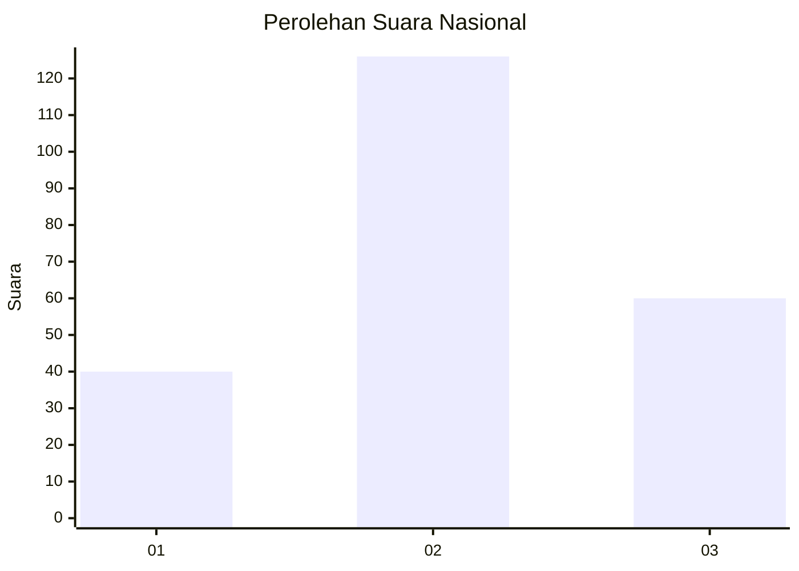
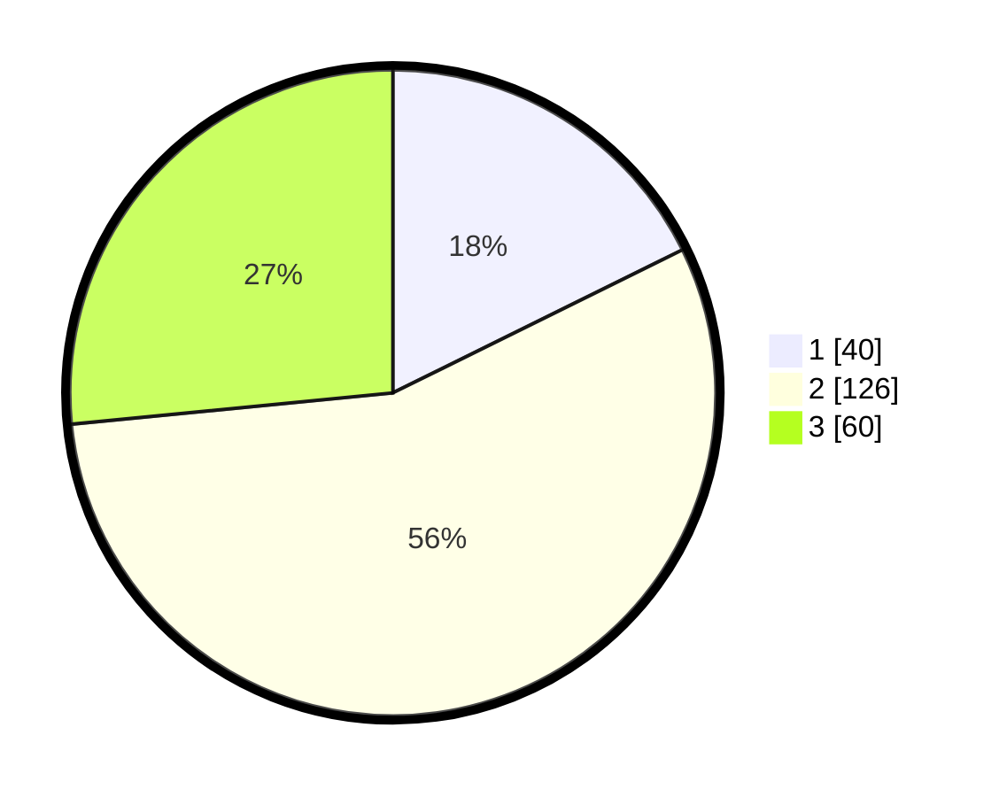

# Hasil

## Grafik

## Tabel

| No. | Nama Paslon    | Suara | Suara (raw) | Persentase |
|:--- |:-------------- | -----:| -----------:| ----------:|
| 1   | ANIES MUHAIMIN | 40    | [40][p-1]   | 17,70      |
| 2   | PRABOWO GIBRAN | 126   | [126][p-2]  | 55,75      |
| 3   | GANJAR MAHFUD  | 60    | [60][p-3]   | 26,55      |

[p-1]: https://github.com/gigit-pemilu/pemilu-2024/blob/main/pilpres/hitung-suara/sub/51-bali/sub/08-buleleng/sub/01-gerokgak/sub/2002-pejarakan/sub/025-tps/sub/paslon-1.txt
[p-2]: https://github.com/gigit-pemilu/pemilu-2024/blob/main/pilpres/hitung-suara/sub/51-bali/sub/08-buleleng/sub/01-gerokgak/sub/2002-pejarakan/sub/025-tps/sub/paslon-2.txt
[p-3]: https://github.com/gigit-pemilu/pemilu-2024/blob/main/pilpres/hitung-suara/sub/51-bali/sub/08-buleleng/sub/01-gerokgak/sub/2002-pejarakan/sub/025-tps/sub/paslon-3.txt

## Foto C Plano

https://sirekap-obj-formc.kpu.go.id/1ae8/pemilu/ppwp/51/08/01/20/02/5108012002025-20240214-223024--499781ab-1193-4b64-8c37-d7274c7dc985.jpg

https://sirekap-obj-formc.kpu.go.id/1ae8/pemilu/ppwp/51/08/01/20/02/5108012002025-20240214-223121--c19b46ee-af9e-4fc1-bcdf-6c226564436d.jpg

https://sirekap-obj-formc.kpu.go.id/1ae8/pemilu/ppwp/51/08/01/20/02/5108012002025-20240214-223223--2474663e-72a5-4f44-bbb9-c5981daba5f9.jpg

## Metadata

| Key        | Value               |
| ---------- | ------------------- |
| Time Stamp | 2024-02-24 22:31:28 |

