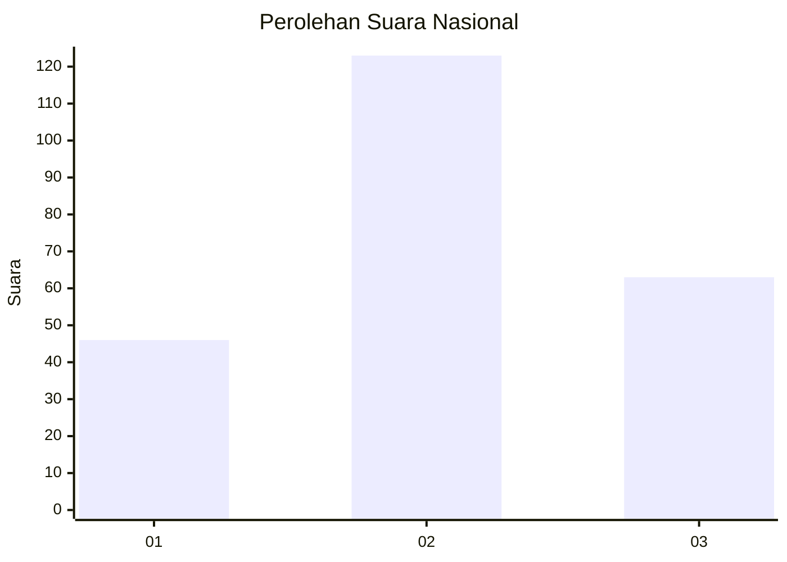
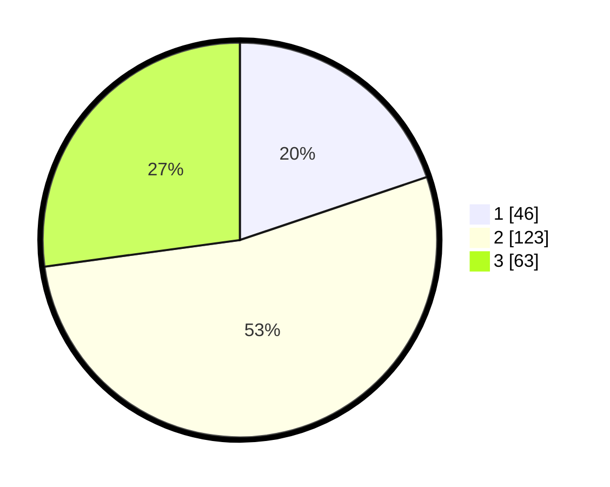

# Hasil

## Grafik

## Tabel

| No. | Nama Paslon    | Suara | Suara (raw) | Persentase |
|:--- |:-------------- | -----:| -----------:| ----------:|
| 1   | ANIES MUHAIMIN | 46    | [46][p-1]   | 19,83      |
| 2   | PRABOWO GIBRAN | 123   | [123][p-2]  | 53,02      |
| 3   | GANJAR MAHFUD  | 63    | [63][p-3]   | 27,16      |

[p-1]: https://github.com/gigit-pemilu/pemilu-2024/blob/main/pilpres/hitung-suara/sub/51-bali/sub/08-buleleng/sub/01-gerokgak/sub/2002-pejarakan/sub/029-tps/sub/paslon-1.txt
[p-2]: https://github.com/gigit-pemilu/pemilu-2024/blob/main/pilpres/hitung-suara/sub/51-bali/sub/08-buleleng/sub/01-gerokgak/sub/2002-pejarakan/sub/029-tps/sub/paslon-2.txt
[p-3]: https://github.com/gigit-pemilu/pemilu-2024/blob/main/pilpres/hitung-suara/sub/51-bali/sub/08-buleleng/sub/01-gerokgak/sub/2002-pejarakan/sub/029-tps/sub/paslon-3.txt

## Foto C Plano

https://sirekap-obj-formc.kpu.go.id/3c37/pemilu/ppwp/51/08/01/20/02/5108012002029-20240214-141440--c6d48135-e8d4-4503-9cb0-6157c3a41db3.jpg

https://sirekap-obj-formc.kpu.go.id/3c37/pemilu/ppwp/51/08/01/20/02/5108012002029-20240214-141338--70ea7602-dd74-4ac5-9d95-7ba30d354adb.jpg

https://sirekap-obj-formc.kpu.go.id/3c37/pemilu/ppwp/51/08/01/20/02/5108012002029-20240214-141115--75b4e7af-d9d2-40e2-b19f-0f9cdf5e2e2d.jpg

## Metadata

| Key        | Value               |
| ---------- | ------------------- |
| Time Stamp | 2024-02-24 22:31:28 |

