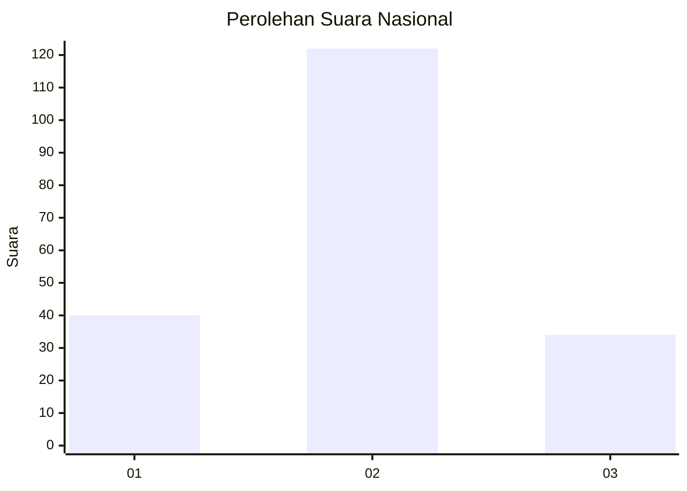

# Hasil

## Grafik

## Tabel

| No. | Nama Paslon    | Suara | Suara (raw) | Persentase |
|:--- |:-------------- | -----:| -----------:| ----------:|
| 1   | ANIES MUHAIMIN | 40    | [40][p-1]   | 20,41      |
| 2   | PRABOWO GIBRAN | 122   | [122][p-2]  | 62,24      |
| 3   | GANJAR MAHFUD  | 34    | [34][p-3]   | 17,35      |

[p-1]: https://github.com/gigit-pemilu/pemilu-2024/blob/main/pilpres/hitung-suara/sub/51-bali/sub/08-buleleng/sub/01-gerokgak/sub/2003-sumberkima/sub/001-tps/sub/paslon-1.txt
[p-2]: https://github.com/gigit-pemilu/pemilu-2024/blob/main/pilpres/hitung-suara/sub/51-bali/sub/08-buleleng/sub/01-gerokgak/sub/2003-sumberkima/sub/001-tps/sub/paslon-2.txt
[p-3]: https://github.com/gigit-pemilu/pemilu-2024/blob/main/pilpres/hitung-suara/sub/51-bali/sub/08-buleleng/sub/01-gerokgak/sub/2003-sumberkima/sub/001-tps/sub/paslon-3.txt

## Foto C Plano

https://sirekap-obj-formc.kpu.go.id/6f2d/pemilu/ppwp/51/08/01/20/03/5108012003001-20240215-235653--4ecb1940-314a-445c-ad7a-e5686760a1c3.jpg

https://sirekap-obj-formc.kpu.go.id/6f2d/pemilu/ppwp/51/08/01/20/03/5108012003001-20240215-235658--7e3d632a-3b31-4ca8-b597-2b49a8b261e6.jpg

https://sirekap-obj-formc.kpu.go.id/6f2d/pemilu/ppwp/51/08/01/20/03/5108012003001-20240215-235655--88b423c9-5a90-44cb-b1d7-a368bd53ade8.jpg

## Metadata

| Key        | Value               |
| ---------- | ------------------- |
| Time Stamp | 2024-02-16 16:25:10 |

## DATA PEMILIH TETAP

Jumlah pemilih dalam DPT: **280**.
 * L: **139**.
 * P: **141**.

## DATA PENGGUNA HAK PILIH

Jumlah pengguna hak pilih dalam DPT: **194**.
 * L: **95**.
 * P: **99**.

Jumlah pengguna hak pilih dalam DPTb: **1**.
 * L: **0**.
 * P: **1**.

Jumlah pengguna hak pilih dalam DPK: **4**.
 * L: **1**.
 * P: **3**.

Jumlah pengguna hak pilih: **199**.
 * L: **96**.
 * P: **103**.

## JUMLAH SUARA SAH DAN TIDAK SAH

JUMLAH SELURUH SUARA SAH: **196**.

JUMLAH SUARA TIDAK SAH: **3**.

JUMLAH SELURUH SUARA SAH DAN SUARA TIDAK SAH: **199**.

