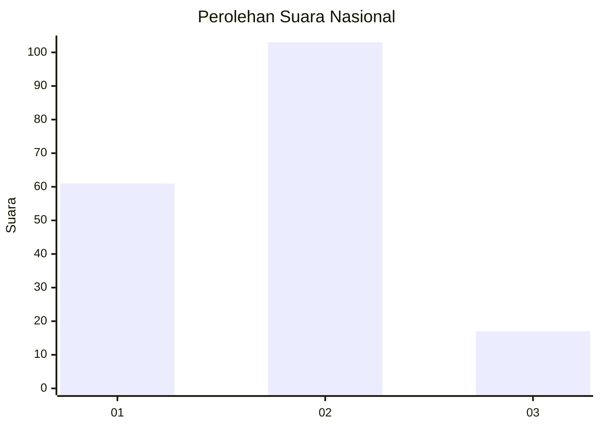
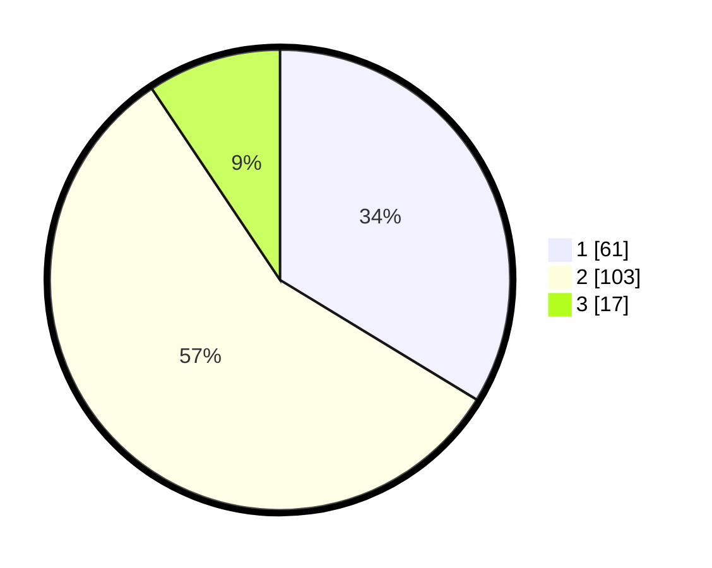

# Hasil

## Grafik

## Tabel

| No. | Nama Paslon    | Suara | Suara (raw) | Persentase |
|:--- |:-------------- | -----:| -----------:| ----------:|
| 1   | ANIES MUHAIMIN | 61    | [61][p-1]   | 33,70      |
| 2   | PRABOWO GIBRAN | 103   | [103][p-2]  | 56,91      |
| 3   | GANJAR MAHFUD  | 17    | [17][p-3]   | 9,39       |

[p-1]: https://github.com/gigit-pemilu/pemilu-2024/blob/main/pilpres/hitung-suara/sub/51-bali/sub/08-buleleng/sub/01-gerokgak/sub/2003-sumberkima/sub/002-tps/sub/paslon-1.txt
[p-2]: https://github.com/gigit-pemilu/pemilu-2024/blob/main/pilpres/hitung-suara/sub/51-bali/sub/08-buleleng/sub/01-gerokgak/sub/2003-sumberkima/sub/002-tps/sub/paslon-2.txt
[p-3]: https://github.com/gigit-pemilu/pemilu-2024/blob/main/pilpres/hitung-suara/sub/51-bali/sub/08-buleleng/sub/01-gerokgak/sub/2003-sumberkima/sub/002-tps/sub/paslon-3.txt

## Foto C Plano

https://sirekap-obj-formc.kpu.go.id/2457/pemilu/ppwp/51/08/01/20/03/5108012003002-20240214-195332--706e41c4-d681-4faa-83b6-44fa9bc11c9f.jpg

https://sirekap-obj-formc.kpu.go.id/2457/pemilu/ppwp/51/08/01/20/03/5108012003002-20240214-232248--1723b14b-daa8-4588-8487-2481f9f7d1da.jpg

https://sirekap-obj-formc.kpu.go.id/2457/pemilu/ppwp/51/08/01/20/03/5108012003002-20240214-201054--6fdceb2d-a641-4405-a502-1df3803e6a1e.jpg

## Metadata

| Key        | Value               |
| ---------- | ------------------- |
| Time Stamp | 2024-02-24 22:31:28 |

## DATA PEMILIH TETAP

Jumlah pemilih dalam DPT: **264**.
 * L: **138**.
 * P: **126**.

## DATA PENGGUNA HAK PILIH

Jumlah pengguna hak pilih dalam DPT: **178**.
 * L: **91**.
 * P: **87**.

Jumlah pengguna hak pilih dalam DPTb: **2**.
 * L: **0**.
 * P: **2**.

Jumlah pengguna hak pilih dalam DPK: **6**.
 * L: **3**.
 * P: **3**.

Jumlah pengguna hak pilih: **186**.
 * L: **94**.
 * P: **92**.

## JUMLAH SUARA SAH DAN TIDAK SAH

JUMLAH SELURUH SUARA SAH: **181**.

JUMLAH SUARA TIDAK SAH: **5**.

JUMLAH SELURUH SUARA SAH DAN SUARA TIDAK SAH: **186**.

