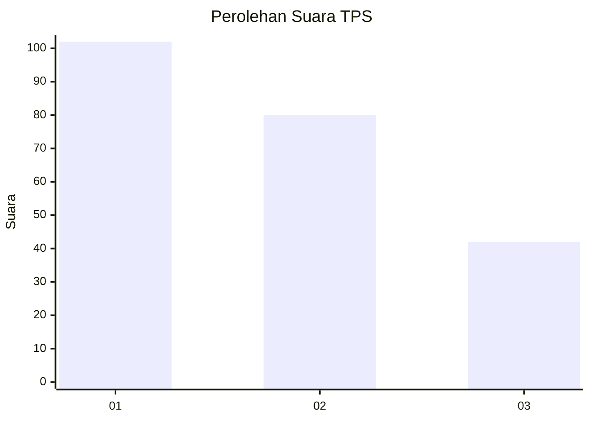
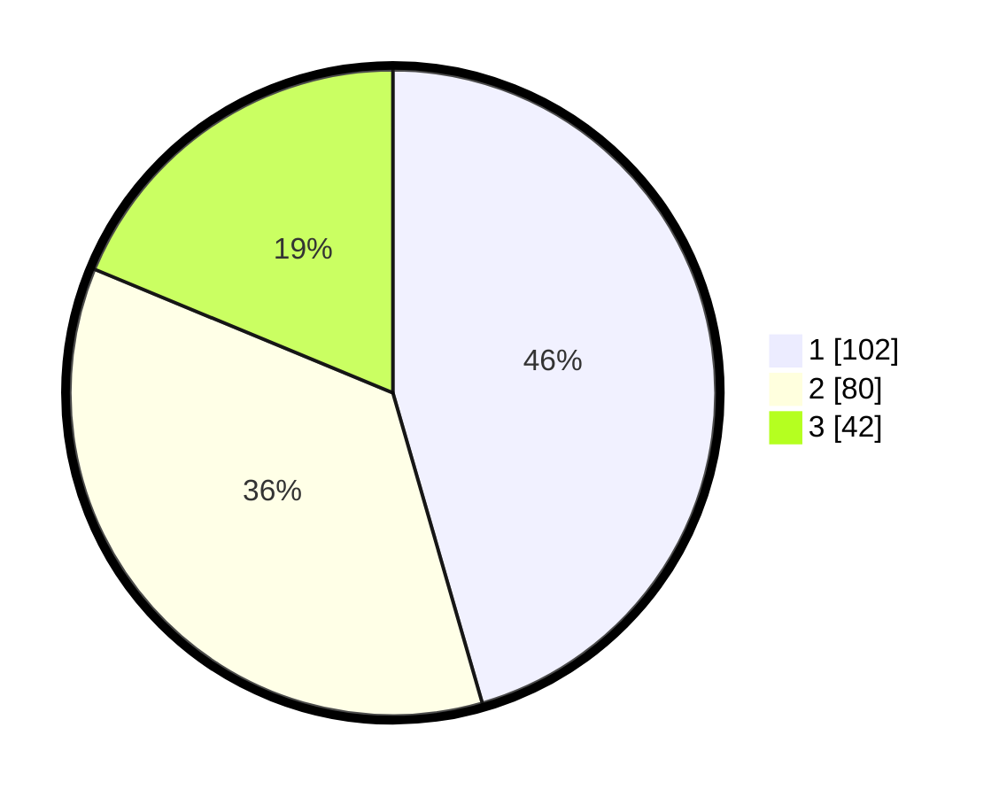

# Hasil

## Grafik

## Tabel

| No. | Nama Paslon    | Suara | Suara (raw) | Persentase |
|:--- |:-------------- | -----:| -----------:| ----------:|
| 1   | ANIES MUHAIMIN | 102   | [102][p-1]  | 45,54      |
| 2   | PRABOWO GIBRAN | 80    | [80][p-2]   | 35,71      |
| 3   | GANJAR MAHFUD  | 42    | [42][p-3]   | 18,75      |

[p-1]: https://github.com/gigit-pemilu/pemilu-2024-51-bali/blob/main/pilpres/hitung-suara/sub/51-bali/sub/08-buleleng/sub/01-gerokgak/sub/2003-sumberkima/sub/003-tps/sub/paslon-1.txt
[p-2]: https://github.com/gigit-pemilu/pemilu-2024-51-bali/blob/main/pilpres/hitung-suara/sub/51-bali/sub/08-buleleng/sub/01-gerokgak/sub/2003-sumberkima/sub/003-tps/sub/paslon-2.txt
[p-3]: https://github.com/gigit-pemilu/pemilu-2024-51-bali/blob/main/pilpres/hitung-suara/sub/51-bali/sub/08-buleleng/sub/01-gerokgak/sub/2003-sumberkima/sub/003-tps/sub/paslon-3.txt

## Foto C Plano

https://sirekap-obj-formc.kpu.go.id/6009/pemilu/ppwp/51/08/01/20/03/5108012003003-20240214-214903--c07cd976-781e-42f5-ae60-8d33a1ab5046.jpg

https://sirekap-obj-formc.kpu.go.id/6009/pemilu/ppwp/51/08/01/20/03/5108012003003-20240214-215036--1e0d1120-29f5-42c0-97aa-a95965ed4729.jpg

https://sirekap-obj-formc.kpu.go.id/6009/pemilu/ppwp/51/08/01/20/03/5108012003003-20240214-214951--a8e58f58-04ea-40e7-8646-52929a7c8a78.jpg

## Metadata

| Key        | Value               |
| ---------- | ------------------- |
| Time Stamp | 2024-02-24 22:31:28 |

