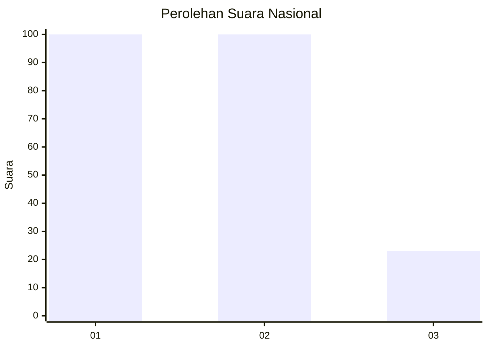
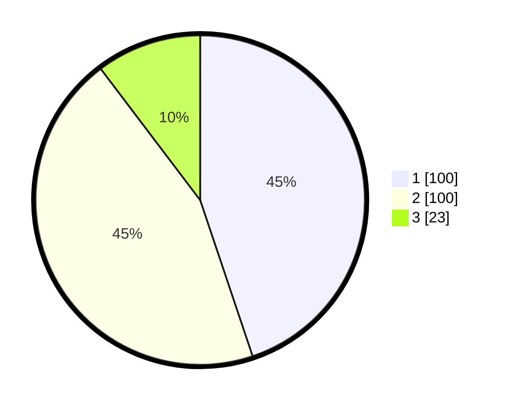

# Hasil

## Grafik

## Tabel

| No. | Nama Paslon    | Suara | Suara (raw) | Persentase |
|:--- |:-------------- | -----:| -----------:| ----------:|
| 1   | ANIES MUHAIMIN | 100   | [100][p-1]  | 44,84      |
| 2   | PRABOWO GIBRAN | 100   | [100][p-2]  | 44,84      |
| 3   | GANJAR MAHFUD  | 23    | [23][p-3]   | 10,31      |

[p-1]: https://github.com/gigit-pemilu/pemilu-2024/blob/main/pilpres/hitung-suara/sub/51-bali/sub/08-buleleng/sub/01-gerokgak/sub/2003-sumberkima/sub/004-tps/sub/paslon-1.txt
[p-2]: https://github.com/gigit-pemilu/pemilu-2024/blob/main/pilpres/hitung-suara/sub/51-bali/sub/08-buleleng/sub/01-gerokgak/sub/2003-sumberkima/sub/004-tps/sub/paslon-2.txt
[p-3]: https://github.com/gigit-pemilu/pemilu-2024/blob/main/pilpres/hitung-suara/sub/51-bali/sub/08-buleleng/sub/01-gerokgak/sub/2003-sumberkima/sub/004-tps/sub/paslon-3.txt

## Foto C Plano

https://sirekap-obj-formc.kpu.go.id/2f92/pemilu/ppwp/51/08/01/20/03/5108012003004-20240216-084822--52115361-da3d-4b88-803e-b8a8876a9ed4.jpg

https://sirekap-obj-formc.kpu.go.id/2f92/pemilu/ppwp/51/08/01/20/03/5108012003004-20240216-084824--3769927d-b9b2-4761-af24-cc3bc63ea679.jpg

https://sirekap-obj-formc.kpu.go.id/2f92/pemilu/ppwp/51/08/01/20/03/5108012003004-20240216-084823--0107ee1e-f525-412e-89eb-2e07a009ac03.jpg

## Metadata

| Key        | Value               |
| ---------- | ------------------- |
| Time Stamp | 2024-02-16 16:25:10 |

## DATA PEMILIH TETAP

Jumlah pemilih dalam DPT: **286**.
 * L: **141**.
 * P: **145**.

## DATA PENGGUNA HAK PILIH

Jumlah pengguna hak pilih dalam DPT: **228**.
 * L: **110**.
 * P: **118**.

Jumlah pengguna hak pilih dalam DPTb: **0**.
 * L: **0**.
 * P: **0**.

Jumlah pengguna hak pilih dalam DPK: **0**.
 * L: **0**.
 * P: **0**.

Jumlah pengguna hak pilih: **228**.
 * L: **110**.
 * P: **118**.

## JUMLAH SUARA SAH DAN TIDAK SAH

JUMLAH SELURUH SUARA SAH: **223**.

JUMLAH SUARA TIDAK SAH: **5**.

JUMLAH SELURUH SUARA SAH DAN SUARA TIDAK SAH: **228**.

