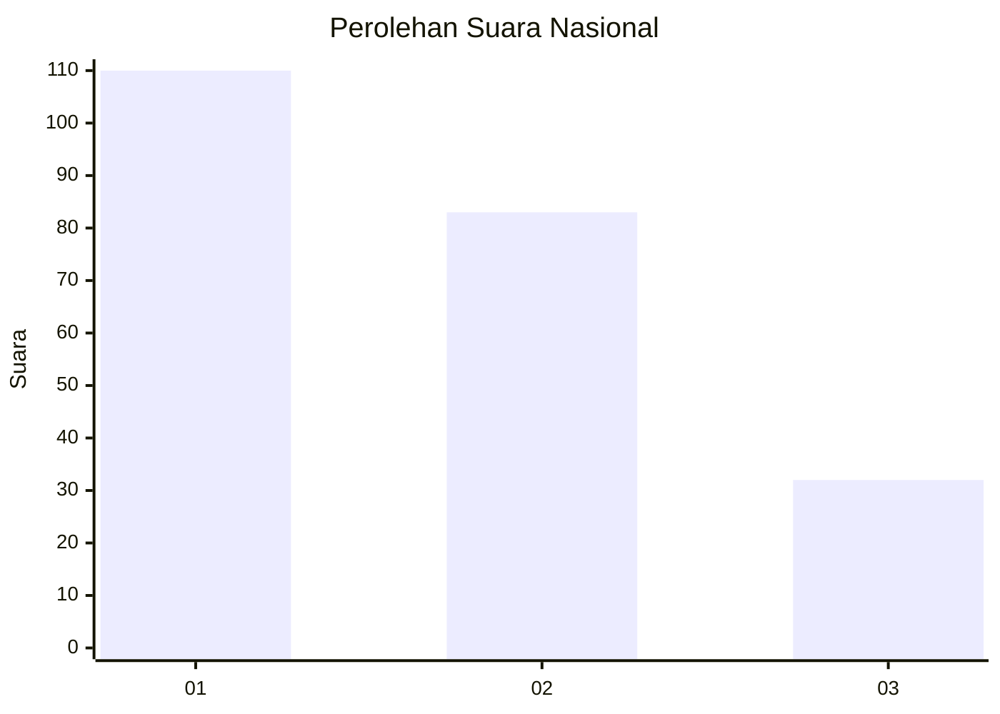
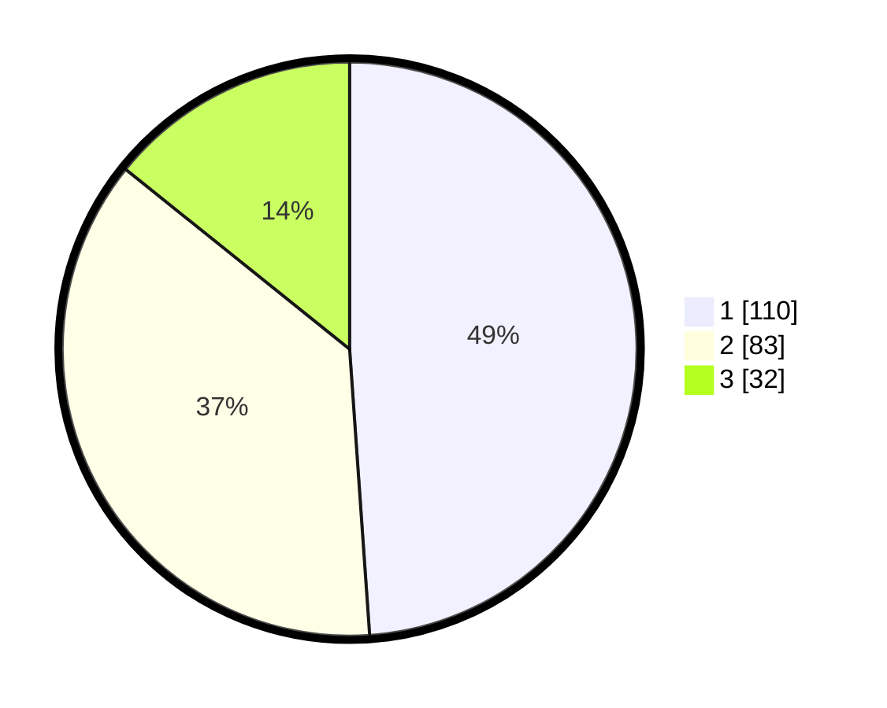

# Hasil

## Grafik

## Tabel

| No. | Nama Paslon    | Suara | Suara (raw) | Persentase |
|:--- |:-------------- | -----:| -----------:| ----------:|
| 1   | ANIES MUHAIMIN | 110   | [110][p-1]  | 48,89      |
| 2   | PRABOWO GIBRAN | 83    | [83][p-2]   | 36,89      |
| 3   | GANJAR MAHFUD  | 32    | [32][p-3]   | 14,22      |

[p-1]: https://github.com/gigit-pemilu/pemilu-2024/blob/main/pilpres/hitung-suara/sub/51-bali/sub/08-buleleng/sub/01-gerokgak/sub/2003-sumberkima/sub/006-tps/sub/paslon-1.txt
[p-2]: https://github.com/gigit-pemilu/pemilu-2024/blob/main/pilpres/hitung-suara/sub/51-bali/sub/08-buleleng/sub/01-gerokgak/sub/2003-sumberkima/sub/006-tps/sub/paslon-2.txt
[p-3]: https://github.com/gigit-pemilu/pemilu-2024/blob/main/pilpres/hitung-suara/sub/51-bali/sub/08-buleleng/sub/01-gerokgak/sub/2003-sumberkima/sub/006-tps/sub/paslon-3.txt

## Foto C Plano

https://sirekap-obj-formc.kpu.go.id/fa7b/pemilu/ppwp/51/08/01/20/03/5108012003006-20240214-212240--8f5ca25f-5f41-4713-994b-d2c753666c0a.jpg

https://sirekap-obj-formc.kpu.go.id/fa7b/pemilu/ppwp/51/08/01/20/03/5108012003006-20240214-221115--a0c6180f-ba10-4ae0-8c41-f2076281e618.jpg

## Metadata

| Key        | Value               |
| ---------- | ------------------- |
| Time Stamp | 2024-02-24 22:31:28 |

