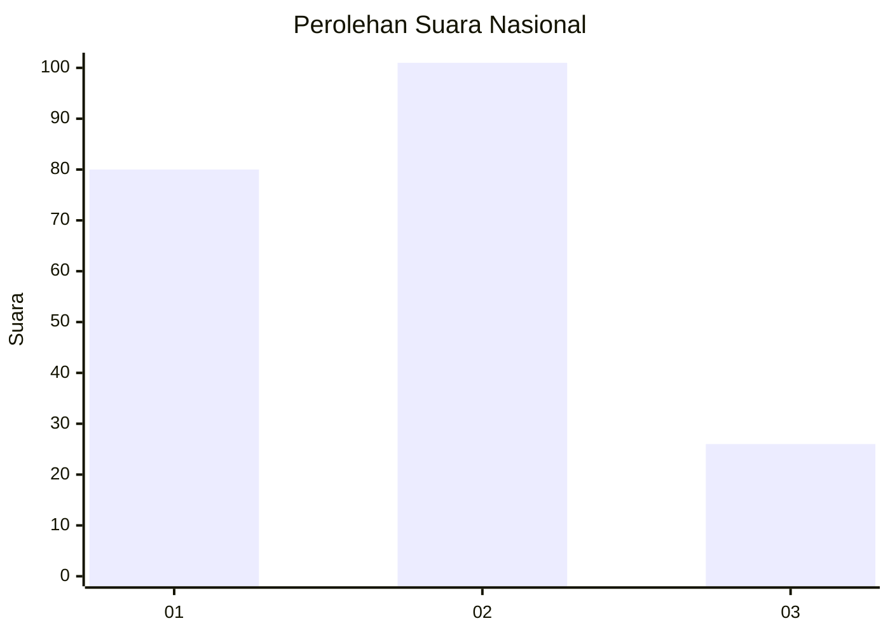
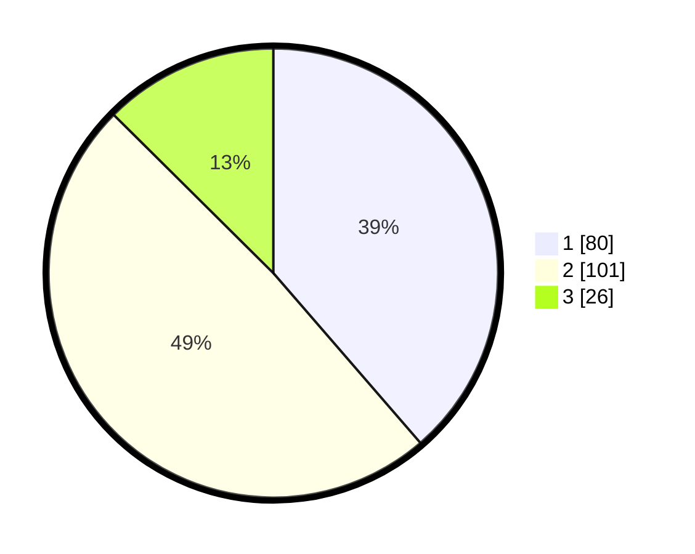

# Hasil

## Grafik

## Tabel

| No. | Nama Paslon    | Suara | Suara (raw) | Persentase |
|:--- |:-------------- | -----:| -----------:| ----------:|
| 1   | ANIES MUHAIMIN | 80    | [80][p-1]   | 38,65      |
| 2   | PRABOWO GIBRAN | 101   | [101][p-2]  | 48,79      |
| 3   | GANJAR MAHFUD  | 26    | [26][p-3]   | 12,56      |

[p-1]: https://github.com/gigit-pemilu/pemilu-2024/blob/main/pilpres/hitung-suara/sub/51-bali/sub/08-buleleng/sub/01-gerokgak/sub/2003-sumberkima/sub/018-tps/sub/paslon-1.txt
[p-2]: https://github.com/gigit-pemilu/pemilu-2024/blob/main/pilpres/hitung-suara/sub/51-bali/sub/08-buleleng/sub/01-gerokgak/sub/2003-sumberkima/sub/018-tps/sub/paslon-2.txt
[p-3]: https://github.com/gigit-pemilu/pemilu-2024/blob/main/pilpres/hitung-suara/sub/51-bali/sub/08-buleleng/sub/01-gerokgak/sub/2003-sumberkima/sub/018-tps/sub/paslon-3.txt

## Foto C Plano

https://sirekap-obj-formc.kpu.go.id/b714/pemilu/ppwp/51/08/01/20/03/5108012003018-20240215-000258--b1429df1-b223-48a7-9ea7-598f2a10b382.jpg

https://sirekap-obj-formc.kpu.go.id/b714/pemilu/ppwp/51/08/01/20/03/5108012003018-20240214-234535--e71ff5f5-5593-4c80-b906-03cc084cbd37.jpg

https://sirekap-obj-formc.kpu.go.id/b714/pemilu/ppwp/51/08/01/20/03/5108012003018-20240214-235324--b67d391d-49cf-4348-b062-000466d06055.jpg

## Metadata

| Key        | Value               |
| ---------- | ------------------- |
| Time Stamp | 2024-02-24 22:31:28 |

