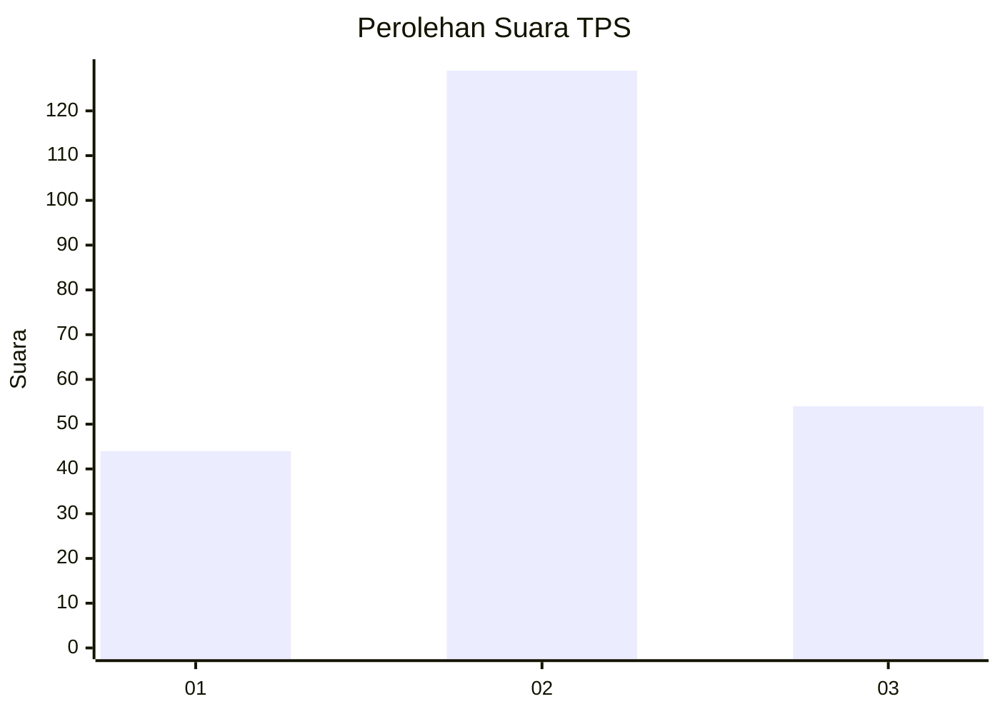
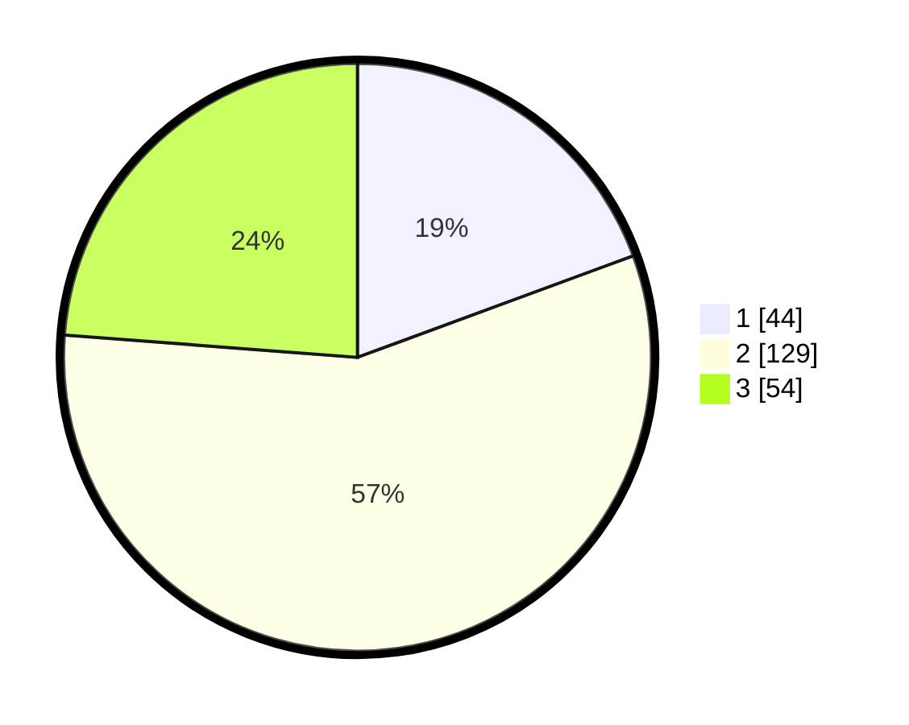

# Hasil

## Grafik

## Tabel

| No. | Nama Paslon    | Suara | Suara (raw) | Persentase |
|:--- |:-------------- | -----:| -----------:| ----------:|
| 1   | ANIES MUHAIMIN | 44    | [44][p-1]   | 19,38      |
| 2   | PRABOWO GIBRAN | 129   | [129][p-2]  | 56,83      |
| 3   | GANJAR MAHFUD  | 54    | [54][p-3]   | 23,79      |

[p-1]: https://github.com/gigit-pemilu/pemilu-2024-51-bali/blob/main/pilpres/hitung-suara/sub/51-bali/sub/08-buleleng/sub/01-gerokgak/sub/2003-sumberkima/sub/021-tps/sub/paslon-1.txt
[p-2]: https://github.com/gigit-pemilu/pemilu-2024-51-bali/blob/main/pilpres/hitung-suara/sub/51-bali/sub/08-buleleng/sub/01-gerokgak/sub/2003-sumberkima/sub/021-tps/sub/paslon-2.txt
[p-3]: https://github.com/gigit-pemilu/pemilu-2024-51-bali/blob/main/pilpres/hitung-suara/sub/51-bali/sub/08-buleleng/sub/01-gerokgak/sub/2003-sumberkima/sub/021-tps/sub/paslon-3.txt

## Foto C Plano

https://sirekap-obj-formc.kpu.go.id/f11c/pemilu/ppwp/51/08/01/20/03/5108012003021-20240214-223758--3e5d5056-7e61-4039-bfae-f25a8bad3dcd.jpg

https://sirekap-obj-formc.kpu.go.id/f11c/pemilu/ppwp/51/08/01/20/03/5108012003021-20240214-224012--9bcd04ea-f01a-43b9-9116-b0d4404ad1c1.jpg

https://sirekap-obj-formc.kpu.go.id/f11c/pemilu/ppwp/51/08/01/20/03/5108012003021-20240214-224831--6e33354f-0367-4bdc-ae90-4421d1d3ead2.jpg

## Metadata

| Key        | Value               |
| ---------- | ------------------- |
| Time Stamp | 2024-02-24 22:31:28 |

