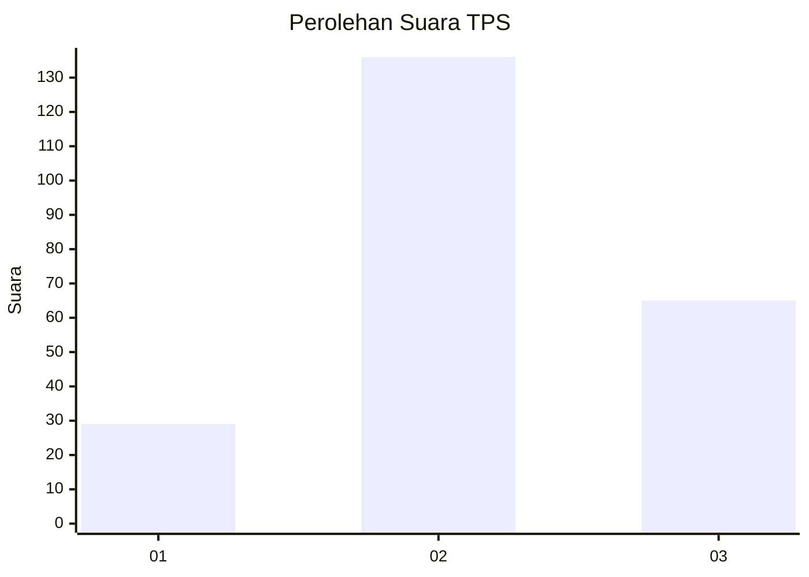
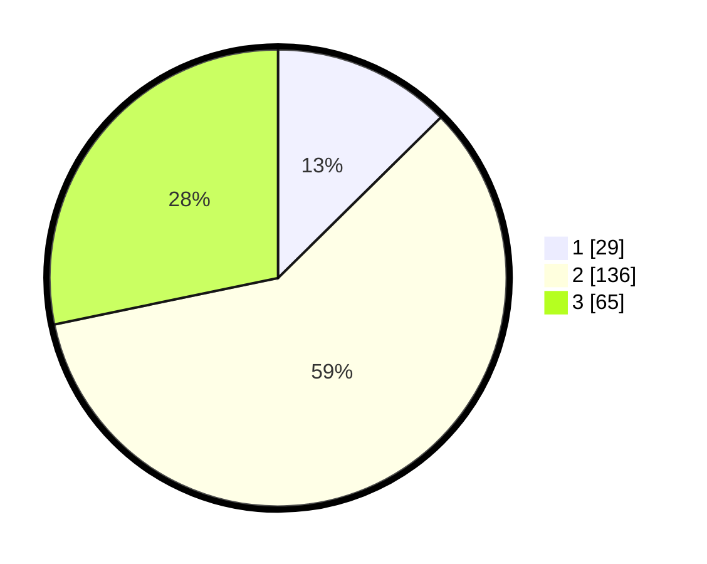

# Hasil

## Grafik

## Tabel

| No. | Nama Paslon    | Suara | Suara (raw) | Persentase |
|:--- |:-------------- | -----:| -----------:| ----------:|
| 1   | ANIES MUHAIMIN | 29    | [29][p-1]   | 12,61      |
| 2   | PRABOWO GIBRAN | 136   | [136][p-2]  | 59,13      |
| 3   | GANJAR MAHFUD  | 65    | [65][p-3]   | 28,26      |

[p-1]: https://github.com/gigit-pemilu/pemilu-2024-51-bali/blob/main/pilpres/hitung-suara/sub/51-bali/sub/08-buleleng/sub/01-gerokgak/sub/2004-pemuteran/sub/001-tps/sub/paslon-1.txt
[p-2]: https://github.com/gigit-pemilu/pemilu-2024-51-bali/blob/main/pilpres/hitung-suara/sub/51-bali/sub/08-buleleng/sub/01-gerokgak/sub/2004-pemuteran/sub/001-tps/sub/paslon-2.txt
[p-3]: https://github.com/gigit-pemilu/pemilu-2024-51-bali/blob/main/pilpres/hitung-suara/sub/51-bali/sub/08-buleleng/sub/01-gerokgak/sub/2004-pemuteran/sub/001-tps/sub/paslon-3.txt

## Foto C Plano

https://sirekap-obj-formc.kpu.go.id/c098/pemilu/ppwp/51/08/01/20/04/5108012004001-20240214-232410--b9bd3c0f-c41e-4f61-ac93-8f01ccc03094.jpg

https://sirekap-obj-formc.kpu.go.id/c098/pemilu/ppwp/51/08/01/20/04/5108012004001-20240214-232508--cdf0bcdf-d2c5-4c7f-bd52-6018cb0afc10.jpg

https://sirekap-obj-formc.kpu.go.id/c098/pemilu/ppwp/51/08/01/20/04/5108012004001-20240214-232557--8b12ec58-9cac-49ed-bbc8-913c3672c3f0.jpg

## Metadata

| Key        | Value               |
| ---------- | ------------------- |
| Time Stamp | 2024-02-24 22:31:28 |

