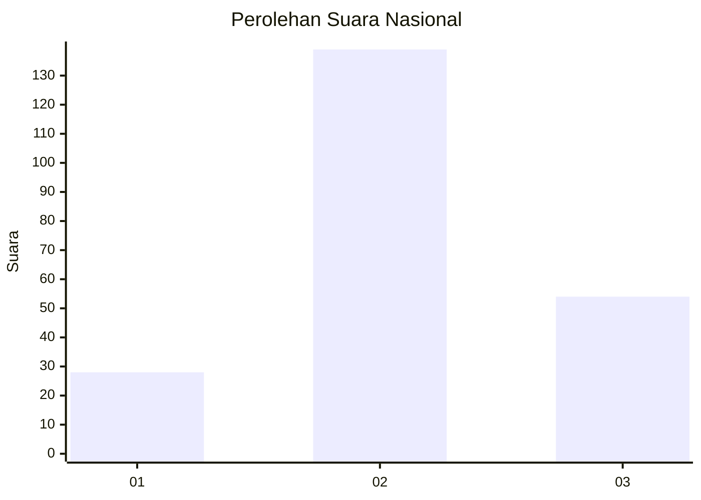
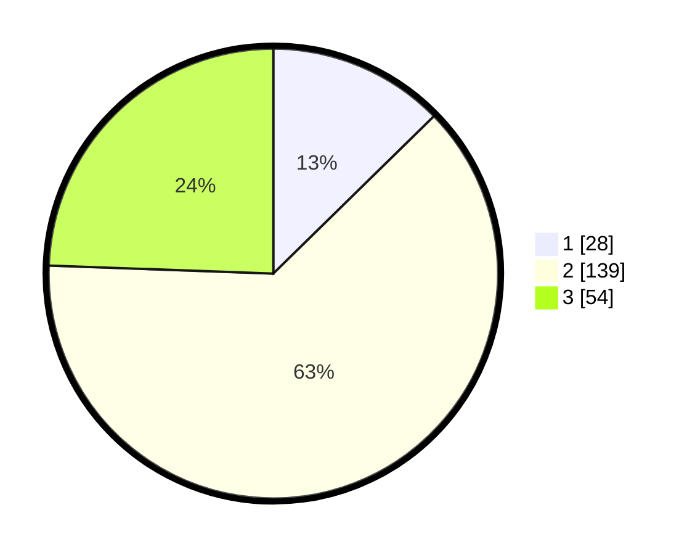

# Hasil

## Grafik

## Tabel

| No. | Nama Paslon    | Suara | Suara (raw) | Persentase |
|:--- |:-------------- | -----:| -----------:| ----------:|
| 1   | ANIES MUHAIMIN | 28    | [28][p-1]   | 12,67      |
| 2   | PRABOWO GIBRAN | 139   | [139][p-2]  | 62,90      |
| 3   | GANJAR MAHFUD  | 54    | [54][p-3]   | 24,43      |

[p-1]: https://github.com/gigit-pemilu/pemilu-2024/blob/main/pilpres/hitung-suara/sub/51-bali/sub/08-buleleng/sub/01-gerokgak/sub/2004-pemuteran/sub/002-tps/sub/paslon-1.txt
[p-2]: https://github.com/gigit-pemilu/pemilu-2024/blob/main/pilpres/hitung-suara/sub/51-bali/sub/08-buleleng/sub/01-gerokgak/sub/2004-pemuteran/sub/002-tps/sub/paslon-2.txt
[p-3]: https://github.com/gigit-pemilu/pemilu-2024/blob/main/pilpres/hitung-suara/sub/51-bali/sub/08-buleleng/sub/01-gerokgak/sub/2004-pemuteran/sub/002-tps/sub/paslon-3.txt

## Foto C Plano

https://sirekap-obj-formc.kpu.go.id/7dc9/pemilu/ppwp/51/08/01/20/04/5108012004002-20240214-215232--25b75e50-ca37-4406-8183-6018eb653353.jpg

https://sirekap-obj-formc.kpu.go.id/7dc9/pemilu/ppwp/51/08/01/20/04/5108012004002-20240214-215422--ed8c3c6c-8316-4912-abf9-93f6db37b422.jpg

https://sirekap-obj-formc.kpu.go.id/7dc9/pemilu/ppwp/51/08/01/20/04/5108012004002-20240214-215611--0748633f-793a-458d-a295-539db6d7ef1d.jpg

## Metadata

| Key        | Value               |
| ---------- | ------------------- |
| Time Stamp | 2024-02-24 22:31:28 |

