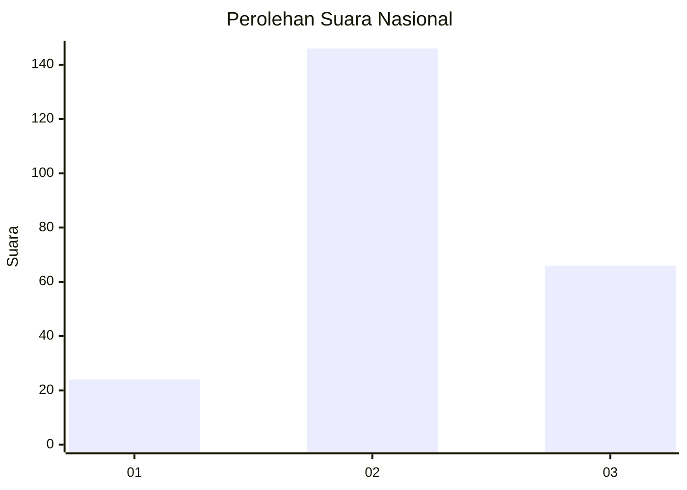
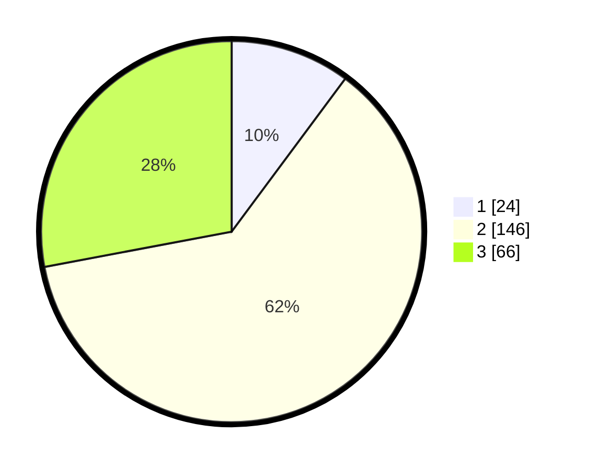

# Hasil

## Grafik

## Tabel

| No. | Nama Paslon    | Suara | Suara (raw) | Persentase |
|:--- |:-------------- | -----:| -----------:| ----------:|
| 1   | ANIES MUHAIMIN | 24    | [24][p-1]   | 10,17      |
| 2   | PRABOWO GIBRAN | 146   | [146][p-2]  | 61,86      |
| 3   | GANJAR MAHFUD  | 66    | [66][p-3]   | 27,97      |

[p-1]: https://github.com/gigit-pemilu/pemilu-2024/blob/main/pilpres/hitung-suara/sub/51-bali/sub/08-buleleng/sub/01-gerokgak/sub/2004-pemuteran/sub/003-tps/sub/paslon-1.txt
[p-2]: https://github.com/gigit-pemilu/pemilu-2024/blob/main/pilpres/hitung-suara/sub/51-bali/sub/08-buleleng/sub/01-gerokgak/sub/2004-pemuteran/sub/003-tps/sub/paslon-2.txt
[p-3]: https://github.com/gigit-pemilu/pemilu-2024/blob/main/pilpres/hitung-suara/sub/51-bali/sub/08-buleleng/sub/01-gerokgak/sub/2004-pemuteran/sub/003-tps/sub/paslon-3.txt

## Foto C Plano

https://sirekap-obj-formc.kpu.go.id/15d0/pemilu/ppwp/51/08/01/20/04/5108012004003-20240215-022111--db156f1f-8302-4adf-86f0-977a78ac50b0.jpg

https://sirekap-obj-formc.kpu.go.id/15d0/pemilu/ppwp/51/08/01/20/04/5108012004003-20240215-022146--384c1231-a1ca-48eb-8807-be3d682af405.jpg

https://sirekap-obj-formc.kpu.go.id/15d0/pemilu/ppwp/51/08/01/20/04/5108012004003-20240215-022228--6ee74a9a-9fe7-477d-acbb-9e88ddde671d.jpg

## Metadata

| Key        | Value               |
| ---------- | ------------------- |
| Time Stamp | 2024-02-24 22:31:28 |

