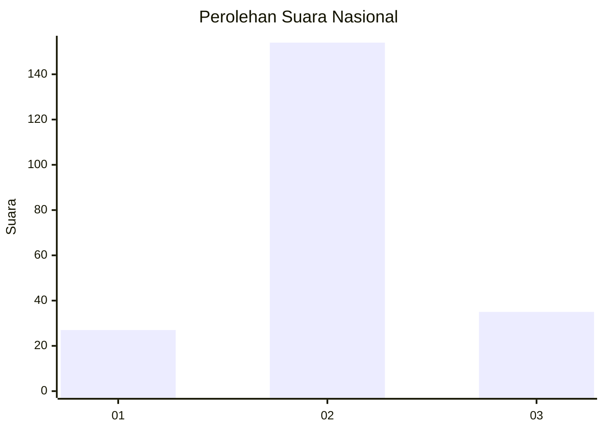
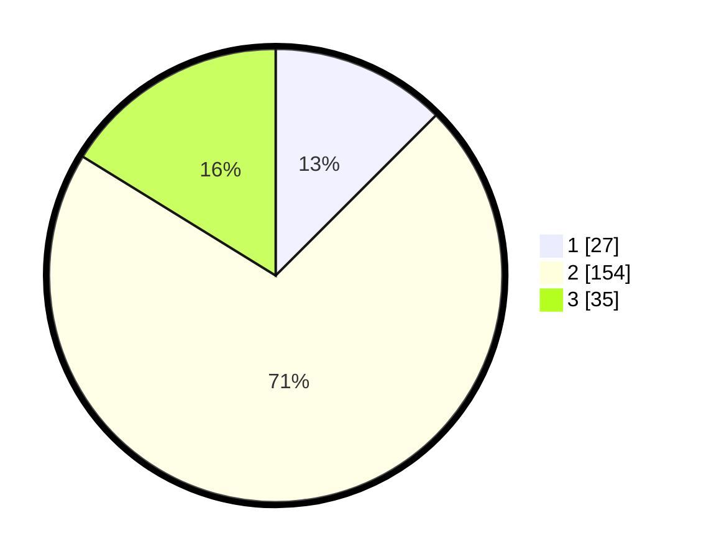

# Hasil

## Grafik

## Tabel

| No. | Nama Paslon    | Suara | Suara (raw) | Persentase |
|:--- |:-------------- | -----:| -----------:| ----------:|
| 1   | ANIES MUHAIMIN | 27    | [27][p-1]   | 12,50      |
| 2   | PRABOWO GIBRAN | 154   | [154][p-2]  | 71,30      |
| 3   | GANJAR MAHFUD  | 35    | [35][p-3]   | 16,20      |

[p-1]: https://github.com/gigit-pemilu/pemilu-2024/blob/main/pilpres/hitung-suara/sub/51-bali/sub/08-buleleng/sub/01-gerokgak/sub/2004-pemuteran/sub/004-tps/sub/paslon-1.txt
[p-2]: https://github.com/gigit-pemilu/pemilu-2024/blob/main/pilpres/hitung-suara/sub/51-bali/sub/08-buleleng/sub/01-gerokgak/sub/2004-pemuteran/sub/004-tps/sub/paslon-2.txt
[p-3]: https://github.com/gigit-pemilu/pemilu-2024/blob/main/pilpres/hitung-suara/sub/51-bali/sub/08-buleleng/sub/01-gerokgak/sub/2004-pemuteran/sub/004-tps/sub/paslon-3.txt

## Foto C Plano

https://sirekap-obj-formc.kpu.go.id/ba33/pemilu/ppwp/51/08/01/20/04/5108012004004-20240216-000157--38f3fb9b-5dae-4254-8ff0-7d45ce0d17e4.jpg

https://sirekap-obj-formc.kpu.go.id/ba33/pemilu/ppwp/51/08/01/20/04/5108012004004-20240216-000200--c6890d6a-6c3c-4a54-a050-853fc46a1cf3.jpg

https://sirekap-obj-formc.kpu.go.id/ba33/pemilu/ppwp/51/08/01/20/04/5108012004004-20240216-000159--ea3cf4be-1168-4919-a7f1-11ec8ff73c4b.jpg

## Metadata

| Key        | Value               |
| ---------- | ------------------- |
| Time Stamp | 2024-02-16 16:25:10 |

## DATA PEMILIH TETAP

Jumlah pemilih dalam DPT: **280**.
 * L: **140**.
 * P: **140**.

## DATA PENGGUNA HAK PILIH

Jumlah pengguna hak pilih dalam DPT: **226**.
 * L: **120**.
 * P: **106**.

Jumlah pengguna hak pilih dalam DPTb: **0**.
 * L: **0**.
 * P: **0**.

Jumlah pengguna hak pilih dalam DPK: **0**.
 * L: **0**.
 * P: **0**.

Jumlah pengguna hak pilih: **226**.
 * L: **120**.
 * P: **106**.

## JUMLAH SUARA SAH DAN TIDAK SAH

JUMLAH SELURUH SUARA SAH: **216**.

JUMLAH SUARA TIDAK SAH: **10**.

JUMLAH SELURUH SUARA SAH DAN SUARA TIDAK SAH: **226**.

