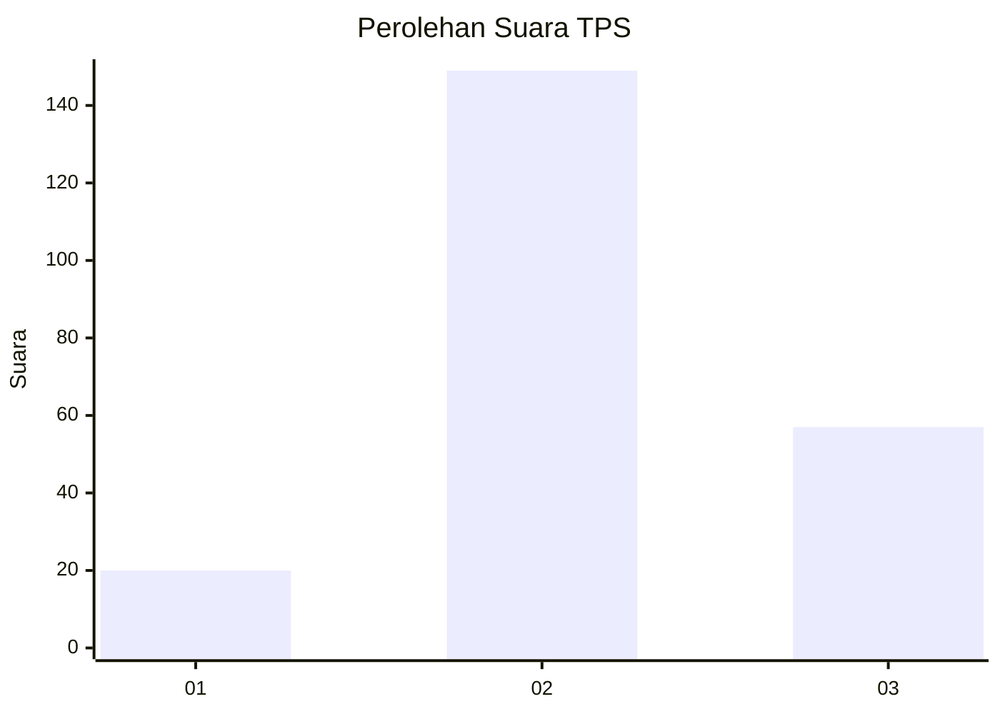
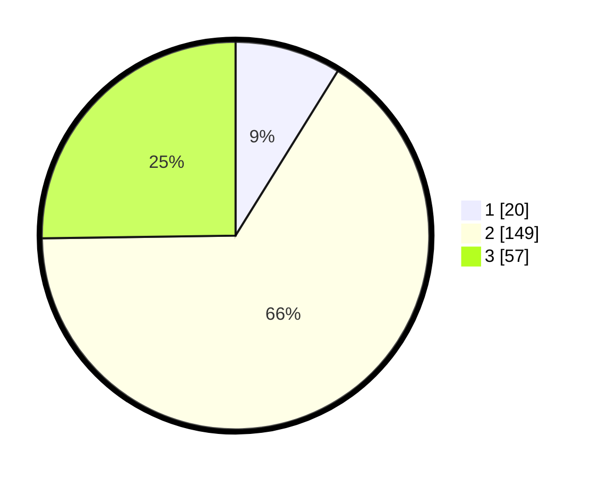

# Hasil

## Grafik

## Tabel

| No. | Nama Paslon    | Suara | Suara (raw) | Persentase |
|:--- |:-------------- | -----:| -----------:| ----------:|
| 1   | ANIES MUHAIMIN | 20    | [20][p-1]   | 8,85       |
| 2   | PRABOWO GIBRAN | 149   | [149][p-2]  | 65,93      |
| 3   | GANJAR MAHFUD  | 57    | [57][p-3]   | 25,22      |

[p-1]: https://github.com/gigit-pemilu/pemilu-2024-51-bali/blob/main/pilpres/hitung-suara/sub/51-bali/sub/08-buleleng/sub/01-gerokgak/sub/2004-pemuteran/sub/005-tps/sub/paslon-1.txt
[p-2]: https://github.com/gigit-pemilu/pemilu-2024-51-bali/blob/main/pilpres/hitung-suara/sub/51-bali/sub/08-buleleng/sub/01-gerokgak/sub/2004-pemuteran/sub/005-tps/sub/paslon-2.txt
[p-3]: https://github.com/gigit-pemilu/pemilu-2024-51-bali/blob/main/pilpres/hitung-suara/sub/51-bali/sub/08-buleleng/sub/01-gerokgak/sub/2004-pemuteran/sub/005-tps/sub/paslon-3.txt

## Foto C Plano

https://sirekap-obj-formc.kpu.go.id/814e/pemilu/ppwp/51/08/01/20/04/5108012004005-20240214-224748--c133009f-1a87-498c-9147-ac937c1c0626.jpg

https://sirekap-obj-formc.kpu.go.id/814e/pemilu/ppwp/51/08/01/20/04/5108012004005-20240215-003142--34f47d5b-7ef6-45a2-8b9f-05e17e29633f.jpg

https://sirekap-obj-formc.kpu.go.id/814e/pemilu/ppwp/51/08/01/20/04/5108012004005-20240214-224919--0a96a5f8-8760-4887-af32-5dc27a7ab3c3.jpg

## Metadata

| Key        | Value               |
| ---------- | ------------------- |
| Time Stamp | 2024-02-24 22:31:28 |

