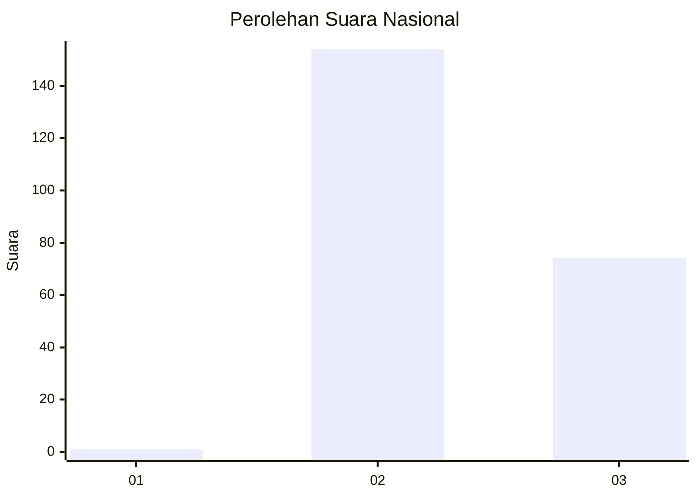
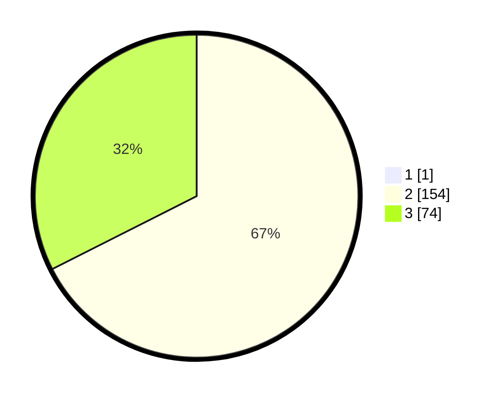

# Hasil

## Grafik

## Tabel

| No. | Nama Paslon    | Suara | Suara (raw) | Persentase |
|:--- |:-------------- | -----:| -----------:| ----------:|
| 1   | ANIES MUHAIMIN | 1     | [1][p-1]    | 0,44       |
| 2   | PRABOWO GIBRAN | 154   | [154][p-2]  | 67,25      |
| 3   | GANJAR MAHFUD  | 74    | [74][p-3]   | 32,31      |

[p-1]: https://github.com/gigit-pemilu/pemilu-2024/blob/main/pilpres/hitung-suara/sub/51-bali/sub/08-buleleng/sub/01-gerokgak/sub/2004-pemuteran/sub/011-tps/sub/paslon-1.txt
[p-2]: https://github.com/gigit-pemilu/pemilu-2024/blob/main/pilpres/hitung-suara/sub/51-bali/sub/08-buleleng/sub/01-gerokgak/sub/2004-pemuteran/sub/011-tps/sub/paslon-2.txt
[p-3]: https://github.com/gigit-pemilu/pemilu-2024/blob/main/pilpres/hitung-suara/sub/51-bali/sub/08-buleleng/sub/01-gerokgak/sub/2004-pemuteran/sub/011-tps/sub/paslon-3.txt

## Foto C Plano

https://sirekap-obj-formc.kpu.go.id/63e7/pemilu/ppwp/51/08/01/20/04/5108012004011-20240215-003108--82b230ec-fd40-4b37-ade6-957ecf476cdb.jpg

https://sirekap-obj-formc.kpu.go.id/63e7/pemilu/ppwp/51/08/01/20/04/5108012004011-20240215-003304--56c72dab-ee46-4f3f-ba3b-7e8230a24310.jpg

https://sirekap-obj-formc.kpu.go.id/63e7/pemilu/ppwp/51/08/01/20/04/5108012004011-20240215-003511--d6325cc8-1918-412a-9b80-4042331d84cc.jpg

## Metadata

| Key        | Value               |
| ---------- | ------------------- |
| Time Stamp | 2024-02-24 22:31:28 |

