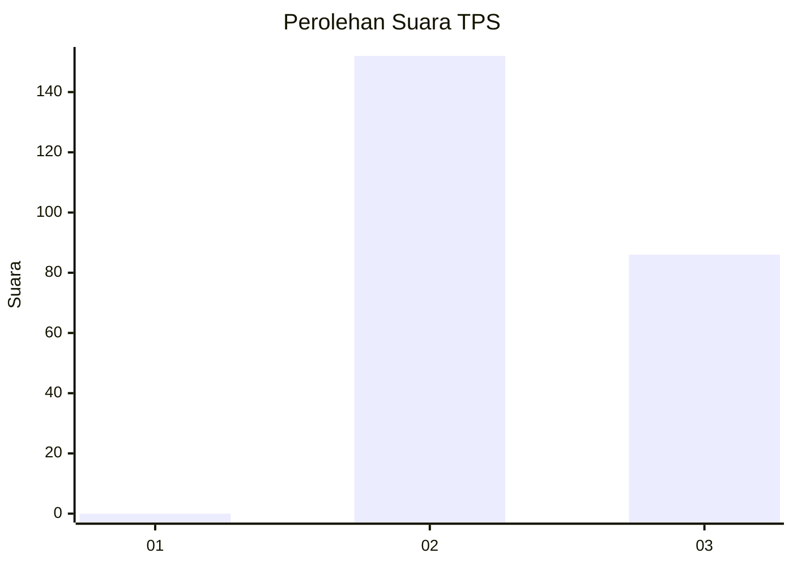
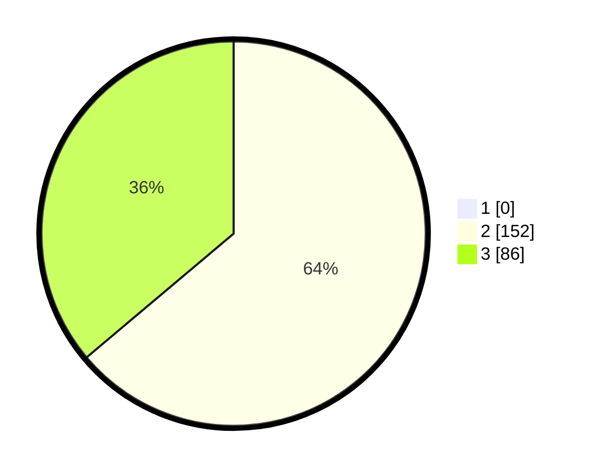

# Hasil

## Grafik

## Tabel

| No. | Nama Paslon    | Suara | Suara (raw) | Persentase |
|:--- |:-------------- | -----:| -----------:| ----------:|
| 1   | ANIES MUHAIMIN | 0     | [0][p-1]    | 0,00       |
| 2   | PRABOWO GIBRAN | 152   | [152][p-2]  | 63,87      |
| 3   | GANJAR MAHFUD  | 86    | [86][p-3]   | 36,13      |

[p-1]: https://github.com/gigit-pemilu/pemilu-2024-51-bali/blob/main/pilpres/hitung-suara/sub/51-bali/sub/08-buleleng/sub/01-gerokgak/sub/2004-pemuteran/sub/012-tps/sub/paslon-1.txt
[p-2]: https://github.com/gigit-pemilu/pemilu-2024-51-bali/blob/main/pilpres/hitung-suara/sub/51-bali/sub/08-buleleng/sub/01-gerokgak/sub/2004-pemuteran/sub/012-tps/sub/paslon-2.txt
[p-3]: https://github.com/gigit-pemilu/pemilu-2024-51-bali/blob/main/pilpres/hitung-suara/sub/51-bali/sub/08-buleleng/sub/01-gerokgak/sub/2004-pemuteran/sub/012-tps/sub/paslon-3.txt

## Foto C Plano

https://sirekap-obj-formc.kpu.go.id/450e/pemilu/ppwp/51/08/01/20/04/5108012004012-20240214-224033--72b2f1e5-393b-4d32-8a14-577af6a19be2.jpg

https://sirekap-obj-formc.kpu.go.id/450e/pemilu/ppwp/51/08/01/20/04/5108012004012-20240214-224155--9f5ef2ed-25f8-40c4-a329-d156eda9ca0b.jpg

https://sirekap-obj-formc.kpu.go.id/450e/pemilu/ppwp/51/08/01/20/04/5108012004012-20240214-224248--630d2507-c1fe-4f70-9bae-18f7aa4d587e.jpg

## Metadata

| Key        | Value               |
| ---------- | ------------------- |
| Time Stamp | 2024-02-24 22:31:28 |

