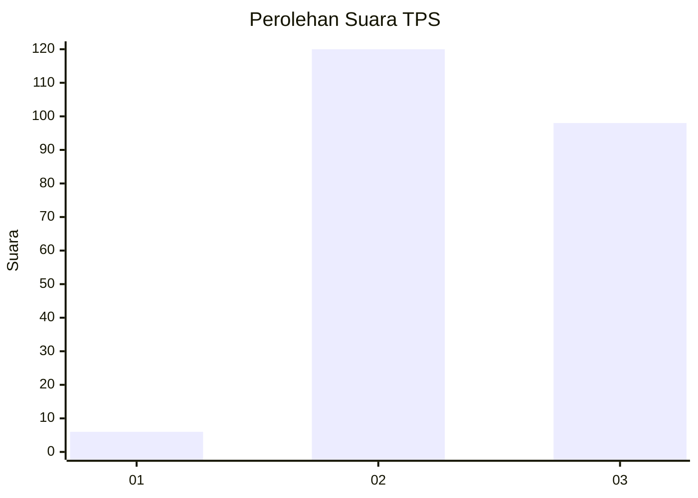
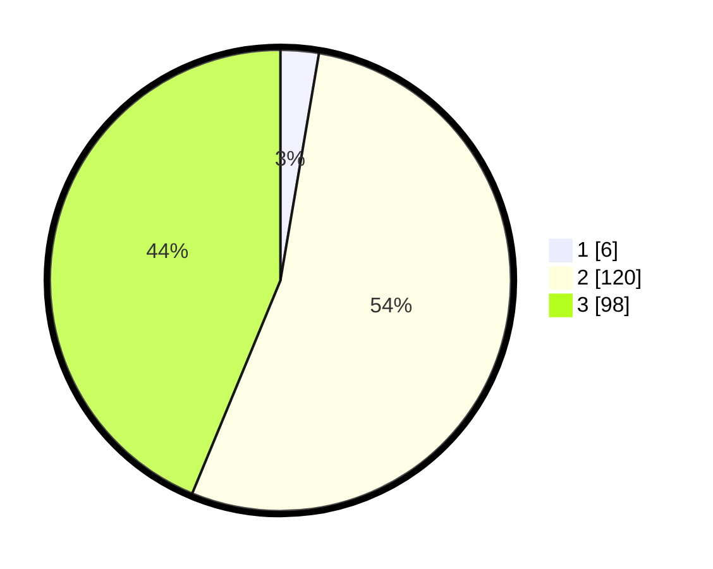

# Hasil

## Grafik

## Tabel

| No. | Nama Paslon    | Suara | Suara (raw) | Persentase |
|:--- |:-------------- | -----:| -----------:| ----------:|
| 1   | ANIES MUHAIMIN | 6     | [6][p-1]    | 2,68       |
| 2   | PRABOWO GIBRAN | 120   | [120][p-2]  | 53,57      |
| 3   | GANJAR MAHFUD  | 98    | [98][p-3]   | 43,75      |

[p-1]: https://github.com/gigit-pemilu/pemilu-2024-51-bali/blob/main/pilpres/hitung-suara/sub/51-bali/sub/08-buleleng/sub/01-gerokgak/sub/2004-pemuteran/sub/018-tps/sub/paslon-1.txt
[p-2]: https://github.com/gigit-pemilu/pemilu-2024-51-bali/blob/main/pilpres/hitung-suara/sub/51-bali/sub/08-buleleng/sub/01-gerokgak/sub/2004-pemuteran/sub/018-tps/sub/paslon-2.txt
[p-3]: https://github.com/gigit-pemilu/pemilu-2024-51-bali/blob/main/pilpres/hitung-suara/sub/51-bali/sub/08-buleleng/sub/01-gerokgak/sub/2004-pemuteran/sub/018-tps/sub/paslon-3.txt

## Foto C Plano

https://sirekap-obj-formc.kpu.go.id/94f7/pemilu/ppwp/51/08/01/20/04/5108012004018-20240214-224717--de6a8140-b26f-414e-923a-a33170deefc9.jpg

https://sirekap-obj-formc.kpu.go.id/94f7/pemilu/ppwp/51/08/01/20/04/5108012004018-20240214-225238--8c97f348-524d-49ae-99fd-f0528d911266.jpg

https://sirekap-obj-formc.kpu.go.id/94f7/pemilu/ppwp/51/08/01/20/04/5108012004018-20240214-225456--27754cfa-7a4b-4231-8936-a674f3b1d76b.jpg

## Metadata

| Key        | Value               |
| ---------- | ------------------- |
| Time Stamp | 2024-02-24 22:31:28 |

