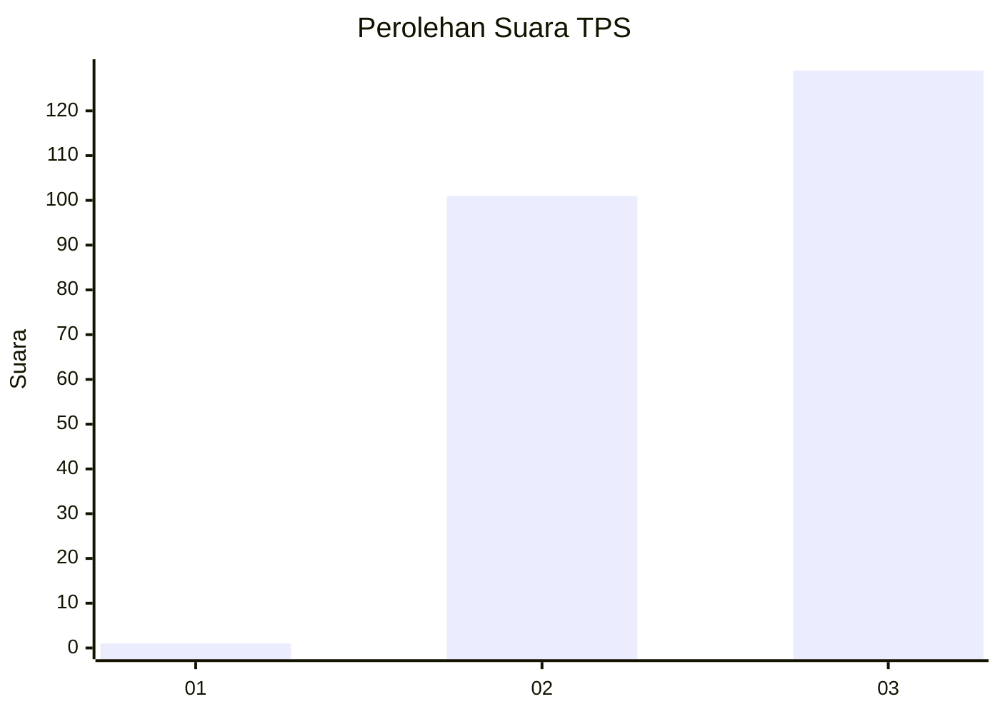
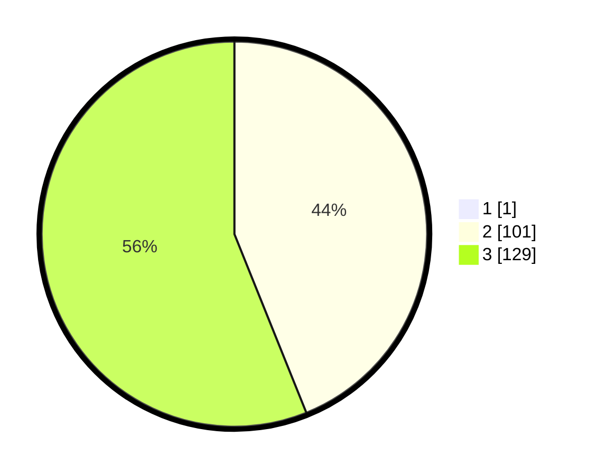

# Hasil

## Grafik

## Tabel

| No. | Nama Paslon    | Suara | Suara (raw) | Persentase |
|:--- |:-------------- | -----:| -----------:| ----------:|
| 1   | ANIES MUHAIMIN | 1     | [1][p-1]    | 0,43       |
| 2   | PRABOWO GIBRAN | 101   | [101][p-2]  | 43,72      |
| 3   | GANJAR MAHFUD  | 129   | [129][p-3]  | 55,84      |

[p-1]: https://github.com/gigit-pemilu/pemilu-2024-51-bali/blob/main/pilpres/hitung-suara/sub/51-bali/sub/08-buleleng/sub/01-gerokgak/sub/2004-pemuteran/sub/021-tps/sub/paslon-1.txt
[p-2]: https://github.com/gigit-pemilu/pemilu-2024-51-bali/blob/main/pilpres/hitung-suara/sub/51-bali/sub/08-buleleng/sub/01-gerokgak/sub/2004-pemuteran/sub/021-tps/sub/paslon-2.txt
[p-3]: https://github.com/gigit-pemilu/pemilu-2024-51-bali/blob/main/pilpres/hitung-suara/sub/51-bali/sub/08-buleleng/sub/01-gerokgak/sub/2004-pemuteran/sub/021-tps/sub/paslon-3.txt

## Foto C Plano

https://sirekap-obj-formc.kpu.go.id/c0a2/pemilu/ppwp/51/08/01/20/04/5108012004021-20240214-205347--37e6b498-f3d0-4a26-9e71-7efcb0d2b618.jpg

https://sirekap-obj-formc.kpu.go.id/c0a2/pemilu/ppwp/51/08/01/20/04/5108012004021-20240214-232422--f42cccb1-05b5-4cc2-a86f-2f664a0304af.jpg

https://sirekap-obj-formc.kpu.go.id/c0a2/pemilu/ppwp/51/08/01/20/04/5108012004021-20240214-232600--4906e35a-1e72-4be5-bcf5-626aba2ccb44.jpg

## Metadata

| Key        | Value               |
| ---------- | ------------------- |
| Time Stamp | 2024-02-24 22:31:28 |

