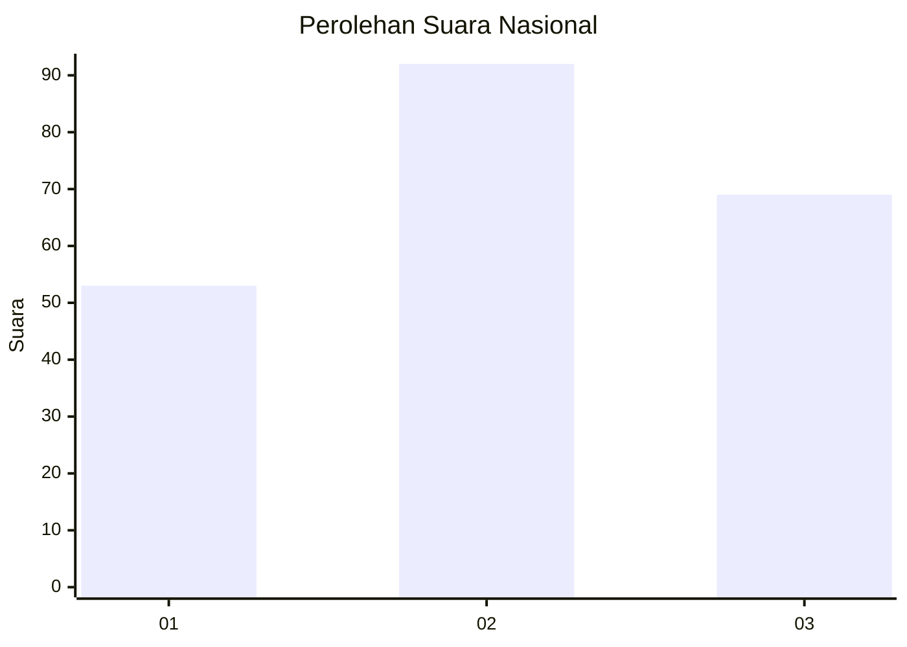
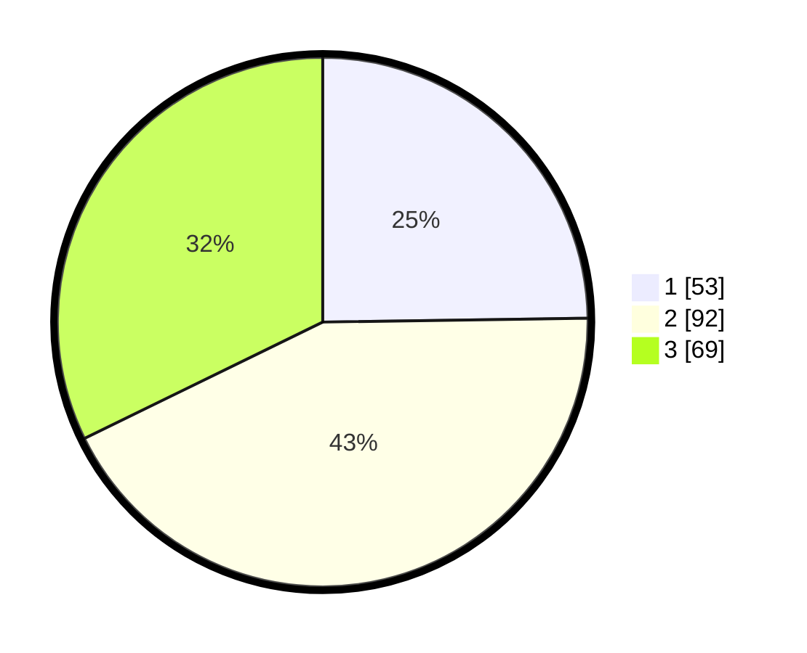

# Hasil

## Grafik

## Tabel

| No. | Nama Paslon    | Suara | Suara (raw) | Persentase |
|:--- |:-------------- | -----:| -----------:| ----------:|
| 1   | ANIES MUHAIMIN | 53    | [53][p-1]   | 24,77      |
| 2   | PRABOWO GIBRAN | 92    | [92][p-2]   | 42,99      |
| 3   | GANJAR MAHFUD  | 69    | [69][p-3]   | 32,24      |

[p-1]: https://github.com/gigit-pemilu/pemilu-2024/blob/main/pilpres/hitung-suara/sub/51-bali/sub/08-buleleng/sub/01-gerokgak/sub/2004-pemuteran/sub/023-tps/sub/paslon-1.txt
[p-2]: https://github.com/gigit-pemilu/pemilu-2024/blob/main/pilpres/hitung-suara/sub/51-bali/sub/08-buleleng/sub/01-gerokgak/sub/2004-pemuteran/sub/023-tps/sub/paslon-2.txt
[p-3]: https://github.com/gigit-pemilu/pemilu-2024/blob/main/pilpres/hitung-suara/sub/51-bali/sub/08-buleleng/sub/01-gerokgak/sub/2004-pemuteran/sub/023-tps/sub/paslon-3.txt

## Foto C Plano

https://sirekap-obj-formc.kpu.go.id/bee3/pemilu/ppwp/51/08/01/20/04/5108012004023-20240214-214323--9c7a8d6b-d56c-45dc-bbe5-b4bcea2e3887.jpg

https://sirekap-obj-formc.kpu.go.id/bee3/pemilu/ppwp/51/08/01/20/04/5108012004023-20240214-214606--2e07a2c1-004d-43c5-8c96-126aaf101e06.jpg

https://sirekap-obj-formc.kpu.go.id/bee3/pemilu/ppwp/51/08/01/20/04/5108012004023-20240214-214737--39aa7a48-83ec-406f-8a60-4bcb80770155.jpg

## Metadata

| Key        | Value               |
| ---------- | ------------------- |
| Time Stamp | 2024-02-24 22:31:28 |

