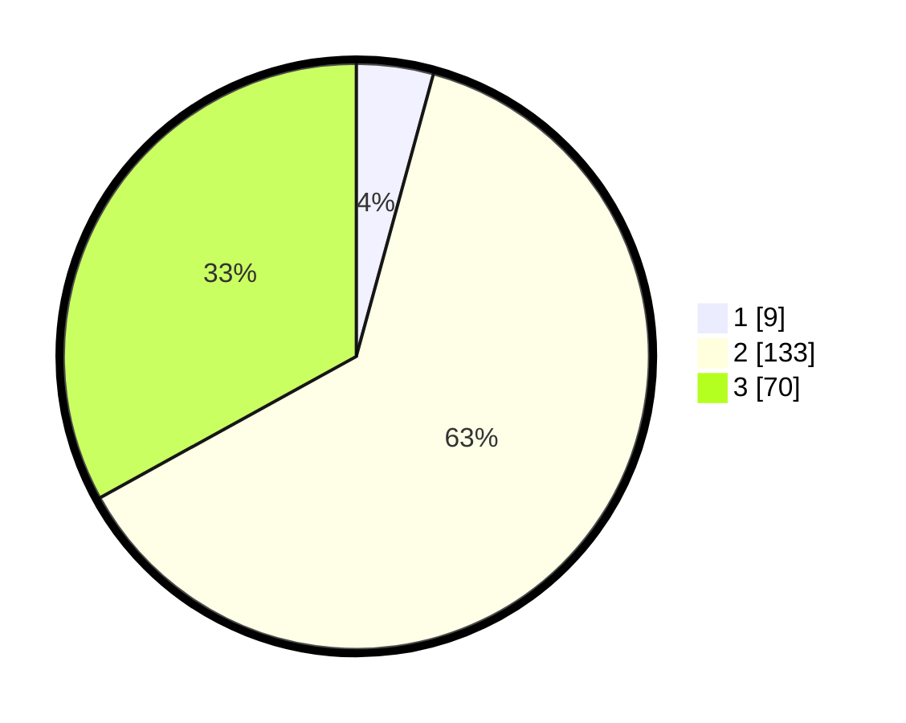

# Hasil

## Grafik

## Tabel

| No. | Nama Paslon    | Suara | Suara (raw) | Persentase |
|:--- |:-------------- | -----:| -----------:| ----------:|
| 1   | ANIES MUHAIMIN | 9     | [9][p-1]    | 4,25       |
| 2   | PRABOWO GIBRAN | 133   | [133][p-2]  | 62,74      |
| 3   | GANJAR MAHFUD  | 70    | [70][p-3]   | 33,02      |

[p-1]: https://github.com/gigit-pemilu/pemilu-2024-51-bali/blob/main/pilpres/hitung-suara/sub/51-bali/sub/08-buleleng/sub/01-gerokgak/sub/2005-banyupoh/sub/002-tps/sub/paslon-1.txt
[p-2]: https://github.com/gigit-pemilu/pemilu-2024-51-bali/blob/main/pilpres/hitung-suara/sub/51-bali/sub/08-buleleng/sub/01-gerokgak/sub/2005-banyupoh/sub/002-tps/sub/paslon-2.txt
[p-3]: https://github.com/gigit-pemilu/pemilu-2024-51-bali/blob/main/pilpres/hitung-suara/sub/51-bali/sub/08-buleleng/sub/01-gerokgak/sub/2005-banyupoh/sub/002-tps/sub/paslon-3.txt

## Foto C Plano

https://sirekap-obj-formc.kpu.go.id/1e2d/pemilu/ppwp/51/08/01/20/05/5108012005002-20240215-124659--32602b1c-87c9-4e03-b312-11b1af8fe365.jpg

https://sirekap-obj-formc.kpu.go.id/1e2d/pemilu/ppwp/51/08/01/20/05/5108012005002-20240215-124709--a3762fd1-9f1f-4378-98e5-11638ee6039d.jpg

https://sirekap-obj-formc.kpu.go.id/1e2d/pemilu/ppwp/51/08/01/20/05/5108012005002-20240215-124718--a2240769-fe16-4f8c-a7ac-59e6c4cf6326.jpg

## Metadata

| Key        | Value               |
| ---------- | ------------------- |
| Time Stamp | 2024-02-24 22:31:28 |

