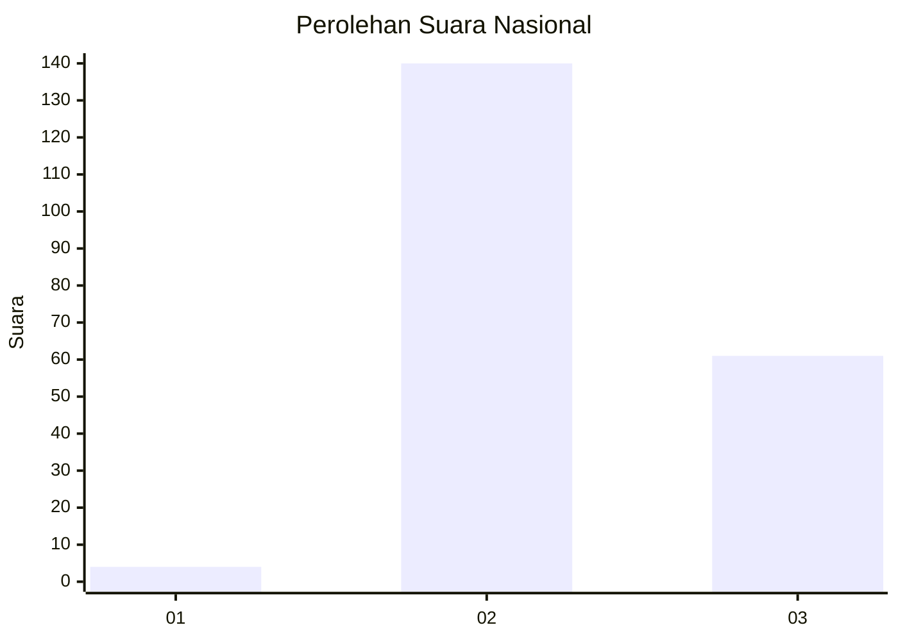

# Hasil

## Grafik

## Tabel

| No. | Nama Paslon    | Suara | Suara (raw) | Persentase |
|:--- |:-------------- | -----:| -----------:| ----------:|
| 1   | ANIES MUHAIMIN | 4     | [4][p-1]    | 1,95       |
| 2   | PRABOWO GIBRAN | 140   | [140][p-2]  | 68,29      |
| 3   | GANJAR MAHFUD  | 61    | [61][p-3]   | 29,76      |

[p-1]: https://github.com/gigit-pemilu/pemilu-2024/blob/main/pilpres/hitung-suara/sub/51-bali/sub/08-buleleng/sub/01-gerokgak/sub/2005-banyupoh/sub/004-tps/sub/paslon-1.txt
[p-2]: https://github.com/gigit-pemilu/pemilu-2024/blob/main/pilpres/hitung-suara/sub/51-bali/sub/08-buleleng/sub/01-gerokgak/sub/2005-banyupoh/sub/004-tps/sub/paslon-2.txt
[p-3]: https://github.com/gigit-pemilu/pemilu-2024/blob/main/pilpres/hitung-suara/sub/51-bali/sub/08-buleleng/sub/01-gerokgak/sub/2005-banyupoh/sub/004-tps/sub/paslon-3.txt

## Foto C Plano

https://sirekap-obj-formc.kpu.go.id/2bf7/pemilu/ppwp/51/08/01/20/05/5108012005004-20240214-200605--13562546-4ac2-4999-86dc-62e199fcf713.jpg

https://sirekap-obj-formc.kpu.go.id/2bf7/pemilu/ppwp/51/08/01/20/05/5108012005004-20240214-200926--6ee7a879-a0f4-44d9-9049-19eabb0a6103.jpg

https://sirekap-obj-formc.kpu.go.id/2bf7/pemilu/ppwp/51/08/01/20/05/5108012005004-20240214-201040--4a1b0200-c2a4-4273-ac03-2c57aafaad33.jpg

## Metadata

| Key        | Value               |
| ---------- | ------------------- |
| Time Stamp | 2024-02-14 21:46:01 |

## DATA PEMILIH TETAP

Jumlah pemilih dalam DPT: **261**.
 * L: **122**.
 * P: **139**.

## DATA PENGGUNA HAK PILIH

Jumlah pengguna hak pilih dalam DPT: **197**.
 * L: **97**.
 * P: **100**.

Jumlah pengguna hak pilih dalam DPTb: **8**.
 * L: **2**.
 * P: **6**.

Jumlah pengguna hak pilih dalam DPK: **2**.
 * L: **0**.
 * P: **2**.

Jumlah pengguna hak pilih: **207**.
 * L: **99**.
 * P: **108**.

## JUMLAH SUARA SAH DAN TIDAK SAH

JUMLAH SELURUH SUARA SAH: **205**.

JUMLAH SUARA TIDAK SAH: **2**.

JUMLAH SELURUH SUARA SAH DAN SUARA TIDAK SAH: **207**.

