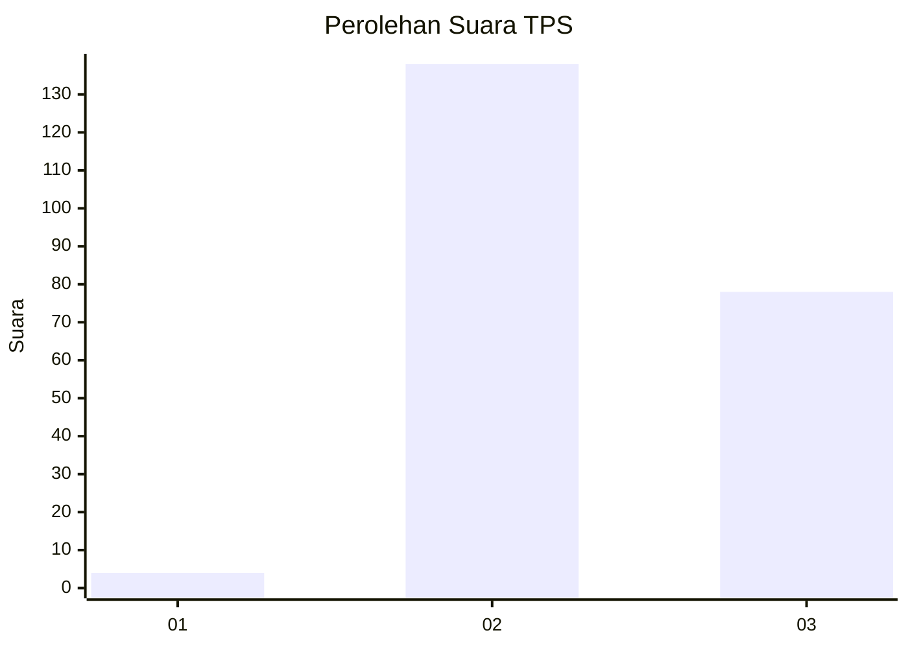
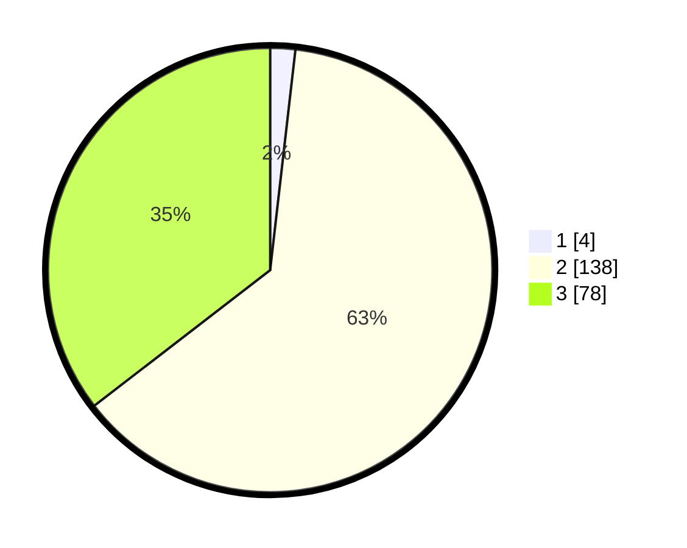

# Hasil

## Grafik

## Tabel

| No. | Nama Paslon    | Suara | Suara (raw) | Persentase |
|:--- |:-------------- | -----:| -----------:| ----------:|
| 1   | ANIES MUHAIMIN | 4     | [4][p-1]    | 1,82       |
| 2   | PRABOWO GIBRAN | 138   | [138][p-2]  | 62,73      |
| 3   | GANJAR MAHFUD  | 78    | [78][p-3]   | 35,45      |

[p-1]: https://github.com/gigit-pemilu/pemilu-2024-51-bali/blob/main/pilpres/hitung-suara/sub/51-bali/sub/08-buleleng/sub/01-gerokgak/sub/2005-banyupoh/sub/005-tps/sub/paslon-1.txt
[p-2]: https://github.com/gigit-pemilu/pemilu-2024-51-bali/blob/main/pilpres/hitung-suara/sub/51-bali/sub/08-buleleng/sub/01-gerokgak/sub/2005-banyupoh/sub/005-tps/sub/paslon-2.txt
[p-3]: https://github.com/gigit-pemilu/pemilu-2024-51-bali/blob/main/pilpres/hitung-suara/sub/51-bali/sub/08-buleleng/sub/01-gerokgak/sub/2005-banyupoh/sub/005-tps/sub/paslon-3.txt

## Foto C Plano

https://sirekap-obj-formc.kpu.go.id/d16b/pemilu/ppwp/51/08/01/20/05/5108012005005-20240215-004835--984fa2a3-e0ab-4db7-b0f7-c900d0e61ba6.jpg

https://sirekap-obj-formc.kpu.go.id/d16b/pemilu/ppwp/51/08/01/20/05/5108012005005-20240215-031958--bf1535c2-f4b6-4f36-bea5-289912a6c891.jpg

https://sirekap-obj-formc.kpu.go.id/d16b/pemilu/ppwp/51/08/01/20/05/5108012005005-20240215-005102--4b30c39a-1db2-4d2b-bbbf-129d4c436139.jpg

## Metadata

| Key        | Value               |
| ---------- | ------------------- |
| Time Stamp | 2024-02-24 22:31:28 |

