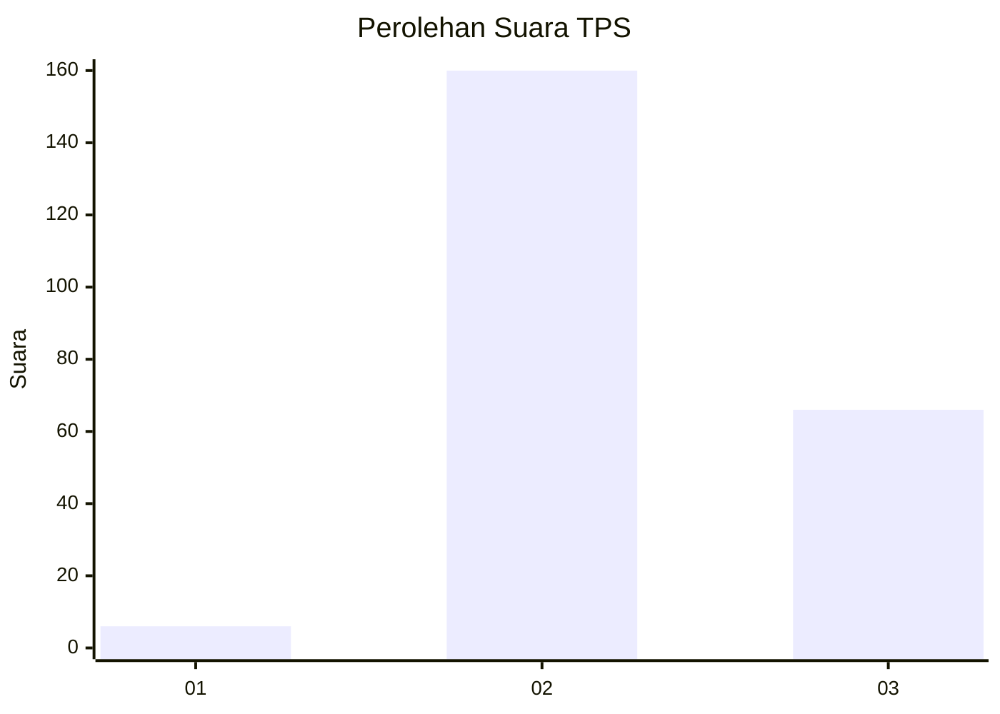
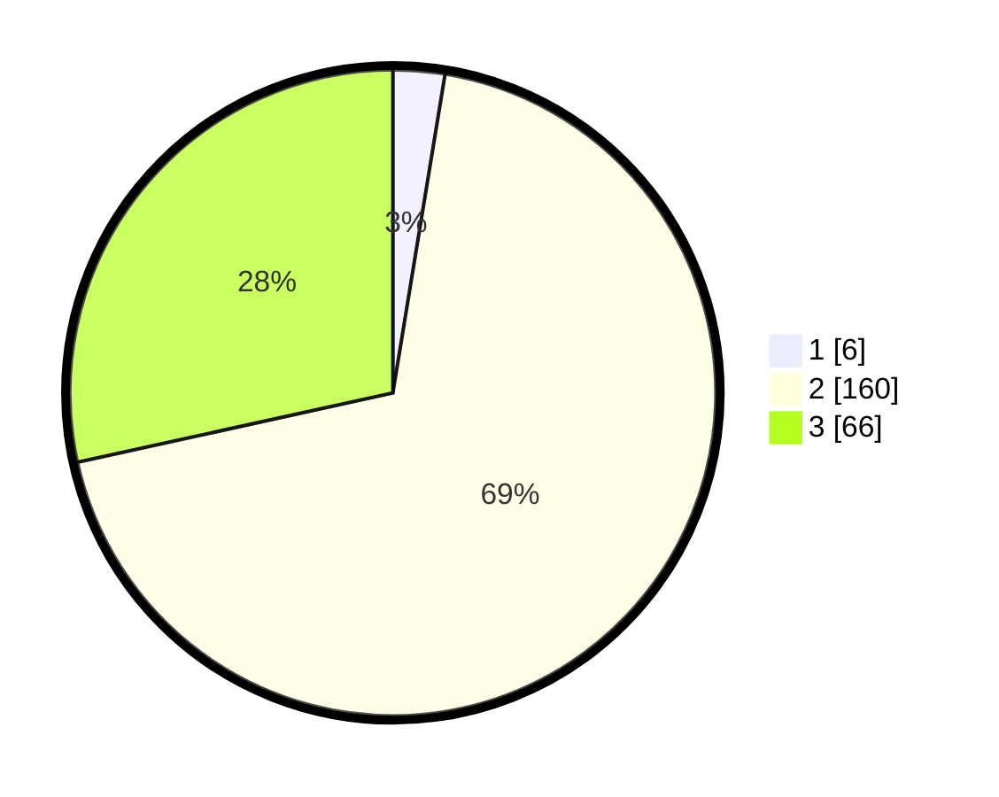

# Hasil

## Grafik

## Tabel

| No. | Nama Paslon    | Suara | Suara (raw) | Persentase |
|:--- |:-------------- | -----:| -----------:| ----------:|
| 1   | ANIES MUHAIMIN | 6     | [6][p-1]    | 2,59       |
| 2   | PRABOWO GIBRAN | 160   | [160][p-2]  | 68,97      |
| 3   | GANJAR MAHFUD  | 66    | [66][p-3]   | 28,45      |

[p-1]: https://github.com/gigit-pemilu/pemilu-2024-51-bali/blob/main/pilpres/hitung-suara/sub/51-bali/sub/08-buleleng/sub/01-gerokgak/sub/2005-banyupoh/sub/007-tps/sub/paslon-1.txt
[p-2]: https://github.com/gigit-pemilu/pemilu-2024-51-bali/blob/main/pilpres/hitung-suara/sub/51-bali/sub/08-buleleng/sub/01-gerokgak/sub/2005-banyupoh/sub/007-tps/sub/paslon-2.txt
[p-3]: https://github.com/gigit-pemilu/pemilu-2024-51-bali/blob/main/pilpres/hitung-suara/sub/51-bali/sub/08-buleleng/sub/01-gerokgak/sub/2005-banyupoh/sub/007-tps/sub/paslon-3.txt

## Foto C Plano

https://sirekap-obj-formc.kpu.go.id/0798/pemilu/ppwp/51/08/01/20/05/5108012005007-20240214-213903--c47c2ef5-fd5a-4cf2-a07a-f7d8e4e8b279.jpg

https://sirekap-obj-formc.kpu.go.id/0798/pemilu/ppwp/51/08/01/20/05/5108012005007-20240214-214626--b4d6e722-54ee-43aa-a4a5-cdfd2c42f235.jpg

https://sirekap-obj-formc.kpu.go.id/0798/pemilu/ppwp/51/08/01/20/05/5108012005007-20240214-215034--25cfa85f-a88b-4e07-aa0c-6d5ebfa43f15.jpg

## Metadata

| Key        | Value               |
| ---------- | ------------------- |
| Time Stamp | 2024-02-24 22:31:28 |

