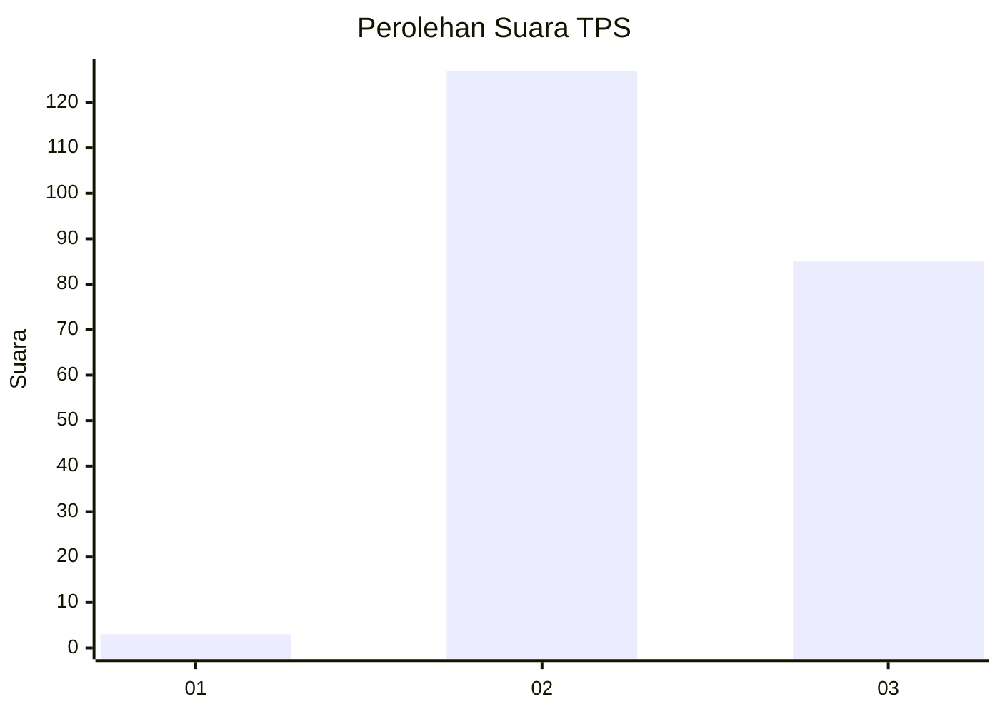
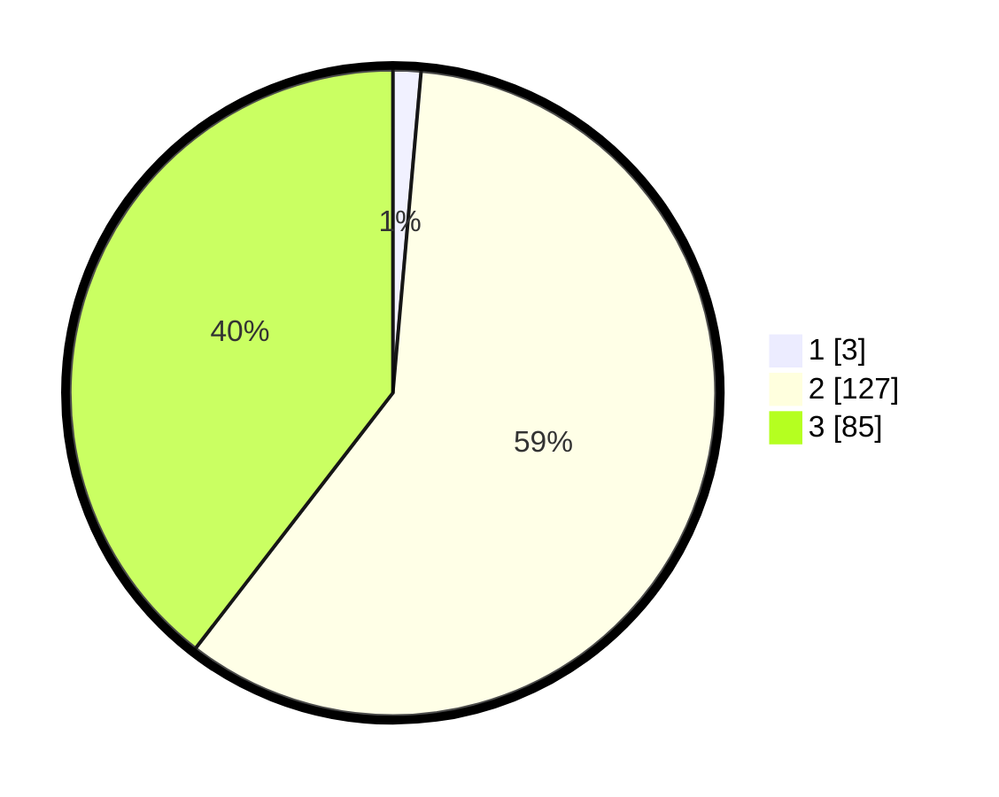

# Hasil

## Grafik

## Tabel

| No. | Nama Paslon    | Suara | Suara (raw) | Persentase |
|:--- |:-------------- | -----:| -----------:| ----------:|
| 1   | ANIES MUHAIMIN | 3     | [3][p-1]    | 1,40       |
| 2   | PRABOWO GIBRAN | 127   | [127][p-2]  | 59,07      |
| 3   | GANJAR MAHFUD  | 85    | [85][p-3]   | 39,53      |

[p-1]: https://github.com/gigit-pemilu/pemilu-2024-51-bali/blob/main/pilpres/hitung-suara/sub/51-bali/sub/08-buleleng/sub/01-gerokgak/sub/2005-banyupoh/sub/009-tps/sub/paslon-1.txt
[p-2]: https://github.com/gigit-pemilu/pemilu-2024-51-bali/blob/main/pilpres/hitung-suara/sub/51-bali/sub/08-buleleng/sub/01-gerokgak/sub/2005-banyupoh/sub/009-tps/sub/paslon-2.txt
[p-3]: https://github.com/gigit-pemilu/pemilu-2024-51-bali/blob/main/pilpres/hitung-suara/sub/51-bali/sub/08-buleleng/sub/01-gerokgak/sub/2005-banyupoh/sub/009-tps/sub/paslon-3.txt

## Foto C Plano

https://sirekap-obj-formc.kpu.go.id/62bc/pemilu/ppwp/51/08/01/20/05/5108012005009-20240215-001920--2ae80038-a849-47ad-9186-3d7a5f4809c1.jpg

https://sirekap-obj-formc.kpu.go.id/62bc/pemilu/ppwp/51/08/01/20/05/5108012005009-20240215-003043--f6bc700d-0327-4b46-bb05-8c787032307a.jpg

https://sirekap-obj-formc.kpu.go.id/62bc/pemilu/ppwp/51/08/01/20/05/5108012005009-20240215-003136--c32b90f7-3367-41f2-b0d5-7dae07573fd9.jpg

## Metadata

| Key        | Value               |
| ---------- | ------------------- |
| Time Stamp | 2024-02-24 22:31:28 |

