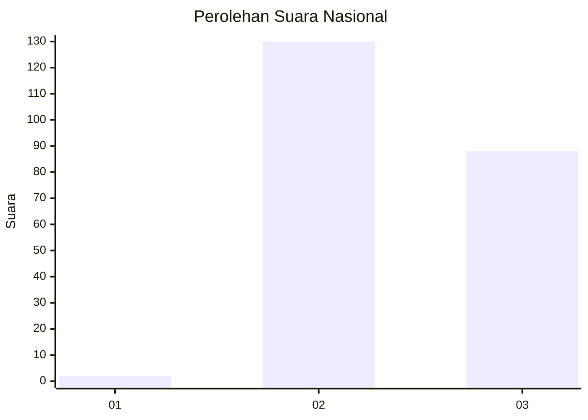
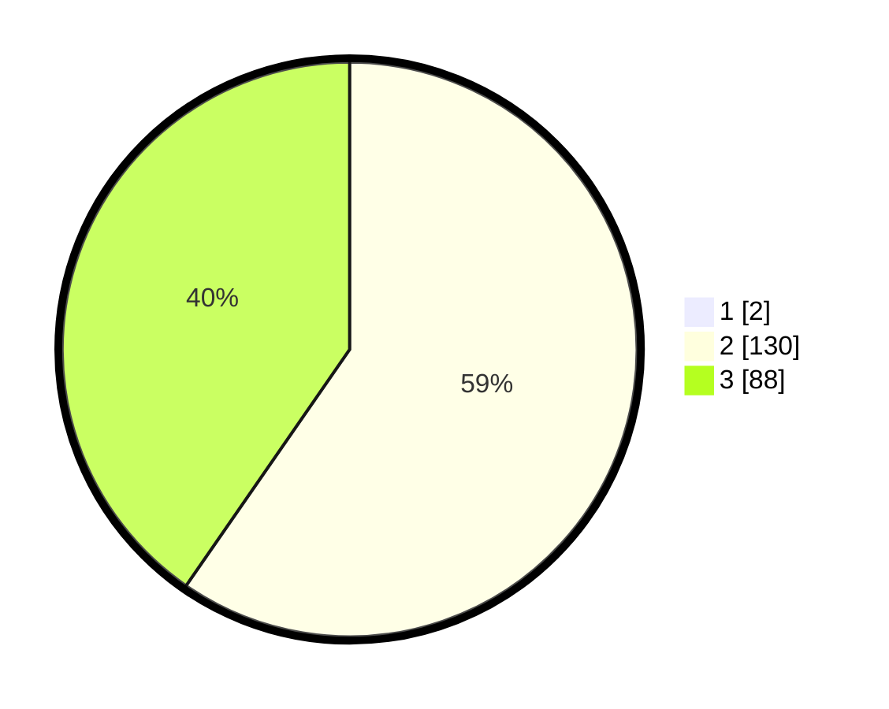

# Hasil

## Grafik

## Tabel

| No. | Nama Paslon    | Suara | Suara (raw) | Persentase |
|:--- |:-------------- | -----:| -----------:| ----------:|
| 1   | ANIES MUHAIMIN | 2     | [2][p-1]    | 0,91       |
| 2   | PRABOWO GIBRAN | 130   | [130][p-2]  | 59,09      |
| 3   | GANJAR MAHFUD  | 88    | [88][p-3]   | 40,00      |

[p-1]: https://github.com/gigit-pemilu/pemilu-2024/blob/main/pilpres/hitung-suara/sub/51-bali/sub/08-buleleng/sub/01-gerokgak/sub/2005-banyupoh/sub/011-tps/sub/paslon-1.txt
[p-2]: https://github.com/gigit-pemilu/pemilu-2024/blob/main/pilpres/hitung-suara/sub/51-bali/sub/08-buleleng/sub/01-gerokgak/sub/2005-banyupoh/sub/011-tps/sub/paslon-2.txt
[p-3]: https://github.com/gigit-pemilu/pemilu-2024/blob/main/pilpres/hitung-suara/sub/51-bali/sub/08-buleleng/sub/01-gerokgak/sub/2005-banyupoh/sub/011-tps/sub/paslon-3.txt

## Foto C Plano

https://sirekap-obj-formc.kpu.go.id/82c7/pemilu/ppwp/51/08/01/20/05/5108012005011-20240214-225231--264ddf8f-e816-466e-be7b-166b4077a4cc.jpg

https://sirekap-obj-formc.kpu.go.id/82c7/pemilu/ppwp/51/08/01/20/05/5108012005011-20240214-225238--eea4e6c7-aa3a-46bb-a1a3-c7aeedd66f65.jpg

https://sirekap-obj-formc.kpu.go.id/82c7/pemilu/ppwp/51/08/01/20/05/5108012005011-20240214-225242--89551991-0291-4cc2-90d9-7c654ad8f646.jpg

## Metadata

| Key        | Value               |
| ---------- | ------------------- |
| Time Stamp | 2024-02-24 22:31:28 |

