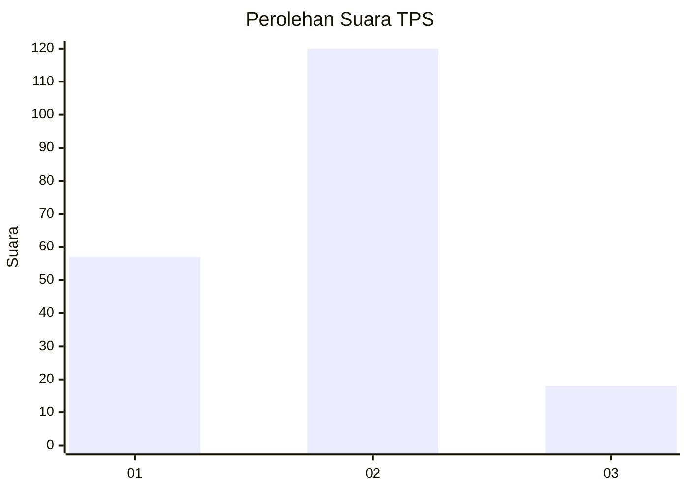
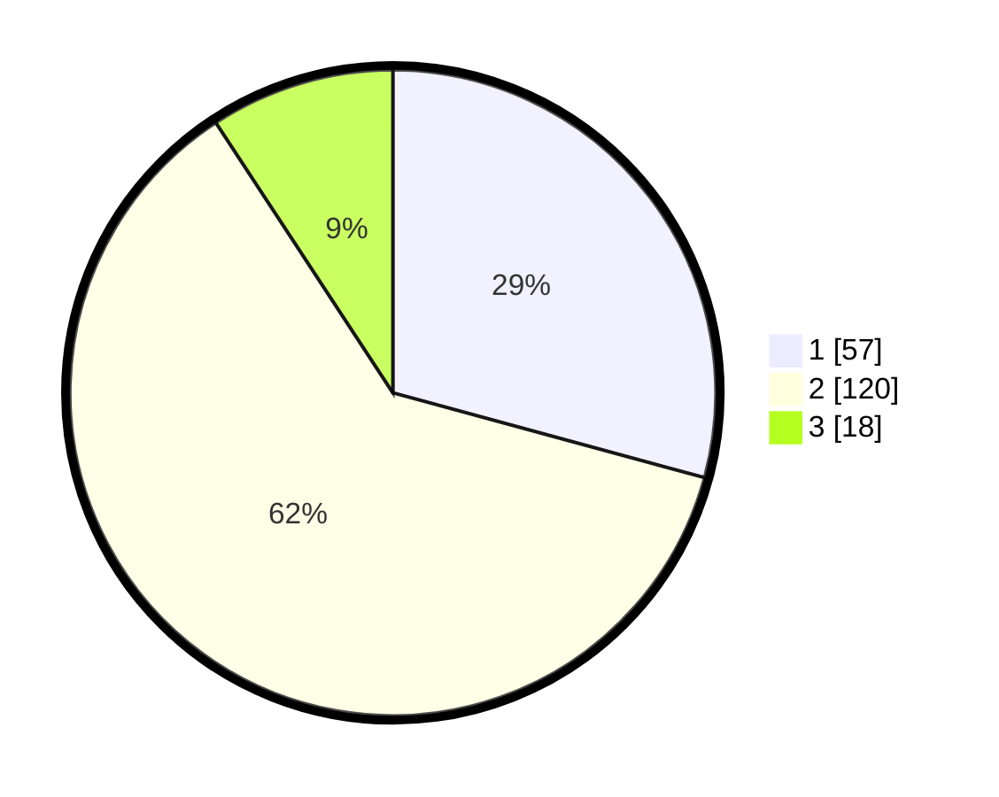

# Hasil

## Grafik

## Tabel

| No. | Nama Paslon    | Suara | Suara (raw) | Persentase |
|:--- |:-------------- | -----:| -----------:| ----------:|
| 1   | ANIES MUHAIMIN | 57    | [57][p-1]   | 29,23      |
| 2   | PRABOWO GIBRAN | 120   | [120][p-2]  | 61,54      |
| 3   | GANJAR MAHFUD  | 18    | [18][p-3]   | 9,23       |

[p-1]: https://github.com/gigit-pemilu/pemilu-2024-51-bali/blob/main/pilpres/hitung-suara/sub/51-bali/sub/08-buleleng/sub/01-gerokgak/sub/2006-penyabangan/sub/001-tps/sub/paslon-1.txt
[p-2]: https://github.com/gigit-pemilu/pemilu-2024-51-bali/blob/main/pilpres/hitung-suara/sub/51-bali/sub/08-buleleng/sub/01-gerokgak/sub/2006-penyabangan/sub/001-tps/sub/paslon-2.txt
[p-3]: https://github.com/gigit-pemilu/pemilu-2024-51-bali/blob/main/pilpres/hitung-suara/sub/51-bali/sub/08-buleleng/sub/01-gerokgak/sub/2006-penyabangan/sub/001-tps/sub/paslon-3.txt

## Foto C Plano

https://sirekap-obj-formc.kpu.go.id/6e0f/pemilu/ppwp/51/08/01/20/06/5108012006001-20240214-215412--eb9a0319-f63b-4917-909f-c43ce718100f.jpg

https://sirekap-obj-formc.kpu.go.id/6e0f/pemilu/ppwp/51/08/01/20/06/5108012006001-20240214-215554--bbae8878-56a0-4745-ba75-1397113725c7.jpg

https://sirekap-obj-formc.kpu.go.id/6e0f/pemilu/ppwp/51/08/01/20/06/5108012006001-20240214-215842--cab9bb73-ae6d-4a45-b2c6-828427f39138.jpg

## Metadata

| Key        | Value               |
| ---------- | ------------------- |
| Time Stamp | 2024-02-24 22:31:28 |

