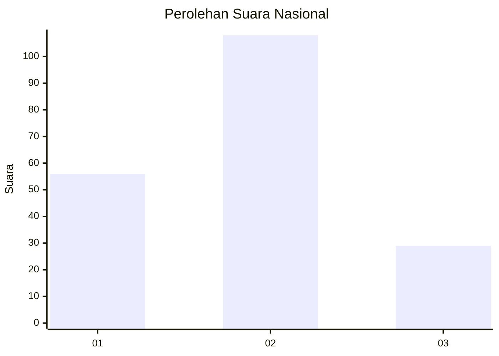
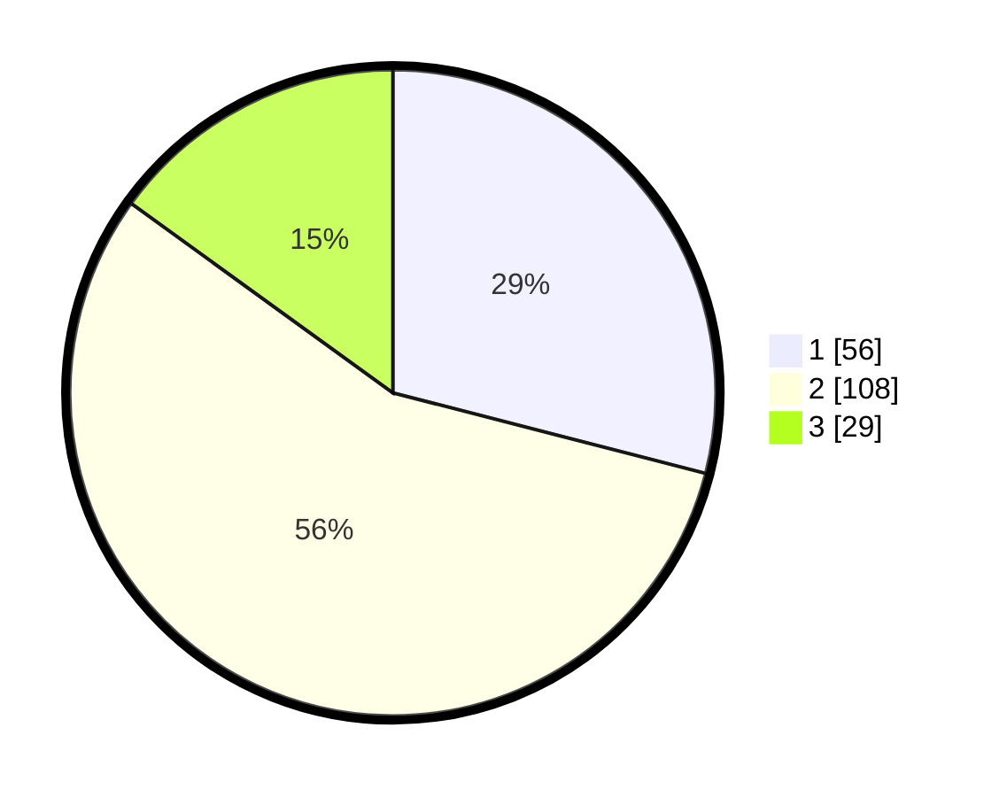

# Hasil

## Grafik

## Tabel

| No. | Nama Paslon    | Suara | Suara (raw) | Persentase |
|:--- |:-------------- | -----:| -----------:| ----------:|
| 1   | ANIES MUHAIMIN | 56    | [56][p-1]   | 29,02      |
| 2   | PRABOWO GIBRAN | 108   | [108][p-2]  | 55,96      |
| 3   | GANJAR MAHFUD  | 29    | [29][p-3]   | 15,03      |

[p-1]: https://github.com/gigit-pemilu/pemilu-2024/blob/main/pilpres/hitung-suara/sub/51-bali/sub/08-buleleng/sub/01-gerokgak/sub/2006-penyabangan/sub/003-tps/sub/paslon-1.txt
[p-2]: https://github.com/gigit-pemilu/pemilu-2024/blob/main/pilpres/hitung-suara/sub/51-bali/sub/08-buleleng/sub/01-gerokgak/sub/2006-penyabangan/sub/003-tps/sub/paslon-2.txt
[p-3]: https://github.com/gigit-pemilu/pemilu-2024/blob/main/pilpres/hitung-suara/sub/51-bali/sub/08-buleleng/sub/01-gerokgak/sub/2006-penyabangan/sub/003-tps/sub/paslon-3.txt

## Foto C Plano

https://sirekap-obj-formc.kpu.go.id/b30a/pemilu/ppwp/51/08/01/20/06/5108012006003-20240215-010313--085d1f86-5623-4b3b-9db2-fb2bdf5150c7.jpg

https://sirekap-obj-formc.kpu.go.id/b30a/pemilu/ppwp/51/08/01/20/06/5108012006003-20240215-010422--b1c1f88a-a26c-4f3f-8d4f-cd06e994d773.jpg

https://sirekap-obj-formc.kpu.go.id/b30a/pemilu/ppwp/51/08/01/20/06/5108012006003-20240215-010507--071237ef-db82-4efb-8339-594bc995430c.jpg

## Metadata

| Key        | Value               |
| ---------- | ------------------- |
| Time Stamp | 2024-02-24 22:31:28 |

