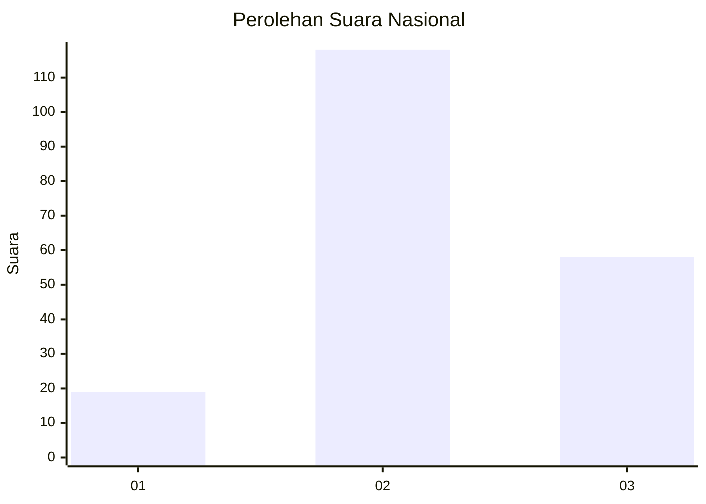
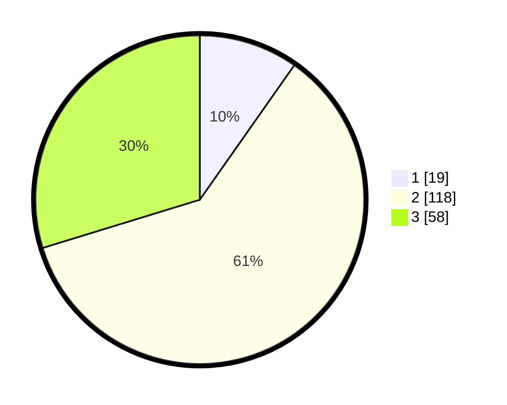

# Hasil

## Grafik

## Tabel

| No. | Nama Paslon    | Suara | Suara (raw) | Persentase |
|:--- |:-------------- | -----:| -----------:| ----------:|
| 1   | ANIES MUHAIMIN | 19    | [19][p-1]   | 9,74       |
| 2   | PRABOWO GIBRAN | 118   | [118][p-2]  | 60,51      |
| 3   | GANJAR MAHFUD  | 58    | [58][p-3]   | 29,74      |

[p-1]: https://github.com/gigit-pemilu/pemilu-2024/blob/main/pilpres/hitung-suara/sub/51-bali/sub/08-buleleng/sub/01-gerokgak/sub/2006-penyabangan/sub/005-tps/sub/paslon-1.txt
[p-2]: https://github.com/gigit-pemilu/pemilu-2024/blob/main/pilpres/hitung-suara/sub/51-bali/sub/08-buleleng/sub/01-gerokgak/sub/2006-penyabangan/sub/005-tps/sub/paslon-2.txt
[p-3]: https://github.com/gigit-pemilu/pemilu-2024/blob/main/pilpres/hitung-suara/sub/51-bali/sub/08-buleleng/sub/01-gerokgak/sub/2006-penyabangan/sub/005-tps/sub/paslon-3.txt

## Foto C Plano

https://sirekap-obj-formc.kpu.go.id/495f/pemilu/ppwp/51/08/01/20/06/5108012006005-20240215-013939--fb0cbf99-84a6-41b9-befe-766735087f19.jpg

https://sirekap-obj-formc.kpu.go.id/495f/pemilu/ppwp/51/08/01/20/06/5108012006005-20240215-014000--b5fc3999-86a8-4266-bde3-eb53492e2bba.jpg

https://sirekap-obj-formc.kpu.go.id/495f/pemilu/ppwp/51/08/01/20/06/5108012006005-20240215-014010--1fbf846b-dd9f-44c6-ae69-34bf32973044.jpg

## Metadata

| Key        | Value               |
| ---------- | ------------------- |
| Time Stamp | 2024-02-24 22:31:28 |

