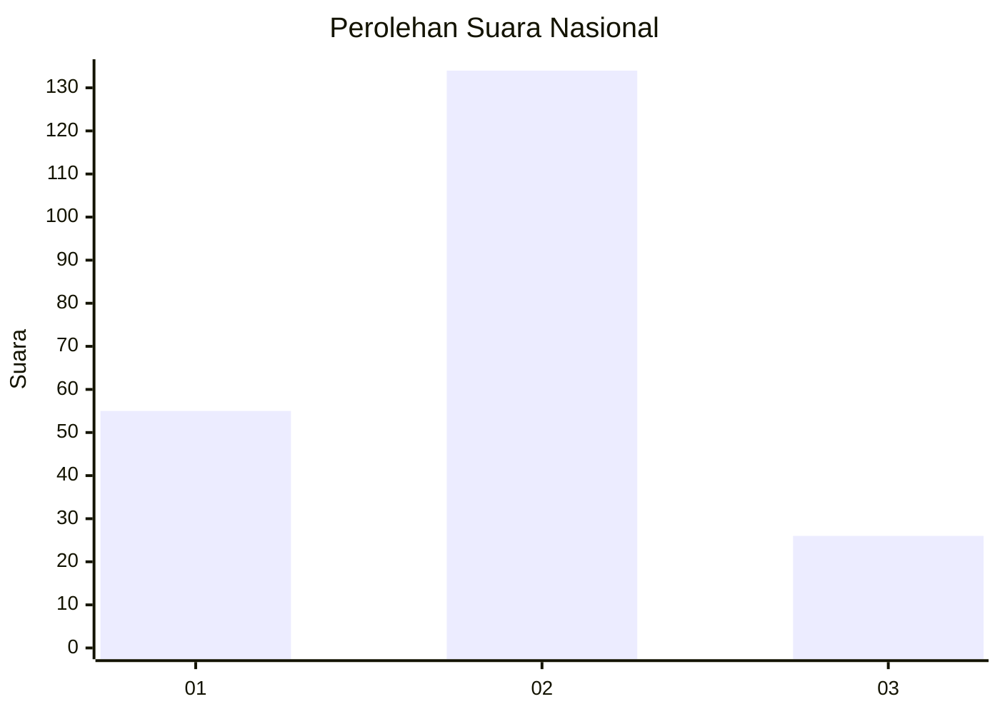
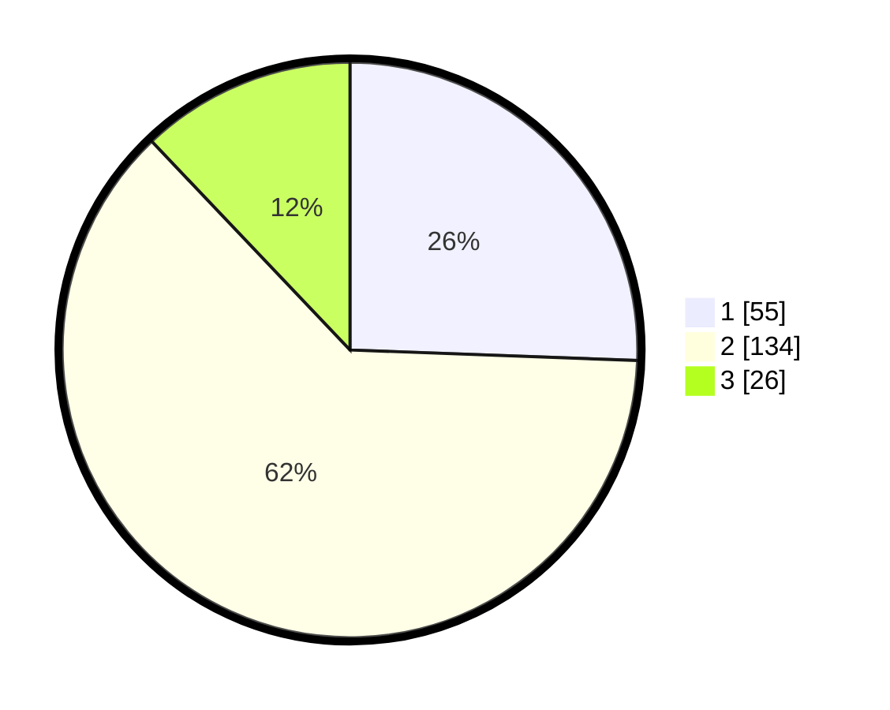

# Hasil

## Grafik

## Tabel

| No. | Nama Paslon    | Suara | Suara (raw) | Persentase |
|:--- |:-------------- | -----:| -----------:| ----------:|
| 1   | ANIES MUHAIMIN | 55    | [55][p-1]   | 25,58      |
| 2   | PRABOWO GIBRAN | 134   | [134][p-2]  | 62,33      |
| 3   | GANJAR MAHFUD  | 26    | [26][p-3]   | 12,09      |

[p-1]: https://github.com/gigit-pemilu/pemilu-2024/blob/main/pilpres/hitung-suara/sub/51-bali/sub/08-buleleng/sub/01-gerokgak/sub/2006-penyabangan/sub/007-tps/sub/paslon-1.txt
[p-2]: https://github.com/gigit-pemilu/pemilu-2024/blob/main/pilpres/hitung-suara/sub/51-bali/sub/08-buleleng/sub/01-gerokgak/sub/2006-penyabangan/sub/007-tps/sub/paslon-2.txt
[p-3]: https://github.com/gigit-pemilu/pemilu-2024/blob/main/pilpres/hitung-suara/sub/51-bali/sub/08-buleleng/sub/01-gerokgak/sub/2006-penyabangan/sub/007-tps/sub/paslon-3.txt

## Foto C Plano

https://sirekap-obj-formc.kpu.go.id/0200/pemilu/ppwp/51/08/01/20/06/5108012006007-20240214-210252--159137ef-ebac-4ed7-aa0e-28dcf2190e2f.jpg

https://sirekap-obj-formc.kpu.go.id/0200/pemilu/ppwp/51/08/01/20/06/5108012006007-20240214-210531--e60313a2-bc4e-48d4-8843-1ca1190d5e10.jpg

https://sirekap-obj-formc.kpu.go.id/0200/pemilu/ppwp/51/08/01/20/06/5108012006007-20240214-210756--b210826d-885e-4ffb-a7fb-3e1c2d5ae7d2.jpg

## Metadata

| Key        | Value               |
| ---------- | ------------------- |
| Time Stamp | 2024-02-24 22:31:28 |

