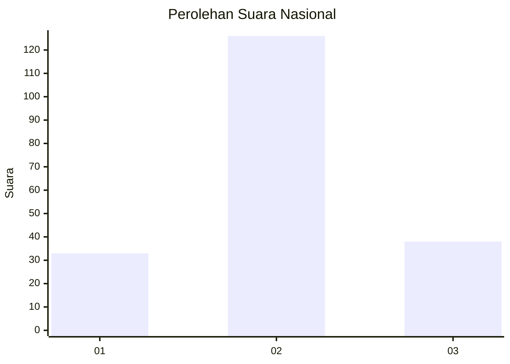
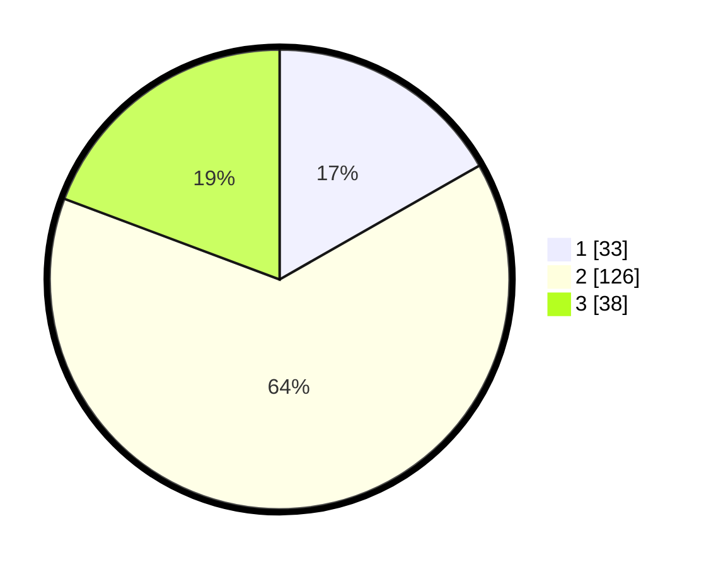

# Hasil

## Grafik

## Tabel

| No. | Nama Paslon    | Suara | Suara (raw) | Persentase |
|:--- |:-------------- | -----:| -----------:| ----------:|
| 1   | ANIES MUHAIMIN | 33    | [33][p-1]   | 16,75      |
| 2   | PRABOWO GIBRAN | 126   | [126][p-2]  | 63,96      |
| 3   | GANJAR MAHFUD  | 38    | [38][p-3]   | 19,29      |

[p-1]: https://github.com/gigit-pemilu/pemilu-2024/blob/main/pilpres/hitung-suara/sub/51-bali/sub/08-buleleng/sub/01-gerokgak/sub/2006-penyabangan/sub/012-tps/sub/paslon-1.txt
[p-2]: https://github.com/gigit-pemilu/pemilu-2024/blob/main/pilpres/hitung-suara/sub/51-bali/sub/08-buleleng/sub/01-gerokgak/sub/2006-penyabangan/sub/012-tps/sub/paslon-2.txt
[p-3]: https://github.com/gigit-pemilu/pemilu-2024/blob/main/pilpres/hitung-suara/sub/51-bali/sub/08-buleleng/sub/01-gerokgak/sub/2006-penyabangan/sub/012-tps/sub/paslon-3.txt

## Foto C Plano

https://sirekap-obj-formc.kpu.go.id/3969/pemilu/ppwp/51/08/01/20/06/5108012006012-20240214-235427--4408b899-279a-474b-866b-28abad57abf3.jpg

https://sirekap-obj-formc.kpu.go.id/3969/pemilu/ppwp/51/08/01/20/06/5108012006012-20240214-235457--7df151a2-3dee-4926-8f56-c65eb87327c7.jpg

https://sirekap-obj-formc.kpu.go.id/3969/pemilu/ppwp/51/08/01/20/06/5108012006012-20240214-235528--3b079849-304b-4fe9-904e-e92c7b8ab13f.jpg

## Metadata

| Key        | Value               |
| ---------- | ------------------- |
| Time Stamp | 2024-02-24 22:31:28 |

