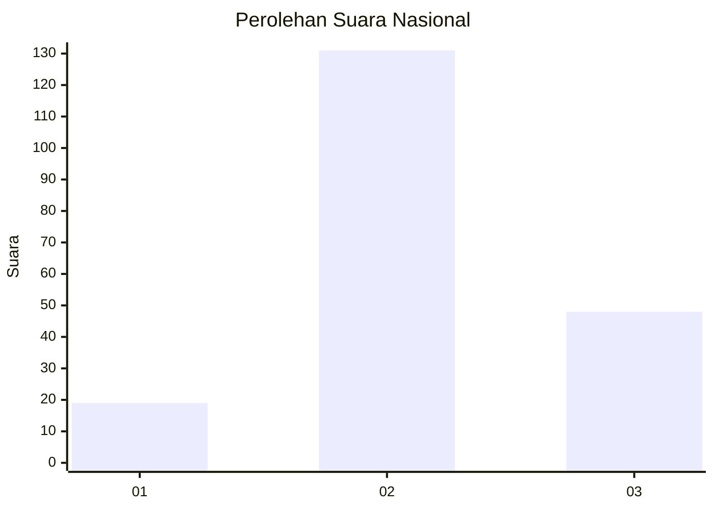
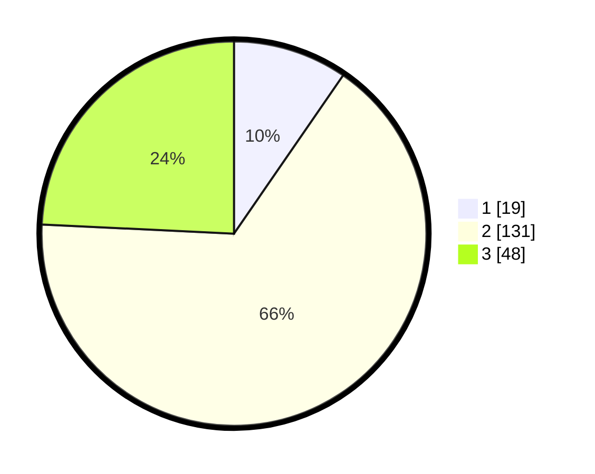

# Hasil

## Grafik

## Tabel

| No. | Nama Paslon    | Suara | Suara (raw) | Persentase |
|:--- |:-------------- | -----:| -----------:| ----------:|
| 1   | ANIES MUHAIMIN | 19    | [19][p-1]   | 9,60       |
| 2   | PRABOWO GIBRAN | 131   | [131][p-2]  | 66,16      |
| 3   | GANJAR MAHFUD  | 48    | [48][p-3]   | 24,24      |

[p-1]: https://github.com/gigit-pemilu/pemilu-2024/blob/main/pilpres/hitung-suara/sub/51-bali/sub/08-buleleng/sub/01-gerokgak/sub/2006-penyabangan/sub/015-tps/sub/paslon-1.txt
[p-2]: https://github.com/gigit-pemilu/pemilu-2024/blob/main/pilpres/hitung-suara/sub/51-bali/sub/08-buleleng/sub/01-gerokgak/sub/2006-penyabangan/sub/015-tps/sub/paslon-2.txt
[p-3]: https://github.com/gigit-pemilu/pemilu-2024/blob/main/pilpres/hitung-suara/sub/51-bali/sub/08-buleleng/sub/01-gerokgak/sub/2006-penyabangan/sub/015-tps/sub/paslon-3.txt

## Foto C Plano

https://sirekap-obj-formc.kpu.go.id/d751/pemilu/ppwp/51/08/01/20/06/5108012006015-20240214-223403--32bef8e2-6024-447f-97d9-6c8c678e49c8.jpg

https://sirekap-obj-formc.kpu.go.id/d751/pemilu/ppwp/51/08/01/20/06/5108012006015-20240214-223452--7172f70b-030b-4dda-8de9-508032592d50.jpg

https://sirekap-obj-formc.kpu.go.id/d751/pemilu/ppwp/51/08/01/20/06/5108012006015-20240214-223520--a485d1dc-fabd-40d8-bcbf-198f2d467fc9.jpg

## Metadata

| Key        | Value               |
| ---------- | ------------------- |
| Time Stamp | 2024-02-24 22:31:28 |

