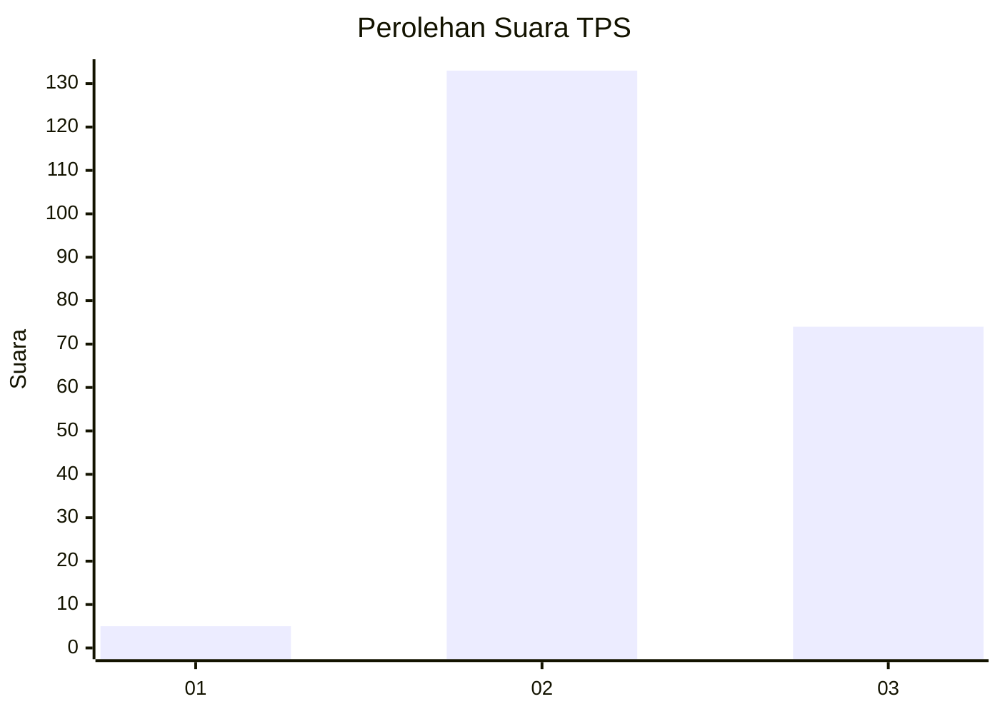
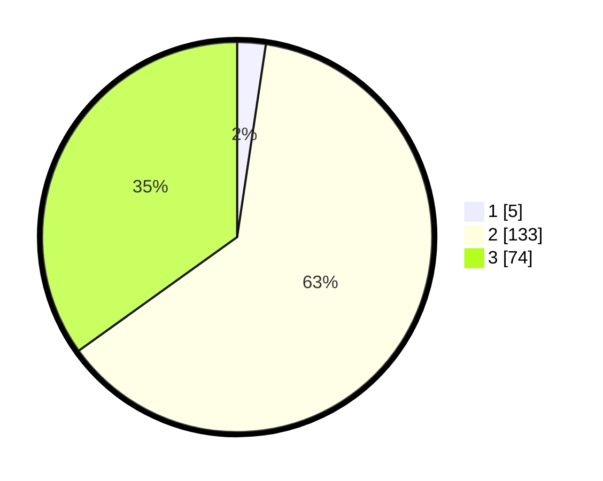

# Hasil

## Grafik

## Tabel

| No. | Nama Paslon    | Suara | Suara (raw) | Persentase |
|:--- |:-------------- | -----:| -----------:| ----------:|
| 1   | ANIES MUHAIMIN | 5     | [5][p-1]    | 2,36       |
| 2   | PRABOWO GIBRAN | 133   | [133][p-2]  | 62,74      |
| 3   | GANJAR MAHFUD  | 74    | [74][p-3]   | 34,91      |

[p-1]: https://github.com/gigit-pemilu/pemilu-2024-51-bali/blob/main/pilpres/hitung-suara/sub/51-bali/sub/08-buleleng/sub/01-gerokgak/sub/2006-penyabangan/sub/016-tps/sub/paslon-1.txt
[p-2]: https://github.com/gigit-pemilu/pemilu-2024-51-bali/blob/main/pilpres/hitung-suara/sub/51-bali/sub/08-buleleng/sub/01-gerokgak/sub/2006-penyabangan/sub/016-tps/sub/paslon-2.txt
[p-3]: https://github.com/gigit-pemilu/pemilu-2024-51-bali/blob/main/pilpres/hitung-suara/sub/51-bali/sub/08-buleleng/sub/01-gerokgak/sub/2006-penyabangan/sub/016-tps/sub/paslon-3.txt

## Foto C Plano

https://sirekap-obj-formc.kpu.go.id/8684/pemilu/ppwp/51/08/01/20/06/5108012006016-20240215-004418--e0916e99-233b-4c50-8a7f-5386819a3b1b.jpg

https://sirekap-obj-formc.kpu.go.id/8684/pemilu/ppwp/51/08/01/20/06/5108012006016-20240215-004520--e415699f-8ba5-4014-8922-c3a5329f4052.jpg

https://sirekap-obj-formc.kpu.go.id/8684/pemilu/ppwp/51/08/01/20/06/5108012006016-20240215-004548--bff2c15c-e334-4b8c-b999-93d20d4b6579.jpg

## Metadata

| Key        | Value               |
| ---------- | ------------------- |
| Time Stamp | 2024-02-24 22:31:28 |

